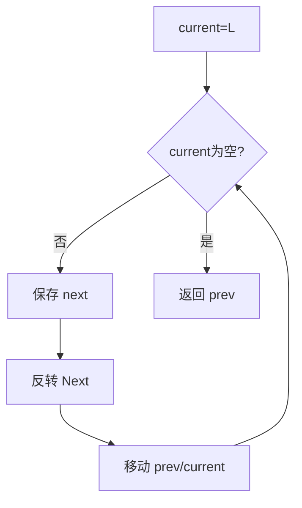
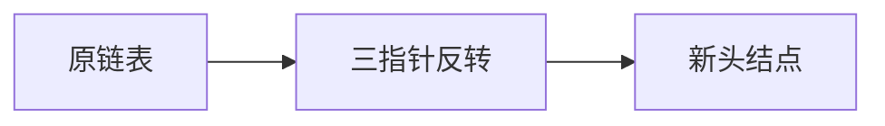

# 6-1 单链表逆转

- **分值：** 20分

## 题目描述

本题要求实现一个函数，将给定的单链表逆转。

## 函数接口定义
```cpp
List Reverse( List L );
```

其中`List`结构定义如下：

```cpp
typedef struct Node *PtrToNode;
struct Node {
    ElementType Data; /* 存储结点数据 */
    PtrToNode   Next; /* 指向下一个结点的指针 */
};
typedef PtrToNode List; /* 定义单链表类型 */
```

`L`是给定单链表，函数`Reverse`要返回被逆转后的链表。

## 裁判测试程序样例
```cpp
#include <iostream>
#include <cstdlib>
using namespace std;

typedef int ElementType;
typedef struct Node *PtrToNode;
struct Node {
    ElementType Data;
    PtrToNode   Next;
};
typedef PtrToNode List;

List Read(); /* 细节在此不表 */
void Print( List L ); /* 细节在此不表 */

List Reverse( List L );

int main()
{
    List L1, L2;
    L1 = Read();
    L2 = Reverse(L1);
    Print(L1);
    Print(L2);
    return 0;
}

/* 你的代码将被嵌在这里 */
```

## 输入样例
```
5
1 3 4 5 2
```

## 输出样例
```
1
2 5 4 3 1
```

### 函数部分

```cpp
List Reverse(List L) {
    PtrToNode prev = nullptr, cur = L;
    while (cur) {
        PtrToNode next = cur->Next;
        cur->Next = prev;
        prev = cur;
        cur = next;
    }
    return prev;
}
```

### 解题思路

逐结点改变 `Next` 指针。用 `next` 暂存未处理部分，避免断开链表；循环结束时 `prev` 指向新的头结点。

### 代码流程说明

函数只修改原链表链接，不创建新结点；空链表直接返回空指针。时间复杂度 `O(n)`，空间复杂度 `O(1)`。

### 代码流程图



### 解题流程图



### 复杂度分析

遍历每个结点一次，时间复杂度 `O(n)`；只使用三个指针，空间复杂度 `O(1)`。

### 常见易错点

- 修改 `Next` 前必须先保存后继指针。
- 返回值应为 `prev`，不是原来的 `L`。
- 不要释放结点，裁判程序还要打印逆转后的链表。
