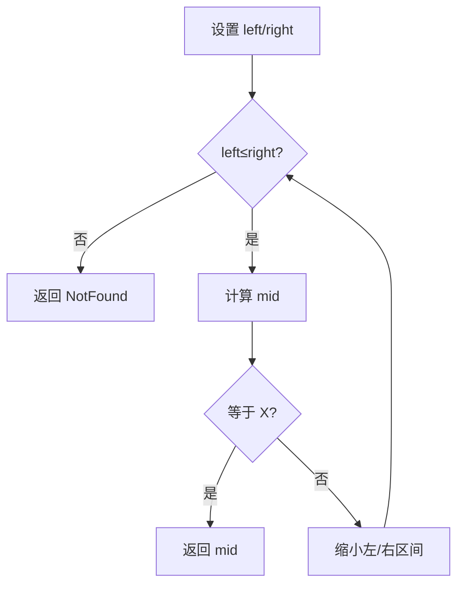

# 6-10 二分查找

- **分值：** 20分

## 题目描述

本题要求实现二分查找算法。

## 函数接口定义
```cpp
Position BinarySearch( List L, ElementType X );
```

其中`List`结构定义如下：

```cpp
typedef int Position;
typedef struct LNode *List;
struct LNode {
    ElementType Data[MAXSIZE];
    Position Last; /* 保存线性表中最后一个元素的位置 */
};
```

`L`是用户传入的一个线性表，其中`ElementType`元素可以通过$$>$$、$$==$$、$$<$$进行比较，并且题目保证传入的数据是递增有序的。函数`BinarySearch`要查找`X`在`Data`中的位置，即数组下标（注意：元素从下标1开始存储）。找到则返回下标，否则返回一个特殊的失败标记`NotFound`。

## 裁判测试程序样例
```cpp
#include <iostream>
#include <cstdlib>
using namespace std;

#define MAXSIZE 10
#define NotFound 0
typedef int ElementType;

typedef int Position;
typedef struct LNode *List;
struct LNode {
    ElementType Data[MAXSIZE];
    Position Last; /* 保存线性表中最后一个元素的位置 */
};

List ReadInput(); /* 裁判实现，细节不表。元素从下标1开始存储 */
Position BinarySearch( List L, ElementType X );

int main()
{
    List L;
    ElementType X;
    Position P;

    L = ReadInput();
    cin >> X;
    P = BinarySearch( L, X );
    cout << P << '\n';

    return 0;
}

/* 你的代码将被嵌在这里 */
```

## 输入样例
```
5
12 31 55 89 101
31
```

## 输出样例
```
2
```

## 输入样例
```
3
26 78 233
31
```

## 输出样例
```
0
```

**鸣谢宁波大学 Eyre-lemon-郎俊杰 同学修正原题！**

### 函数部分

```cpp
Position BinarySearch(List L, ElementType X) {
    Position left = 1, right = L->Last;
    while (left <= right) {
        Position mid = left + (right - left) / 2;
        if (L->Data[mid] == X) return mid;
        if (L->Data[mid] < X) left = mid + 1;
        else right = mid - 1;
    }
    return NotFound;
}
```

### 解题思路

表中元素从下标 1 开始且已递增有序，因此维护闭区间二分查找；区间为空时返回 `NotFound`。

### 代码流程说明

每轮将搜索区间缩小一半，时间复杂度 `O(log n)`，空间复杂度 `O(1)`。

### 代码流程图



### 解题流程图


### 复杂度分析

时间复杂度 `O(log n)`，只使用边界变量，空间复杂度 `O(1)`。

### 常见易错点

- 数据从下标 1 开始，不能初始化 `left=0`。
- 找不到时必须返回题目定义的 `NotFound`。
- 中点更新后要保证区间严格缩小。
