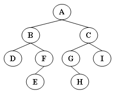
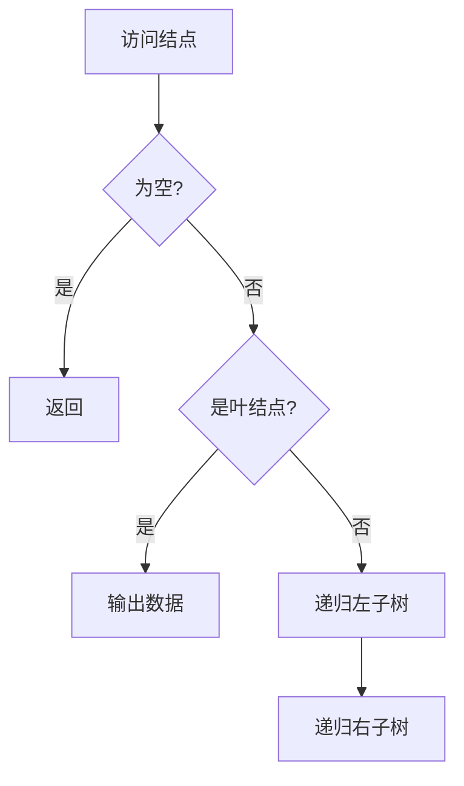

# 6-11 先序输出叶结点

- **分值：** 15分

## 题目描述

本题要求按照先序遍历的顺序输出给定二叉树的叶结点。

## 函数接口定义
```cpp
void PreorderPrintLeaves( BinTree BT );
```

其中`BinTree`结构定义如下：

```cpp
typedef struct TNode *Position;
typedef Position BinTree;
struct TNode{
    ElementType Data;
    BinTree Left;
    BinTree Right;
};
```

函数`PreorderPrintLeaves`应按照先序遍历的顺序输出给定二叉树`BT`的叶结点，格式为一个空格跟着一个字符。

## 裁判测试程序样例
```cpp
#include <iostream>
#include <cstdlib>
using namespace std;

typedef char ElementType;
typedef struct TNode *Position;
typedef Position BinTree;
struct TNode{
    ElementType Data;
    BinTree Left;
    BinTree Right;
};

BinTree CreatBinTree(); /* 实现细节忽略 */
void PreorderPrintLeaves( BinTree BT );

int main()
{
    BinTree BT = CreatBinTree();
    cout << "Leaf nodes are:";
    PreorderPrintLeaves(BT);
    cout << '\n';

    return 0;
}
/* 你的代码将被嵌在这里 */
```

## 输出样例


```
Leaf nodes are: D E H I
```

### 函数部分

```cpp
void PreorderPrintLeaves(BinTree BT) {
    if (BT == nullptr) return;
    if (BT->Left == nullptr && BT->Right == nullptr) {
        cout << ' ' << BT->Data;
        return;
    }
    PreorderPrintLeaves(BT->Left);
    PreorderPrintLeaves(BT->Right);
}
```

### 解题思路

按先序顺序访问结点，只有左右孩子均为空时才输出。先递归左子树再递归右子树即可保持先序叶结点顺序。

### 代码流程说明

空树直接结束；叶结点输出后无需继续递归。每个结点访问一次，时间复杂度 `O(n)`，递归空间复杂度 `O(h)`。

### 代码流程图



### 解题流程图


### 复杂度分析

时间复杂度 `O(n)`；递归调用栈空间为 `O(h)`，`h` 为树高。

### 常见易错点

- 叶结点必须同时满足 `Left==NULL` 和 `Right==NULL`。
- 输出格式要求每个字符前有一个空格。
- 空树不能访问其成员。
