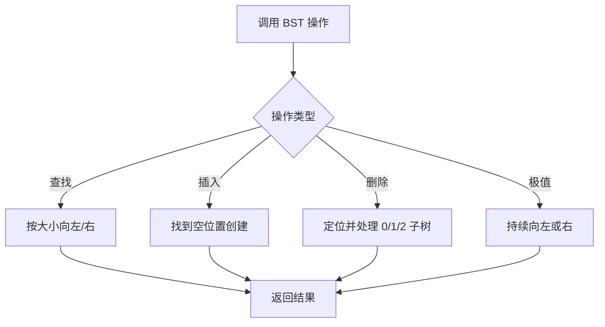
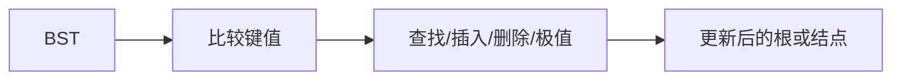

# 6-12 二叉搜索树的操作集

- **分值：** 30分

## 题目描述

本题要求实现给定二叉搜索树的5种常用操作。

## 函数接口定义
```cpp
BinTree Insert( BinTree BST, ElementType X );
BinTree Delete( BinTree BST, ElementType X );
Position Find( BinTree BST, ElementType X );
Position FindMin( BinTree BST );
Position FindMax( BinTree BST );
```

其中`BinTree`结构定义如下：

```cpp
typedef struct TNode *Position;
typedef Position BinTree;
struct TNode{
    ElementType Data;
    BinTree Left;
    BinTree Right;
};
```

- 函数`Insert`将`X`插入二叉搜索树`BST`并返回结果树的根结点指针；
- 函数`Delete`将`X`从二叉搜索树`BST`中删除，并返回结果树的根结点指针；如果`X`不在树中，则打印一行`Not Found`并返回原树的根结点指针；
- 函数`Find`在二叉搜索树`BST`中找到`X`，返回该结点的指针；如果找不到则返回空指针；
- 函数`FindMin`返回二叉搜索树`BST`中最小元结点的指针；
- 函数`FindMax`返回二叉搜索树`BST`中最大元结点的指针。

## 裁判测试程序样例
```cpp
#include <iostream>
#include <cstdlib>
using namespace std;

typedef int ElementType;
typedef struct TNode *Position;
typedef Position BinTree;
struct TNode{
    ElementType Data;
    BinTree Left;
    BinTree Right;
};

void PreorderTraversal( BinTree BT ); /* 先序遍历，由裁判实现，细节不表 */
void InorderTraversal( BinTree BT );  /* 中序遍历，由裁判实现，细节不表 */

BinTree Insert( BinTree BST, ElementType X );
BinTree Delete( BinTree BST, ElementType X );
Position Find( BinTree BST, ElementType X );
Position FindMin( BinTree BST );
Position FindMax( BinTree BST );

int main()
{
    BinTree BST, MinP, MaxP, Tmp;
    ElementType X;
    int N, i;

    BST = NULL;
    cin >> N;
    for ( i=0; i<N; i++ ) {
        cin >> X;
        BST = Insert(BST, X);
    }
    cout << "Preorder:"; PreorderTraversal(BST); cout << '\n';
    MinP = FindMin(BST);
    MaxP = FindMax(BST);
    cin >> N;
    for( i=0; i<N; i++ ) {
        cin >> X;
        Tmp = Find(BST, X);
        if (Tmp == NULL) cout << X << " is not found\n";
        else {
            cout << Tmp->Data << " is found\n";
            if (Tmp==MinP) cout << Tmp->Data << " is the smallest key\n";
            if (Tmp==MaxP) cout << Tmp->Data << " is the largest key\n";
        }
    }
    cin >> N;
    for( i=0; i<N; i++ ) {
        cin >> X;
        BST = Delete(BST, X);
    }
    cout << "Inorder:"; InorderTraversal(BST); cout << '\n';

    return 0;
}
/* 你的代码将被嵌在这里 */
```

## 输入样例
```
10
5 8 6 2 4 1 0 10 9 7
5
6 3 10 0 5
5
5 7 0 10 3
```

## 输出样例
```
Preorder: 5 2 1 0 4 8 6 7 10 9
6 is found
3 is not found
10 is found
10 is the largest key
0 is found
0 is the smallest key
5 is found
Not Found
Inorder: 1 2 4 6 8 9
```

### 函数部分

```cpp
BinTree Insert(BinTree BST, ElementType X) {
    if (!BST) { BST = new struct TNode; BST->Data = X; BST->Left = BST->Right = nullptr; return BST; }
    if (X < BST->Data) BST->Left = Insert(BST->Left, X);
    else if (X > BST->Data) BST->Right = Insert(BST->Right, X);
    return BST;
}

Position Find(BinTree BST, ElementType X) {
    while (BST) {
        if (X == BST->Data) return BST;
        BST = X < BST->Data ? BST->Left : BST->Right;
    }
    return nullptr;
}

Position FindMin(BinTree BST) {
    if (!BST) return nullptr;
    while (BST->Left) BST = BST->Left;
    return BST;
}

Position FindMax(BinTree BST) {
    if (!BST) return nullptr;
    while (BST->Right) BST = BST->Right;
    return BST;
}

BinTree Delete(BinTree BST, ElementType X) {
    if (!BST) { cout << "Not Found\n"; return nullptr; }
    if (X < BST->Data) BST->Left = Delete(BST->Left, X);
    else if (X > BST->Data) BST->Right = Delete(BST->Right, X);
    else if (BST->Left && BST->Right) {
        Position p = FindMin(BST->Right);
        BST->Data = p->Data;
        BST->Right = Delete(BST->Right, p->Data);
    } else {
        BinTree old = BST;
        BST = BST->Left ? BST->Left : BST->Right;
        delete old;
    }
    return BST;
}
```

### 解题思路

五个函数都利用 BST 的有序性质。插入和查找沿一条根到叶路径；删除分为空结点、单孩子和双孩子三种情况，双孩子用后继替代。

### 代码流程说明

递归函数始终返回当前子树的新根，删除不存在的值时打印 `Not Found` 并保持原树。平均时间复杂度 `O(log n)`，最坏 `O(n)`；递归空间 `O(h)`。

### 代码流程图



### 解题流程图



### 复杂度分析

各操作时间为 `O(h)`，平衡时为 `O(log n)`、最坏退化为 `O(n)`；递归栈为 `O(h)`。

### 常见易错点

- 插入、删除后要返回子树新根并接回父结点。
- 双孩子删除应复制后继值后再删除后继。
- 删除不存在元素要输出 `Not Found`，不要改变树。
