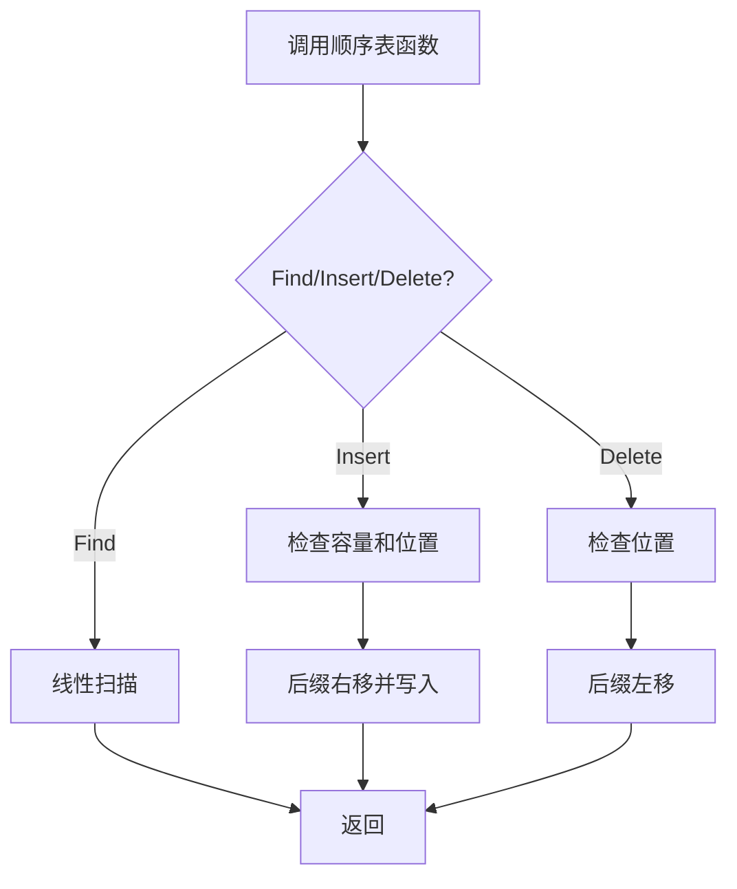

# 6-2 顺序表操作集

- **分值：** 20分

## 题目描述

本题要求实现顺序表的操作集。

## 函数接口定义
```cpp
List MakeEmpty();
Position Find( List L, ElementType X );
bool Insert( List L, ElementType X, Position P );
bool Delete( List L, Position P );
```

其中`List`结构定义如下：

```cpp
typedef int Position;
typedef struct LNode *List;
struct LNode {
    ElementType Data[MAXSIZE];
    Position Last; /* 保存线性表中最后一个元素的位置 */
};
```

各个操作函数的定义为：

`List MakeEmpty()`：创建并返回一个空的线性表；

`Position Find( List L, ElementType X )`：返回线性表中X的位置。若找不到则返回ERROR；

`bool Insert( List L, ElementType X, Position P )`：将X插入在位置P并返回true。若空间已满，则打印“FULL”并返回false；否则，如果参数P指向非法位置，则打印“ILLEGAL POSITION”并返回false；

`bool Delete( List L, Position P )`：将位置P的元素删除并返回true。若参数P指向非法位置，则打印“POSITION P EMPTY”（其中P是参数值）并返回false。

## 裁判测试程序样例
```cpp
#include <iostream>
#include <cstdlib>
using namespace std;

#define MAXSIZE 5
#define ERROR -1
typedef int ElementType;
typedef int Position;
typedef struct LNode *List;
struct LNode {
    ElementType Data[MAXSIZE];
    Position Last; /* 保存线性表中最后一个元素的位置 */
};

List MakeEmpty();
Position Find( List L, ElementType X );
bool Insert( List L, ElementType X, Position P );
bool Delete( List L, Position P );

int main()
{
    List L;
    ElementType X;
    Position P;
    int N;

    L = MakeEmpty();
    cin >> N;
    while ( N-- ) {
        cin >> X;
        if ( Insert(L, X, 0)==false )
            cout << " Insertion Error: " << X << " is not in.\n";
    }
    cin >> N;
    while ( N-- ) {
        cin >> X;
        P = Find(L, X);
        if ( P == ERROR )
            cout << "Finding Error: " << X << " is not in.\n";
        else
            cout << X << " is at position " << P << ".\n";
    }
    cin >> N;
    while ( N-- ) {
        cin >> P;
        if ( Delete(L, P)==false )
            cout << " Deletion Error.\n";
        if ( Insert(L, 0, P)==false )
            cout << " Insertion Error: 0 is not in.\n";
    }
    return 0;
}

/* 你的代码将被嵌在这里 */
```

## 输入样例
```
6
1 2 3 4 5 6
3
6 5 1
2
-1 6
```

## 输出样例
```
FULL Insertion Error: 6 is not in.
Finding Error: 6 is not in.
5 is at position 0.
1 is at position 4.
POSITION -1 EMPTY Deletion Error.
FULL Insertion Error: 0 is not in.
POSITION 6 EMPTY Deletion Error.
FULL Insertion Error: 0 is not in.
```

### 函数部分

```cpp
List MakeEmpty() {
    List L = new LNode;
    L->Last = -1;
    return L;
}

Position Find(List L, ElementType X) {
    for (Position i = 0; i <= L->Last; ++i)
        if (L->Data[i] == X) return i;
    return ERROR;
}

bool Insert(List L, ElementType X, Position P) {
    if (L->Last == MAXSIZE - 1) { cout << "FULL"; return false; }
    if (P < 0 || P > L->Last + 1) { cout << "ILLEGAL POSITION"; return false; }
    for (Position i = L->Last; i >= P; --i) L->Data[i + 1] = L->Data[i];
    L->Data[P] = X; ++L->Last;
    return true;
}

bool Delete(List L, Position P) {
    if (P < 0 || P > L->Last) { cout << "POSITION " << P << " EMPTY"; return false; }
    for (Position i = P; i < L->Last; ++i) L->Data[i] = L->Data[i + 1];
    --L->Last;
    return true;
}
```

### 解题思路

顺序表从下标 0 存储。插入位置允许是 `Last+1`（尾插），插入前将后缀右移；删除后将后缀左移。每次操作都先验证位置和容量。

### 代码流程说明

查找为 `O(n)`；插入、删除移动元素，时间复杂度 `O(n)`，额外空间 `O(1)`，表结构本身为 `O(MAXSIZE)`。

### 代码流程图



### 解题流程图


### 复杂度分析

查找、插入、删除最坏均为 `O(n)`；函数只使用固定临时变量，额外空间 `O(1)`。

### 常见易错点

- `Last` 是最后元素下标，空表为 `-1`。
- 插入合法位置包含 `Last+1`，删除不包含该位置。
- 题目要求的错误信息必须由函数打印。

提交时只保留函数实现，不要重复提交裁判程序和类型定义。
