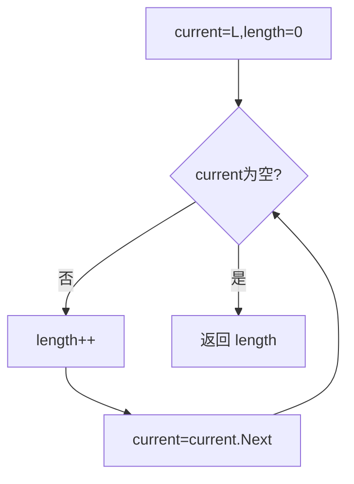

# 6-3 求链式表的表长

- **分值：** 10分

## 题目描述

本题要求实现一个函数，求链式表的表长。

## 函数接口定义
```cpp
int Length( List L );
```

其中`List`结构定义如下：

```cpp
typedef struct LNode *PtrToLNode;
struct LNode {
    ElementType Data;
    PtrToLNode Next;
};
typedef PtrToLNode List;
```

`L`是给定单链表，函数`Length`要返回链式表的长度。

## 裁判测试程序样例
```cpp
#include <iostream>
#include <cstdlib>
using namespace std;

typedef int ElementType;
typedef struct LNode *PtrToLNode;
struct LNode {
    ElementType Data;
    PtrToLNode Next;
};
typedef PtrToLNode List;

List Read(); /* 细节在此不表 */

int Length( List L );

int main()
{
    List L = Read();
    cout << Length(L) << '\n';
    return 0;
}

/* 你的代码将被嵌在这里 */
```

## 输入样例
```
1 3 4 5 2 -1
```

## 输出样例
```
5
```

### 函数部分

```cpp
int Length(List L) {
    int length = 0;
    for (PtrToLNode p = L; p != nullptr; p = p->Next) ++length;
    return length;
}
```

### 解题思路

从头结点开始沿 `Next` 指针遍历，每访问一个有效结点计数一次，直到空指针。

### 代码流程说明

空链表返回 0；不修改链表内容。时间复杂度 `O(n)`，空间复杂度 `O(1)`。

### 代码流程图



### 解题流程图


### 复杂度分析

访问每个结点一次，时间复杂度 `O(n)`，只需计数器和指针，空间复杂度 `O(1)`。

### 常见易错点

- 空指针不能解引用。
- 计数的是结点数，不是指针边数。
- 函数只返回长度，不需要修改或释放链表。
