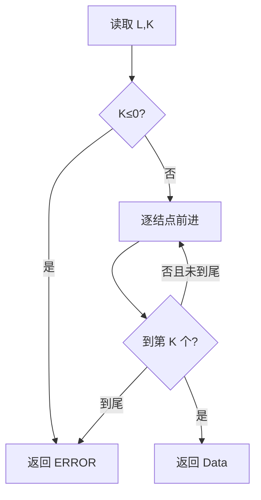

# 6-4 链式表的按序号查找

- **分值：** 10分

## 题目描述

本题要求实现一个函数，找到并返回链式表的第K个元素。

## 函数接口定义
```cpp
// 函数接口声明：裁判程序通过此接口调用实现。
ElementType FindKth(List L, int K);
```

其中`List`结构定义如下：

```cpp
// 数据结构定义：下面的类型由题目提供，提交时无需重复声明。
typedef struct LNode* PtrToLNode;
struct LNode {
    ElementType Data;
    PtrToLNode Next;
};
typedef PtrToLNode List;
```

`L`是给定单链表，函数`FindKth`要返回链式表的第`K`个元素。如果该元素不存在，则返回`ERROR`。

## 裁判测试程序样例
```cpp
// 裁判程序示例：用于展示输入、调用和输出流程。
#include <cstdlib>
#include <iostream>
using namespace std;
#define ERROR -1
typedef int ElementType;
typedef struct LNode* PtrToLNode;
struct LNode {
    ElementType Data;
    PtrToLNode Next;
};
typedef PtrToLNode List;
List Read();
/* 细节在此不表 */
ElementType FindKth(List L, int K);
int main() {
    int N, K;
    ElementType X;
    List L = Read();
    cin >> N;
    while (N--) {
        cin >> K;
        X = FindKth(L, K);
        if (X != ERROR)
            cout << X << ' ';
        else
            cout << "NA ";
    }
    return 0;
} /* 你的代码将被嵌在这里 */
```

## 输入样例
```
1 3 4 5 2 -1
6
3 6 1 5 4 2
```

## 输出样例
```
4 NA 1 2 5 3
```

### 函数部分

```cpp
// 实现原理：
// 链表不能随机访问，因此从首结点顺序移动并维护当前位置；题目中的序号从 1 开始。
// 处理流程：
// 先排除非正序号，再遍历至第 `K` 个结点。时间复杂度 `O(min(K,n))`，空间复杂度 `O(1)`。
ElementType FindKth(List L, int K) {
    if (K <= 0)
        return ERROR;
    int position = 1;
    for (PtrToLNode p = L; p; p = p->Next, ++position)
        if (position == K)
            return p->Data;
    return ERROR;
}
```

### 实现原理与解题思路

链表不能随机访问，因此从首结点顺序移动并维护当前位置；题目中的序号从 1 开始。

### 代码流程说明

先排除非正序号，再遍历至第 `K` 个结点。时间复杂度 `O(min(K,n))`，空间复杂度 `O(1)`。

### 代码流程图



### 解题流程图


### 复杂度分析

最多访问前 `K` 个结点，时间复杂度 `O(min(K,n))`，额外空间 `O(1)`。

### 常见易错点

- 第一个结点是第 1 个元素，不是第 0 个。
- `K` 越界要返回 `ERROR`。
- 裁判程序可能把 `ERROR` 映射为 `NA`，函数不要自行输出 `NA`。
