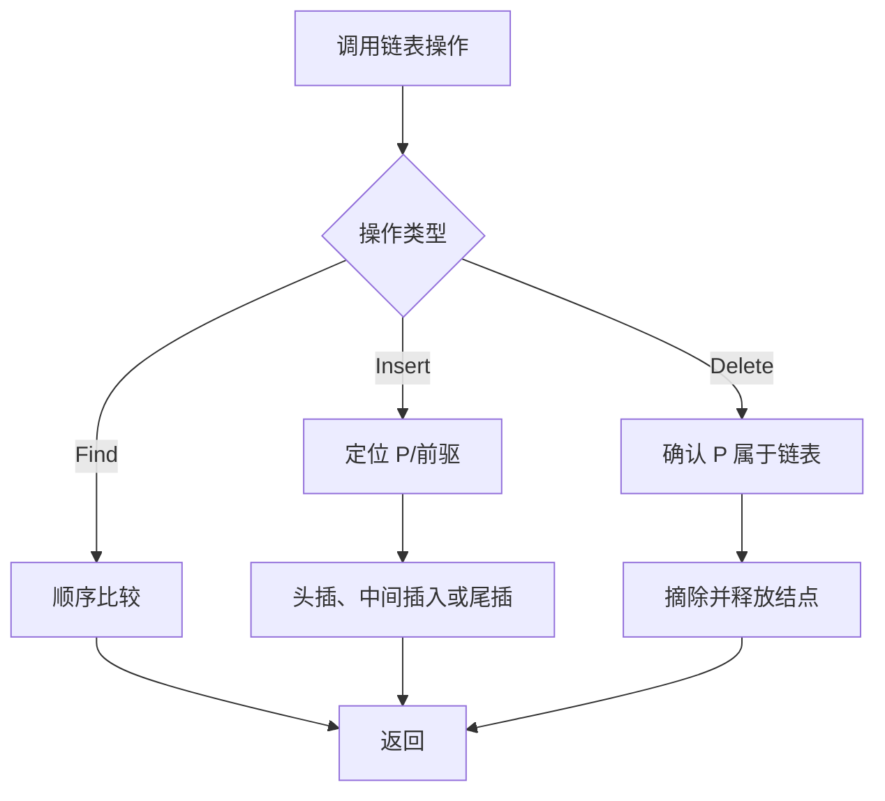

## 6-5 链式表操作集

- **分值：** 20分

## 题目描述

本题要求实现链式表的操作集。

## 函数接口定义
```cpp
// 函数接口声明：裁判程序通过此接口调用实现。
Position Find(List L, ElementType X);
List Insert(List L, ElementType X, Position P);
List Delete(List L, Position P);
```

其中`List`结构定义如下：

```cpp
// 数据结构定义：下面的类型由题目提供，提交时无需重复声明。
typedef struct LNode* PtrToLNode;
struct LNode {
    ElementType Data;
    PtrToLNode Next;
};
typedef PtrToLNode Position;
typedef PtrToLNode List;
```

各个操作函数的定义为：

`Position Find( List L, ElementType X )`：返回线性表中首次出现X的位置。若找不到则返回ERROR；

`List Insert( List L, ElementType X, Position P )`：将X插入在位置P指向的结点之前，返回链表的表头。如果参数P指向非法位置，则打印“Wrong Position for Insertion”，返回ERROR；

`List Delete( List L, Position P )`：将位置P的元素删除并返回链表的表头。若参数P指向非法位置，则打印“Wrong Position for Deletion”并返回ERROR。

## 裁判测试程序样例
```cpp
// 裁判程序示例：用于展示输入、调用和输出流程。
#include <cstdlib>
#include <iostream>
using namespace std;
#define ERROR NULL
typedef int ElementType;
typedef struct LNode* PtrToLNode;
struct LNode {
    ElementType Data;
    PtrToLNode Next;
};
typedef PtrToLNode Position;
typedef PtrToLNode List;
Position Find(List L, ElementType X);
List Insert(List L, ElementType X, Position P);
List Delete(List L, Position P);
int main() {
    List L;
    ElementType X;
    Position P, tmp;
    int N;
    L = NULL;
    cin >> N;
    while (N--) {
        cin >> X;
        L = Insert(L, X, L);
        if (L == ERROR)
            cout << "Wrong Answer\n";
    }
    cin >> N;
    while (N--) {
        cin >> X;
        P = Find(L, X);
        if (P == ERROR)
            cout << "Finding Error: " << X << " is not in.\n";
        else {
            L = Delete(L, P);
            cout << X << " is found and deleted.\n";
            if (L == ERROR)
                cout << "Wrong Answer or Empty List.\n";
        }
    }
    L = Insert(L, X, NULL);
    if (L == ERROR)
        cout << "Wrong Answer\n";
    else
        cout << X << " is inserted as the last element.\n";
    P = (Position)malloc(sizeof(struct LNode));
    tmp = Insert(L, X, P);
    if (tmp != ERROR)
        cout << "Wrong Answer\n";
    tmp = Delete(L, P);
    if (tmp != ERROR)
        cout << "Wrong Answer\n";
    for (P = L; P; P = P->Next)
        cout << P->Data << ' ';
    return 0;
} /* 你的代码将被嵌在这里 */
```

## 输入样例
```
6
12 2 4 87 10 2
4
2 12 87 5
```

## 输出样例
```
2 is found and deleted.
12 is found and deleted.
87 is found and deleted.
Finding Error: 5 is not in.
5 is inserted as the last element.
Wrong Position for Insertion
Wrong Position for Deletion
10 4 2 5
```

## 函数部分

```cpp
// 实现原理：
// 不带头结点的链表需要特别处理头插和删除头结点。插入前找到前驱；`P=NULL` 表示尾插。删除时保存待删结点的后继并释放待删结点，返回可能改变的表头。
// 处理流程：
// 查找前驱、插入和删除都需要线性扫描，时间复杂度 `O(n)`，额外空间 `O(1)`。
Position Find(List L, ElementType X) {
    for (Position p = L; p; p = p->Next)
        if (p->Data == X)
            return p;
    return ERROR;
}
List Insert(List L, ElementType X, Position P) {
    Position node = new struct LNode;
    node->Data = X;
    node->Next = nullptr;
    if (P == L) {
        node->Next = L;
        return node;
    }
    Position prev = L;
    while (prev && prev->Next != P)
        prev = prev->Next;
    if (!prev && P != nullptr) {
        delete node;
        cout << "Wrong Position for Insertion\n";
        return ERROR;
    }
    if (P == nullptr) {
        prev = L;
        if (prev)
            while (prev->Next)
                prev = prev->Next;
    }
    node->Next = P;
    if (prev)
        prev->Next = node;
    else
        L = node;
    return L;
}
List Delete(List L, Position P) {
    if (!L || !P) {
        cout << "Wrong Position for Deletion\n";
        return ERROR;
    }
    if (P == L) {
        L = L->Next;
        delete P;
        return L;
    }
    Position prev = L;
    while (prev && prev->Next != P)
        prev = prev->Next;
    if (!prev) {
        cout << "Wrong Position for Deletion\n";
        return ERROR;
    }
    prev->Next = P->Next;
    delete P;
    return L;
}
```

## 实现原理与解题思路

不带头结点的链表需要特别处理头插和删除头结点。插入前找到前驱；`P=NULL` 表示尾插。删除时保存待删结点的后继并释放待删结点，返回可能改变的表头。

## 代码流程说明

查找前驱、插入和删除都需要线性扫描，时间复杂度 `O(n)`，额外空间 `O(1)`。

## 代码流程图



## 解题流程图


## 复杂度分析

各操作最坏时间复杂度 `O(n)`；只使用指针变量，额外空间复杂度 `O(1)`。

## 常见易错点

- 删除或插入头结点时要更新并返回 `L`。
- `P` 必须确实属于当前链表，不能只判断非空。
- `P=NULL` 仅对插入表示尾插，对删除是非法位置。

提交时只实现题目要求的函数，保留裁判已提供的结构和主程序。
