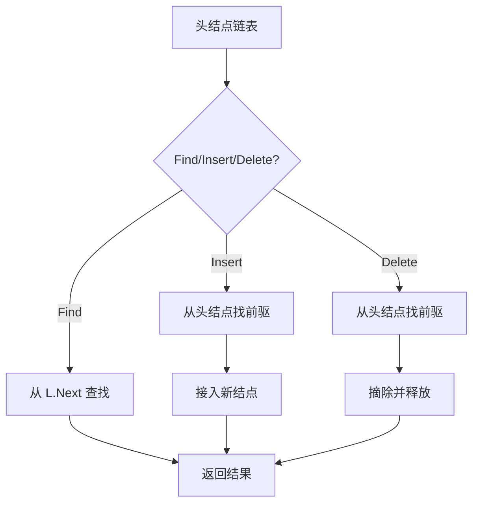

# 6-6 带头结点的链式表操作集

- **分值：** 20分

## 题目描述

本题要求实现带头结点的链式表操作集。

## 函数接口定义
```cpp
// 函数接口声明：裁判程序通过此接口调用实现。
List MakeEmpty();
Position Find(List L, ElementType X);
bool Insert(List L, ElementType X, Position P);
bool Delete(List L, Position P);
```

其中`List`结构定义如下：

```cpp
// 数据结构定义：下面的类型由题目提供，提交时无需重复声明。
typedef struct LNode* PtrToLNode;
struct LNode {
    ElementType Data;
    PtrToLNode Next;
};
typedef PtrToLNode Position;
typedef PtrToLNode List;
```

各个操作函数的定义为：

`List MakeEmpty()`：创建并返回一个空的线性表；

`Position Find( List L, ElementType X )`：返回线性表中X的位置。若找不到则返回ERROR；

`bool Insert( List L, ElementType X, Position P )`：将X插入在位置P指向的结点之前，返回true。如果参数P指向非法位置，则打印“Wrong Position for Insertion”，返回false；

`bool Delete( List L, Position P )`：将位置P的元素删除并返回true。若参数P指向非法位置，则打印“Wrong Position for Deletion”并返回false。

## 裁判测试程序样例
```cpp
// 裁判程序示例：用于展示输入、调用和输出流程。
#include <cstdlib>
#include <iostream>
using namespace std;
#define ERROR NULL
typedef int ElementType;
typedef struct LNode* PtrToLNode;
struct LNode {
    ElementType Data;
    PtrToLNode Next;
};
typedef PtrToLNode Position;
typedef PtrToLNode List;
List MakeEmpty();
Position Find(List L, ElementType X);
bool Insert(List L, ElementType X, Position P);
bool Delete(List L, Position P);
int main() {
    List L;
    ElementType X;
    Position P;
    int N;
    bool flag;
    L = MakeEmpty();
    cin >> N;
    while (N--) {
        cin >> X;
        flag = Insert(L, X, L->Next);
        if (flag == false)
            cout << "Wrong Answer\n";
    }
    cin >> N;
    while (N--) {
        cin >> X;
        P = Find(L, X);
        if (P == ERROR)
            cout << "Finding Error: " << X << " is not in.\n";
        else {
            flag = Delete(L, P);
            cout << X << " is found and deleted.\n";
            if (flag == false)
                cout << "Wrong Answer.\n";
        }
    }
    flag = Insert(L, X, NULL);
    if (flag == false)
        cout << "Wrong Answer\n";
    else
        cout << X << " is inserted as the last element.\n";
    P = (Position)malloc(sizeof(struct LNode));
    flag = Insert(L, X, P);
    if (flag == true)
        cout << "Wrong Answer\n";
    flag = Delete(L, P);
    if (flag == true)
        cout << "Wrong Answer\n";
    for (P = L->Next; P; P = P->Next)
        cout << P->Data << ' ';
    return 0;
} /* 你的代码将被嵌在这里 */
```

## 输入样例
```
6
12 2 4 87 10 2
4
2 12 87 5
```

## 输出样例
```
2 is found and deleted.
12 is found and deleted.
87 is found and deleted.
Finding Error: 5 is not in.
5 is inserted as the last element.
Wrong Position for Insertion
Wrong Position for Deletion
10 4 2 5
```

### 函数部分

```cpp
// 实现原理：
// 头结点不存放有效数据，因此首个元素是 `L->Next`。头结点使头部插入、删除与普通位置使用同一套“找前驱”逻辑。
// 处理流程：
// 所有有效数据结点都从 `L->Next` 开始遍历；插入和删除前验证 `P` 是空（尾插）或确实属于链表。时间复杂度 `O(n)`，额外空间 `O(1)`。
List MakeEmpty() {
    List L = new struct LNode;
    L->Next = nullptr;
    return L;
}
Position Find(List L, ElementType X) {
    for (Position p = L->Next; p; p = p->Next)
        if (p->Data == X)
            return p;
    return ERROR;
}
bool Insert(List L, ElementType X, Position P) {
    Position prev = L;
    while (prev && prev->Next != P)
        prev = prev->Next;
    if (!prev) {
        cout << "Wrong Position for Insertion\n";
        return false;
    }
    Position node = new struct LNode;
    node->Data = X;
    node->Next = P;
    prev->Next = node;
    return true;
}
bool Delete(List L, Position P) {
    if (!P) {
        cout << "Wrong Position for Deletion\n";
        return false;
    }
    Position prev = L;
    while (prev && prev->Next != P)
        prev = prev->Next;
    if (!prev) {
        cout << "Wrong Position for Deletion\n";
        return false;
    }
    prev->Next = P->Next;
    delete P;
    return true;
}
```

### 实现原理与解题思路

头结点不存放有效数据，因此首个元素是 `L->Next`。头结点使头部插入、删除与普通位置使用同一套“找前驱”逻辑。

### 代码流程说明

所有有效数据结点都从 `L->Next` 开始遍历；插入和删除前验证 `P` 是空（尾插）或确实属于链表。时间复杂度 `O(n)`，额外空间 `O(1)`。

### 代码流程图



### 解题流程图


### 复杂度分析

查找前驱最多遍历整个链表，时间复杂度 `O(n)`；额外空间复杂度 `O(1)`，头结点本身不计入操作辅助空间。

### 常见易错点

- 不能把头结点当作数据结点输出或参与查找。
- 遍历和打印从 `L->Next` 开始。
- 题目要求的错误信息由函数输出，返回值只表示成功或失败。
