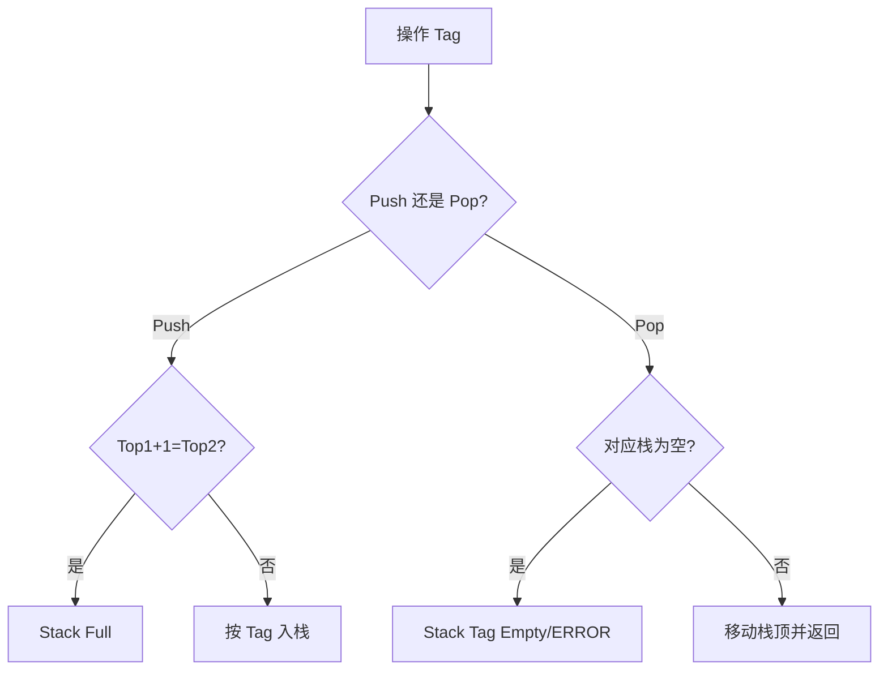
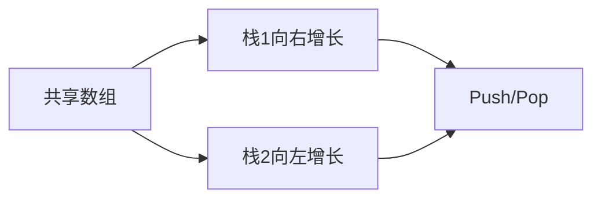

# 6-7 在一个数组中实现两个堆栈

- **分值：** 20分

## 题目描述

本题要求在一个数组中实现两个堆栈。

## 函数接口定义
```cpp
Stack CreateStack( int MaxSize );
bool Push( Stack S, ElementType X, int Tag );
ElementType Pop( Stack S, int Tag );
```

其中`Tag`是堆栈编号，取1或2；`MaxSize`堆栈数组的规模；`Stack`结构定义如下：

```cpp
typedef int Position;
struct SNode {
    ElementType *Data;
    Position Top1, Top2;
    int MaxSize;
};
typedef struct SNode *Stack;
```

注意：如果堆栈已满，`Push`函数必须输出“Stack Full”并且返回false；如果某堆栈是空的，则`Pop`函数必须输出“Stack Tag Empty”（其中Tag是该堆栈的编号），并且返回ERROR。

## 裁判测试程序样例
```cpp
#include <iostream>
#include <cstdlib>
using namespace std;

#define ERROR 1e8
typedef int ElementType;
enum Operation { opPush, opPop, opEnd };
typedef int Position;
struct SNode {
    ElementType *Data;
    Position Top1, Top2;
    int MaxSize;
};
typedef struct SNode *Stack;

Stack CreateStack( int MaxSize );
bool Push( Stack S, ElementType X, int Tag );
ElementType Pop( Stack S, int Tag );

Operation GetOp();  /* details omitted */
void PrintStack( Stack S, int Tag ); /* details omitted */

int main()
{
    int N, Tag, X;
    Stack S;
    int done = 0;

    cin >> N;
    S = CreateStack(N);
    while ( !done ) {
        switch( GetOp() ) {
        case opPush:
            cin >> Tag >> X;
            if (!Push(S, X, Tag)) cout << "Stack " << Tag << " is Full!\n";
            break;
        case opPop:
            cin >> Tag;
            X = Pop(S, Tag);
            if ( X==ERROR ) cout << "Stack " << Tag << " is Empty!\n";
            break;
        case opEnd:
            PrintStack(S, 1);
            PrintStack(S, 2);
            done = 1;
            break;
        }
    }
    return 0;
}

/* 你的代码将被嵌在这里 */
```

## 输入样例
```
5
Push 1 1
Pop 2
Push 2 11
Push 1 2
Push 2 12
Pop 1
Push 2 13
Push 2 14
Push 1 3
Pop 2
End
```

## 输出样例
```
Stack 2 Empty
Stack 2 is Empty!
Stack Full
Stack 1 is Full!
Pop from Stack 1: 1
Pop from Stack 2: 13 12 11
```

### 函数部分

```cpp
Stack CreateStack(int MaxSize) {
    Stack S = new SNode;
    S->Data = new ElementType[MaxSize];
    S->Top1 = -1; S->Top2 = MaxSize; S->MaxSize = MaxSize;
    return S;
}

bool Push(Stack S, ElementType X, int Tag) {
    if (S->Top1 + 1 == S->Top2) { cout << "Stack Full\n"; return false; }
    if (Tag == 1) S->Data[++S->Top1] = X;
    else S->Data[--S->Top2] = X;
    return true;
}

ElementType Pop(Stack S, int Tag) {
    if (Tag == 1) {
        if (S->Top1 == -1) { cout << "Stack 1 Empty\n"; return ERROR; }
        return S->Data[S->Top1--];
    }
    if (S->Top2 == S->MaxSize) { cout << "Stack 2 Empty\n"; return ERROR; }
    return S->Data[S->Top2++];
}
```

### 解题思路

两个栈从同一数组的两端向中间增长：栈 1 的顶部从左向右，栈 2 的顶部从右向左。`Top1+1==Top2` 表示共享数组已满。

### 代码流程说明

创建时设置两个栈顶；入栈检查公共空间并按标签写入；出栈分别判断 `Top1==-1` 或 `Top2==MaxSize`。每次操作 `O(1)`，空间复杂度 `O(MaxSize)`。

### 代码流程图



### 解题流程图



### 复杂度分析

创建空间 `O(MaxSize)`；每次 `Push` 或 `Pop` 均为 `O(1)` 时间、`O(1)` 额外空间。

### 常见易错点

- 栈 2 初始栈顶是 `MaxSize`，其首个元素放在 `MaxSize-1`。
- 满的条件是两个栈顶相邻。
- `Tag` 1 和 2 的空栈判断不同，错误信息中的标签不能写错。
