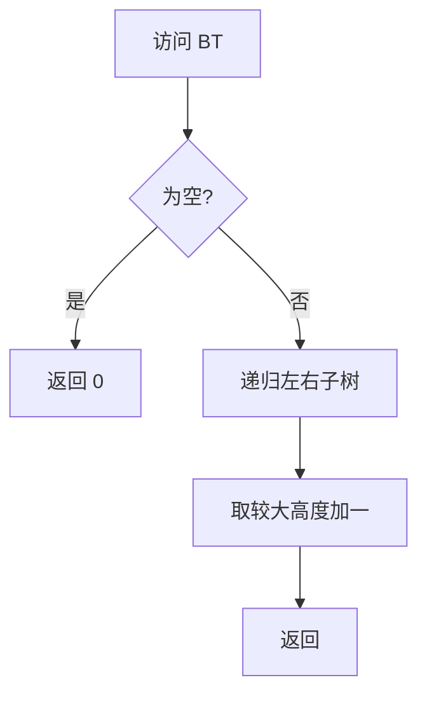

# 6-8 求二叉树高度

- **分值：** 20分

## 题目描述

本题要求给定二叉树的高度。

## 函数接口定义
```cpp
int GetHeight( BinTree BT );
```

其中`BinTree`结构定义如下：

```cpp
typedef struct TNode *Position;
typedef Position BinTree;
struct TNode{
    ElementType Data;
    BinTree Left;
    BinTree Right;
};
```

要求函数返回给定二叉树BT的高度值。

## 裁判测试程序样例
```cpp
#include <iostream>
#include <cstdlib>
#include <algorithm>
using namespace std;

typedef char ElementType;
typedef struct TNode *Position;
typedef Position BinTree;
struct TNode{
    ElementType Data;
    BinTree Left;
    BinTree Right;
};

BinTree CreatBinTree(); /* 实现细节忽略 */
int GetHeight( BinTree BT );

int main()
{
    BinTree BT = CreatBinTree();
    cout << GetHeight(BT) << '\n';
    return 0;
}
/* 你的代码将被嵌在这里 */
```

## 输出样例


```
4
```

### 函数部分

```cpp
int GetHeight(BinTree BT) {
    if (BT == nullptr) return 0;
    return 1 + max(GetHeight(BT->Left), GetHeight(BT->Right));
}
```

### 解题思路

树高等于左右子树高度的较大值加一，空树高度定义为 0。递归自然对应二叉树结构。

### 代码流程说明

从根递归访问所有结点，回溯时计算高度。时间复杂度 `O(n)`，递归空间复杂度 `O(h)`。

### 代码流程图



### 解题流程图


### 复杂度分析

每个结点访问一次，时间复杂度 `O(n)`；调用栈最多 `O(h)`。

### 常见易错点

- 空树高度应返回 0，不能返回 1。
- 当前结点高度要加 1。
- 不要只沿一侧计算高度。
