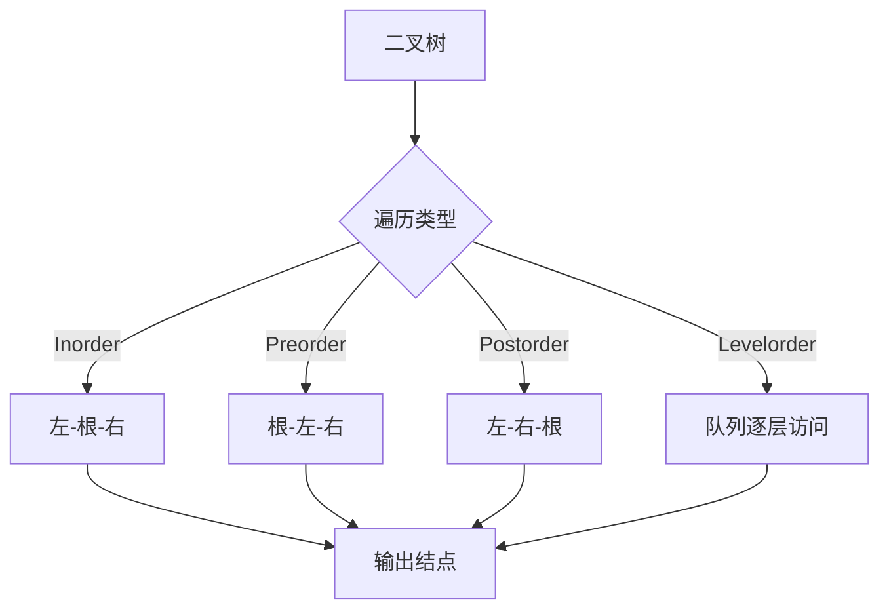
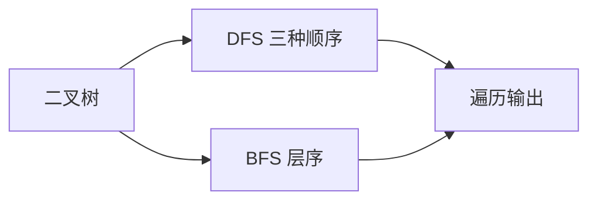

# 6-9 二叉树的遍历

- **分值：** 25分

## 题目描述

本题要求给定二叉树的4种遍历。

## 函数接口定义
```cpp
// 函数接口声明：裁判程序通过此接口调用实现。
void InorderTraversal(BinTree BT);
void PreorderTraversal(BinTree BT);
void PostorderTraversal(BinTree BT);
void LevelorderTraversal(BinTree BT);
```

其中`BinTree`结构定义如下：

```cpp
// 数据结构定义：下面的类型由题目提供，提交时无需重复声明。
typedef struct TNode* Position;
typedef Position BinTree;
struct TNode {
    ElementType Data;
    BinTree Left;
    BinTree Right;
};
```

要求4个函数分别按照访问顺序打印出结点的内容，格式为一个空格跟着一个字符。

## 裁判测试程序样例
```cpp
// 裁判程序示例：用于展示输入、调用和输出流程。
#include <cstdlib>
#include <iostream>
#include <queue>
using namespace std;
typedef char ElementType;
typedef struct TNode* Position;
typedef Position BinTree;
struct TNode {
    ElementType Data;
    BinTree Left;
    BinTree Right;
};
BinTree CreatBinTree();
/* 实现细节忽略 */
void InorderTraversal(BinTree BT);
void PreorderTraversal(BinTree BT);
void PostorderTraversal(BinTree BT);
void LevelorderTraversal(BinTree BT);
int main() {
    BinTree BT = CreatBinTree();
    cout << "Inorder:";
    InorderTraversal(BT);
    cout << '\n';
    cout << "Preorder:";
    PreorderTraversal(BT);
    cout << '\n';
    cout << "Postorder:";
    PostorderTraversal(BT);
    cout << '\n';
    cout << "Levelorder:";
    LevelorderTraversal(BT);
    cout << '\n';
    return 0;
} /* 你的代码将被嵌在这里 */
```

## 输出样例


```
Inorder: D B E F A G H C I
Preorder: A B D F E C G H I
Postorder: D E F B H G I C A
Levelorder: A B C D F G I E H
```

### 函数部分

```cpp
// 实现原理：
// 前三种遍历用递归直接表达访问顺序；层序遍历使用队列按层访问。每个函数都在访问结点前判断空指针。
// 处理流程：
// 深度优先遍历的时间复杂度为 `O(n)`，递归空间为 `O(h)`；层序遍历时间复杂度 `O(n)`，队列空间最坏 `O(n)`。输出时按接口要求在每个字符前打印空格。
void InorderTraversal(BinTree BT) {
    if (!BT)
        return;
    InorderTraversal(BT->Left);
    cout << ' ' << BT->Data;
    InorderTraversal(BT->Right);
}
void PreorderTraversal(BinTree BT) {
    if (!BT)
        return;
    cout << ' ' << BT->Data;
    PreorderTraversal(BT->Left);
    PreorderTraversal(BT->Right);
}
void PostorderTraversal(BinTree BT) {
    if (!BT)
        return;
    PostorderTraversal(BT->Left);
    PostorderTraversal(BT->Right);
    cout << ' ' << BT->Data;
}
void LevelorderTraversal(BinTree BT) {
    if (!BT)
        return;
    queue<BinTree> q;
    q.push(BT);
    while (!q.empty()) {
        BinTree p = q.front();
        q.pop();
        cout << ' ' << p->Data;
        if (p->Left)
            q.push(p->Left);
        if (p->Right)
            q.push(p->Right);
    }
}
```

### 实现原理与解题思路

前三种遍历用递归直接表达访问顺序；层序遍历使用队列按层访问。每个函数都在访问结点前判断空指针。

### 代码流程说明

深度优先遍历的时间复杂度为 `O(n)`，递归空间为 `O(h)`；层序遍历时间复杂度 `O(n)`，队列空间最坏 `O(n)`。输出时按接口要求在每个字符前打印空格。

### 代码流程图



### 解题流程图



### 复杂度分析

每种遍历都访问每个结点一次，时间复杂度 `O(n)`；递归遍历额外空间 `O(h)`，层序遍历队列空间 `O(n)`。

### 常见易错点

- 递归基准必须是空树直接返回。
- 中序、先序、后序的根访问位置不同。
- 层序遍历要先入队根，再依次加入左右孩子。
- 只提交四个函数，不要重复定义结点类型和主程序。
