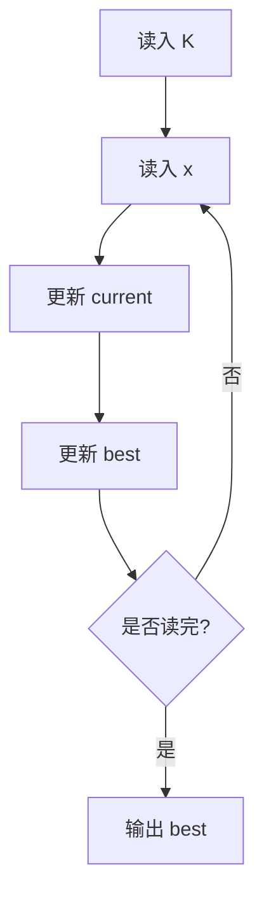

# 7-1 最大子列和问题

- **分值：** 20分

## 题目描述

给定$$K$$个整数组成的序列{ $$N_1$$, $$N_2$$, ..., $$N_K$$ }，“连续子列”被定义为{ $$N_i$$, $$N_{i+1}$$, ..., $$N_j$$ }，其中 $$1 \le i \le j \le K$$。“最大子列和”则被定义为所有连续子列元素的和中最大者。例如给定序列{ -2, 11, -4, 13, -5, -2 }，其连续子列{ 11, -4, 13 }有最大的和20。现要求你编写程序，计算给定整数序列的最大子列和。

本题旨在测试各种不同的算法在各种数据情况下的表现。各组测试数据特点如下：

- 数据1：与样例等价，测试基本正确性；
- 数据2：10<sup>2</sup>个随机整数；
- 数据3：10<sup>3</sup>个随机整数；
- 数据4：10<sup>4</sup>个随机整数；
- 数据5：10<sup>5</sup>个随机整数；

## 输入格式

输入第1行给出正整数$$K$$ ($$\le 100000$$)；第2行给出$$K$$个整数，其间以空格分隔。

## 输出格式

在一行中输出最大子列和。如果序列中所有整数皆为负数，则输出0。

## 输入样例

```
6
-2 11 -4 13 -5 -2
```

## 输出样例

```
20
```

### 解题思路

使用 Kadane 动态规划。`current` 表示以当前位置结尾的最大连续子列和，读入 `x` 后更新为 `max(x, current + x)`；`best` 保存全局最大值。若所有数为负，答案保持题目要求的 0。

### 代码流程说明

1. 读入 `K`，初始化 `current = best = 0`。
2. 逐个读入元素并更新局部最优值与全局最优值。
3. 输出 `best`。时间复杂度 `O(K)`，空间复杂度 `O(1)`。

### 代码实现

```cpp
#include <iostream>
#include <algorithm>
using namespace std;

int main() {
    ios::sync_with_stdio(false);
    cin.tie(nullptr);
    int K;
    cin >> K;
    long long current = 0, best = 0;
    for (int i = 0; i < K; ++i) {
        long long x;
        cin >> x;
        current = max(x, current + x);
        best = max(best, current);
    }
    cout << best << '\n';
    return 0;
}
```

### 代码流程图



### 解题流程图


### 常见易错点

- `current` 必须允许从当前元素重新开始。
- 全负序列按题意输出 0。
- 累加和使用足够大的整数类型。
