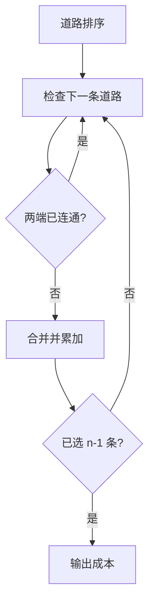

## 7-10 公路村村通

- **分值：** 30分

## 题目描述

现有村落间道路的统计数据表中，列出了有可能建设成标准公路的若干条道路的成本，求使每个村落都有公路连通所需要的最低成本。

## 输入格式

输入数据包括城镇数目正整数 n（\le 1000）和候选道路数目 m（\le 3n）；随后的 m 行对应 m 条道路，每行给出 3 个正整数，分别是该条道路直接连通的两个城镇的编号以及该道路改建的预算成本。为简单起见，城镇从 1 到 n 编号。

## 输出格式

输出村村通需要的最低成本。如果输入数据不足以保证畅通，则输出 -1，表示需要建设更多公路。

## 输入样例
```
6 15
1 2 5
1 3 3
1 4 7
1 5 4
1 6 2
2 3 4
2 4 6
2 5 2
2 6 6
3 4 6
3 5 1
3 6 1
4 5 10
4 6 8
5 6 3
```

## 输出样例
```
12
```

## 实现原理与解题思路

这是最小生成树问题。道路按成本升序排序，用并查集判断两端是否已连通；仅合并不同分量的道路，最后选出的边数为 `n-1` 才能保证村村通。时间复杂度 `O(m log m)`，空间复杂度 `O(n+m)`。

## 代码实现

```cpp
// 实现原理：
// 这是最小生成树问题。道路按成本升序排序，用并查集判断两端是否已连通；仅合并不同分量的道路，最后选出的边数为 `n-1` 才能保证村村通。时间复杂度 `O(m log m)`，空间复杂度
// `O(n+m)`。
// 处理流程：
// 按成本升序排序道路 对每条道路 (u,v,c)：若 find(u) ≠ find(v)，合并并累加 c 若选出 n-1 条边输出总成本，否则输出 -1
#include <algorithm>
#include <iostream>
#include <vector>
using namespace std;
struct Edge {
    int u, v, w;
};
struct DSU {
    vector<int> p;
    DSU(int n) : p(n + 1, -1) {}
    int find(int x) { return p[x] < 0 ? x : p[x] = find(p[x]); }
    bool unite(int a, int b) {
        a = find(a);
        b = find(b);
        if (a == b)
            return false;
        if (p[a] > p[b])
            swap(a, b);
        p[a] += p[b];
        p[b] = a;
        return true;
    }
};
int main() {
    ios::sync_with_stdio(false);
    cin.tie(nullptr);
    int n, m;
    cin >> n >> m;
    vector<Edge> e(m);
    for (auto& x : e)
        cin >> x.u >> x.v >> x.w;
    sort(e.begin(), e.end(), [](auto& a, auto& b) { return a.w < b.w; });
    DSU dsu(n);
    long long ans = 0;
    int used = 0;
    for (auto x : e)
        if (dsu.unite(x.u, x.v))
            ans += x.w, ++used;
    cout << (used == n - 1 ? ans : -1) << '\n';
}
```

## 代码流程说明

```text
按成本升序排序道路
对每条道路 (u,v,c)：若 find(u) ≠ find(v)，合并并累加 c
若选出 n-1 条边输出总成本，否则输出 -1
```

## 代码流程图



## 解题流程图


## 常见易错点

- 不能加入会形成环的道路。
- `n=1` 时答案为 0。
- 必须检查最终是否连通，不能只输出部分累加值。
