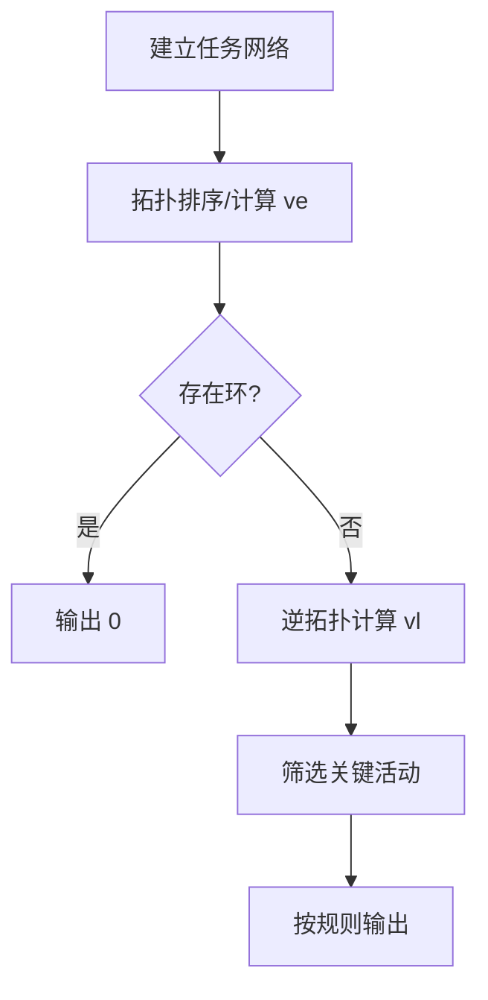

# 7-11 关键活动

- **分值：** 30分

## 题目描述

假定一个工程项目由一组子任务构成，子任务之间有的可以并行执行，有的必须在完成了其它一些子任务后才能执行。“任务调度”包括一组子任务、以及每个子任务可以执行所依赖的子任务集。

比如完成一个专业的所有课程学习和毕业设计可以看成一个本科生要完成的一项工程，各门课程可以看成是子任务。有些课程可以同时开设，比如英语和C程序设计，它们没有必须先修哪门的约束；有些课程则不可以同时开设，因为它们有先后的依赖关系，比如C程序设计和数据结构两门课，必须先学习前者。

但是需要注意的是，对一组子任务，并不是任意的任务调度都是一个可行的方案。比如方案中存在“子任务A依赖于子任务B，子任务B依赖于子任务C，子任务C又依赖于子任务A”，那么这三个任务哪个都不能先执行，这就是一个不可行的方案。

任务调度问题中，如果还给出了完成每个子任务需要的时间，则我们可以算出完成整个工程需要的最短时间。在这些子任务中，有些任务即使推迟几天完成，也不会影响全局的工期；但是有些任务必须准时完成，否则整个项目的工期就要因此延误，这种任务就叫“关键活动”。

请编写程序判定一个给定的工程项目的任务调度是否可行；如果该调度方案可行，则计算完成整个工程项目需要的最短时间，并输出所有的关键活动。

## 输入格式

输入第1行给出两个正整数$$N$$($$\le 100$$)和$$M$$，其中$$N$$是任务交接点（即衔接相互依赖的两个子任务的节点，例如：若任务2要在任务1完成后才开始，则两任务之间必有一个交接点）的数量。交接点按1 ~ $$N$$编号，$$M$$是子任务的数量，依次编号为1 ~ $$M$$。随后$$M$$行，每行给出了3个正整数，分别是该任务开始和完成涉及的交接点编号以及该任务所需的时间，整数间用空格分隔。

## 输出格式

如果任务调度不可行，则输出0；否则第1行输出完成整个工程项目需要的时间，第2行开始输出所有关键活动，每个关键活动占一行，按格式“V->W”输出，其中V和W为该任务开始和完成涉及的交接点编号。关键活动输出的顺序规则是：任务开始的交接点编号小者优先，起点编号相同时，与输入时任务的顺序相反。

## 输入样例
```
7 8
1 2 4
1 3 3
2 4 5
3 4 3
4 5 1
4 6 6
5 7 5
6 7 2
```

## 输出样例
```
17
1->2
2->4
4->6
6->7
```

### 实现原理与解题思路

将交接点视为顶点、任务视为有向边。先拓扑排序并计算事件最早时间 `ve`，再按逆拓扑序计算最迟时间 `vl`。对边 `u→v`，若 `ve[u] == vl[v]-duration`，则它是关键活动。

### 代码流程说明

1. 统计入度并拓扑排序，同时更新 `ve`。
2. 若排序顶点数不足 `N`，说明有环，输出 0。
3. 令 `vl` 初始为工程总工期，逆拓扑更新前驱的最迟时间。
4. 按起点升序、同起点输入逆序输出关键活动。时间复杂度 `O(N+M)`，空间复杂度 `O(N+M)`。

### 代码实现

```cpp
// 实现原理：
// 将交接点视为顶点、任务视为有向边。先拓扑排序并计算事件最早时间 `ve`，再按逆拓扑序计算最迟时间 `vl`。对边 `u→v`，若 `ve[u] == vl[v]-duration`，
// 则它是关键活动。
// 处理流程：
// 1. 统计入度并拓扑排序，同时更新 `ve`。 2. 若排序顶点数不足 `N`，说明有环，输出 0。 3. 令 `vl` 初始为工程总工期，逆拓扑更新前驱的最迟时间。 4. 按起点升序、
// 同起点输入逆序输出关键活动。时间复杂度 `O(N+M)`，空间复杂度 `O(N+M)`。
#include <algorithm>
#include <iostream>
#include <queue>
#include <vector>
using namespace std;
struct Edge {
    int u, v, w, id;
};
int main() {
    ios::sync_with_stdio(false);
    cin.tie(nullptr);
    int n, m;
    cin >> n >> m;
    vector<Edge> e(m);
    vector<vector<int>> out(n + 1);
    vector<int> indeg(n + 1);
    for (int i = 0; i < m; ++i) {
        cin >> e[i].u >> e[i].v >> e[i].w;
        e[i].id = i;
        out[e[i].u].push_back(i);
        ++indeg[e[i].v];
    }
    queue<int> q;
    for (int i = 1; i <= n; ++i)
        if (!indeg[i])
            q.push(i);
    vector<int> order, ve(n + 1);
    while (!q.empty()) {
        int u = q.front();
        q.pop();
        order.push_back(u);
        for (int id : out[u]) {
            auto& x = e[id];
            ve[x.v] = max(ve[x.v], ve[u] + x.w);
            if (!--indeg[x.v])
                q.push(x.v);
        }
    }
    if ((int)order.size() != n) {
        cout << 0 << '\n';
        return 0;
    }
    int total = *max_element(ve.begin() + 1, ve.end());
    vector<int> vl(n + 1, total);
    for (int z = n - 1; z >= 0; --z) {
        int u = order[z];
        for (int id : out[u]) {
            auto& x = e[id];
            vl[u] = min(vl[u], vl[x.v] - x.w);
        }
    }
    vector<Edge> ans;
    for (auto x : e)
        if (ve[x.u] == vl[x.v] - x.w)
            ans.push_back(x);
    sort(ans.begin(), ans.end(),
         [](const Edge& a, const Edge& b) { return a.u != b.u ? a.u < b.u : a.id > b.id; });
    cout << total << '\n';
    for (auto x : ans)
        cout << x.u << "->" << x.v << '\n';
}
```

### 代码流程图



### 解题流程图


### 常见易错点

- 拓扑排序既用于判环，也用于计算 `ve`。
- 逆向更新 `vl` 要取最小值。
- 关键判定和输出顺序都不能混淆。
