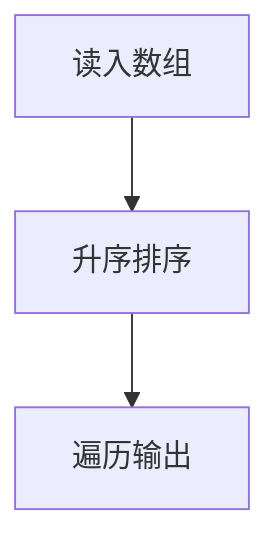

# 7-12 排序

- **分值：** 25分

## 题目描述

给定 $$n$$ 个（长整型范围内的）整数，要求输出从小到大排序后的结果。

本题旨在测试各种不同的排序算法在各种数据情况下的表现。各组测试数据特点如下：

<li>数据1：只有1个元素；
<li>数据2：11个不相同的整数，测试基本正确性；
<li>数据3：10<sup>3</sup>个随机整数；
<li>数据4：10<sup>4</sup>个随机整数；
<li>数据5：10<sup>5</sup>个随机整数；
<li>数据6：10<sup>5</sup>个顺序整数；
<li>数据7：10<sup>5</sup>个逆序整数；
<li>数据8：10<sup>5</sup>个基本有序的整数；
<li>数据9：10<sup>5</sup>个随机正整数，每个数字不超过1000。

## 输入格式

输入第一行给出正整数 $$n$$（$$\le 10^5$$），随后一行给出 $$n$$ 个（长整型范围内的）整数，其间以空格分隔。

## 输出格式

在一行中输出从小到大排序后的结果，数字间以 1 个空格分隔，行末不得有多余空格。

## 输入样例
```
11
4 981 10 -17 0 -20 29 50 8 43 -5
```

## 输出样例
```
-20 -17 -5 0 4 8 10 29 43 50 981
```

### 实现原理与解题思路

数据规模达到 `10^5`，使用 `std::sort` 或归并排序，复杂度为 `O(n log n)`。排序后顺序遍历输出，并在元素之间补空格。

### 代码流程说明

读入数组、升序排序、格式化输出。空间复杂度除输入数组外为库排序所需的辅助空间。

### 代码实现

```cpp
// 实现原理：
// 数据规模达到 `10^5`，使用 `std::sort` 或归并排序，复杂度为 `O(n log n)`。排序后顺序遍历输出，并在元素之间补空格。
// 处理流程：
// 读入数组、升序排序、格式化输出。空间复杂度除输入数组外为库排序所需的辅助空间。
#include <algorithm>
#include <iostream>
#include <vector>
using namespace std;
int main() {
    ios::sync_with_stdio(false);
    cin.tie(nullptr);
    int n;
    cin >> n;
    vector<long long> a(n);
    for (auto& x : a)
        cin >> x;
    sort(a.begin(), a.end());
    for (int i = 0; i < n; ++i) {
        if (i)
            cout << ' ';
        cout << a[i];
    }
    cout << '\n';
}
```

### 代码流程图



### 解题流程图


### 常见易错点

- 使用长整型保存输入。
- 空格只输出在相邻元素之间。
- 最大数据不能使用 `O(n²)` 排序。
