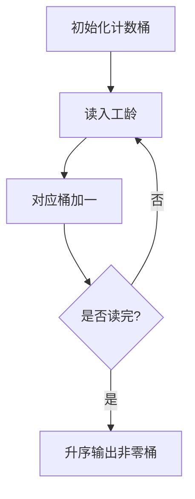

# 7-13 统计工龄

- **分值：** 20分

## 题目描述

给定公司 $$n$$ 名员工的工龄，要求按工龄增序输出每个工龄段有多少员工。

## 输入格式

输入首先给出正整数 $$n$$（$$\le 10^5$$），即员工总人数；随后给出 $$n$$ 个整数，即每个员工的工龄，范围在 [0, 50]。

## 输出格式

按工龄的递增顺序输出每个工龄的员工个数，格式为：“工龄:人数”。每项占一行。如果人数为 0 则不输出该项。

## 输入样例
```
8
10 2 0 5 7 2 5 2
```

## 输出样例
```
0:1
2:3
5:2
7:1
10:1

```

### 解题思路

工龄范围固定为 `[0,50]`，直接用 51 个计数桶统计出现次数，最后从 0 到 50 扫描并输出非零桶。时间复杂度 `O(n+51)`，空间复杂度 `O(51)`。

### 代码实现

```cpp
#include <iostream>
using namespace std;
int main(){
    ios::sync_with_stdio(false); cin.tie(nullptr);
    int n; cin>>n; int cnt[51]={};
    while(n--){int age;cin>>age;++cnt[age];}
    for(int age=0;age<=50;++age) if(cnt[age]) cout<<age<<':'<<cnt[age]<<'\n';
}
```

### 代码流程说明

```text
count[0..50] ← 0
重复 n 次：读入 age；count[age]++
按 age=0..50 扫描：若 count[age]>0，输出 age:count[age]
```

### 代码流程图



### 解题流程图


### 常见易错点

- 工龄 0 是合法数据，不能当作空标记。
- 人数为 0 的工龄不输出。
- 格式为 `工龄:人数`，冒号两侧不加空格。
