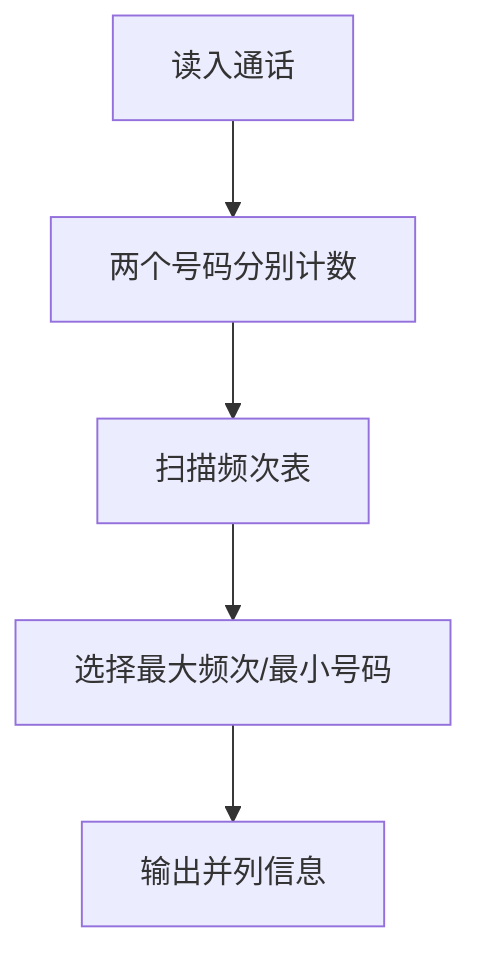
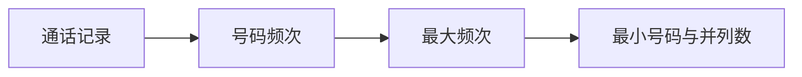

## 7-14 电话聊天狂人

- **分值：** 25分

## 题目描述

给定大量手机用户通话记录，找出其中通话次数最多的聊天狂人。

## 输入格式

输入首先给出正整数$$N$$（$$\le 10^5$$），为通话记录条数。随后$$N$$行，每行给出一条通话记录。简单起见，这里只列出拨出方和接收方的11位数字构成的手机号码，其中以空格分隔。

## 输出格式

在一行中给出聊天狂人的手机号码及其通话次数，其间以空格分隔。如果这样的人不唯一，则输出狂人中最小的号码及其通话次数，并且附加给出并列狂人的人数。

## 输入样例
```
4
13005711862 13588625832
13505711862 13088625832
13588625832 18087925832
15005713862 13588625832
```

## 输出样例
```
13588625832 3
```

## 实现原理与解题思路

用哈希表统计每个号码作为拨出方或接收方的次数。扫描统计结果时按“次数最大、号码最小”选择答案，并统计达到最大次数的号码数量。平均时间复杂度 `O(N)`，空间复杂度 `O(U)`。

## 代码实现

```cpp
// 实现原理：
// 用哈希表统计每个号码作为拨出方或接收方的次数。扫描统计结果时按“次数最大、号码最小”选择答案，并统计达到最大次数的号码数量。平均时间复杂度 `O(N)`，空间复杂度 `O(U)`。
// 处理流程：
// 重复 N 次：读入 a,b；count[a]++；count[b]++ bestCount ← 0 扫描 count：更新最大次数和最小号码，并统计并列号码数 输出号码、次数；
// 并列数大于 1 时继续输出该数量
#include <iostream>
#include <map>
#include <string>
using namespace std;
int main() {
    ios::sync_with_stdio(false);
    cin.tie(nullptr);
    int n;
    cin >> n;
    map<string, int> cnt;
    while (n--) {
        string a, b;
        cin >> a >> b;
        ++cnt[a];
        ++cnt[b];
    }
    int best = 0, many = 0;
    string number;
    for (auto& [s, c] : cnt) {
        if (c > best) {
            best = c;
            number = s;
            many = 1;
        } else if (c == best) {
            ++many;
            if (s < number)
                number = s;
        }
    }
    cout << number << ' ' << best;
    if (many > 1)
        cout << ' ' << many;
    cout << '\n';
}
```

## 代码流程说明

```text
重复 N 次：读入 a,b；count[a]++；count[b]++
bestCount ← 0
扫描 count：更新最大次数和最小号码，并统计并列号码数
输出号码、次数；并列数大于 1 时继续输出该数量
```

## 代码流程图



## 解题流程图



## 常见易错点

- 一条记录的两个号码都要计数。
- 号码建议按字符串处理，避免长度和前导字符问题。
- 并列时选择最小号码并输出并列人数。
