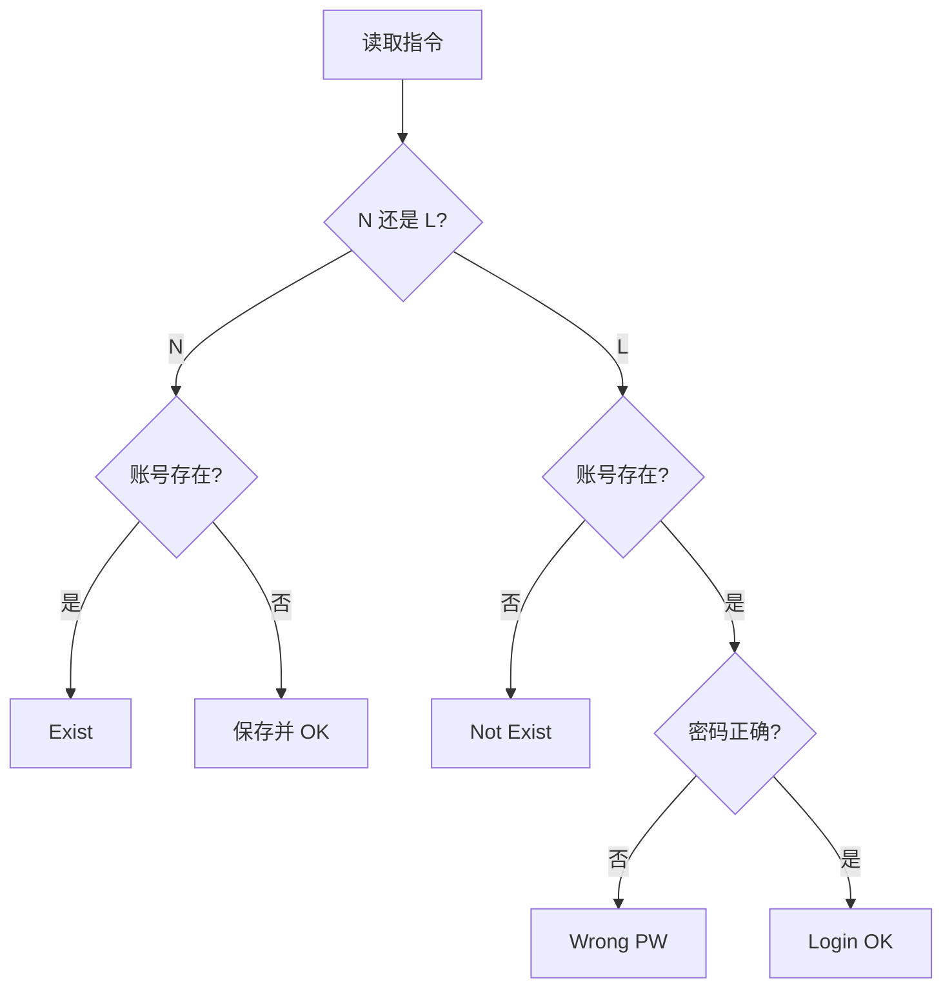

# 7-15 QQ帐户的申请与登陆

- **分值：** 25分

## 题目描述

实现QQ新帐户申请和老帐户登陆的简化版功能。最大挑战是：据说现在的QQ号码已经有10位数了。

## 输入格式

输入首先给出一个正整数$$N$$（$$\le 10^5$$），随后给出$$N$$行指令。每行指令的格式为：“命令符（空格）QQ号码（空格）密码”。其中命令符为“N”（代表New）时表示要新申请一个QQ号，后面是新帐户的号码和密码；命令符为“L”（代表Login）时表示是老帐户登陆，后面是登陆信息。QQ号码为一个不超过10位、但大于1000（据说QQ老总的号码是1001）的整数。密码为不小于6位、不超过16位、且不包含空格的字符串。

## 输出格式

针对每条指令，给出相应的信息：

1）若新申请帐户成功，则输出“New: OK”；<br>
2）若新申请的号码已经存在，则输出“ERROR: Exist”；<br>
3）若老帐户登陆成功，则输出“Login: OK”；<br>
4）若老帐户QQ号码不存在，则输出“ERROR: Not Exist”；<br>
5）若老帐户密码错误，则输出“ERROR: Wrong PW”。

## 输入样例
```
5
L 1234567890 myQQ@qq.com
N 1234567890 myQQ@qq.com
N 1234567890 myQQ@qq.com
L 1234567890 myQQ@qq
L 1234567890 myQQ@qq.com
```

## 输出样例
```
ERROR: Not Exist
New: OK
ERROR: Exist
ERROR: Wrong PW
Login: OK
```

### 解题思路

使用哈希表保存“QQ号码 → 密码”。注册命令只在号码不存在时写入；登录命令依次判断号码是否存在、密码是否一致。

### 代码流程说明

逐条处理 `N` 或 `L` 指令。哈希表操作平均 `O(1)`，总时间复杂度平均 `O(N)`，空间复杂度 `O(U)`。

### 代码实现

```cpp
#include <iostream>
#include <unordered_map>
#include <string>
using namespace std;
int main(){
    ios::sync_with_stdio(false);cin.tie(nullptr);
    int n;cin>>n;unordered_map<string,string> account;
    while(n--){char op;string id,pw;cin>>op>>id>>pw;
        if(op=='N'){
            if(account.count(id)) cout<<"ERROR: Exist\n";
            else account[id]=pw,cout<<"New: OK\n";
        }else if(!account.count(id)) cout<<"ERROR: Not Exist\n";
        else if(account[id]!=pw) cout<<"ERROR: Wrong PW\n";
        else cout<<"Login: OK\n";
    }
}
```

### 代码流程图



### 解题流程图


### 常见易错点

- 注册不能覆盖已有密码。
- 区分账号不存在与密码错误。
- 密码应作为字符串比较。
