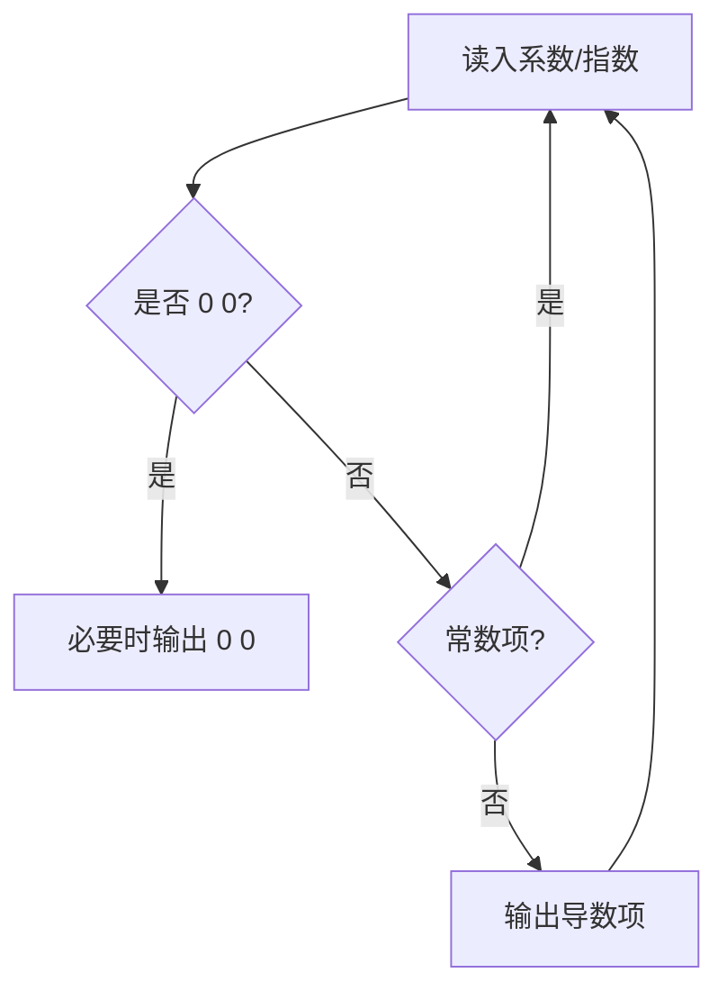

# 7-16 一元多项式求导

- **分值：** 20分

## 题目描述

设计函数求一元多项式的导数。

## 输入格式

以指数递降方式输入多项式非零项系数和指数（绝对值均为不超过1000的整数）。数字间以空格分隔。
注意：零多项式用 `0 0` 表示。

## 输出格式

以与输入相同的格式输出导数多项式非零项的系数和指数。数字间以空格分隔，但结尾不能有多余空格。

## 输入样例
```
3 4 -5 2 6 1 -2 0
```

## 输出样例
```
12 3 -10 1 6 0
```

### 解题思路

对每个非零项 `(c,e)` 使用幂函数求导，得到 `(c×e,e-1)`；常数项导数为 0，直接跳过。输入 `0 0` 表示零多项式，需输出 `0 0`。

### 代码流程说明

按输入顺序逐对处理，边读边输出即可，因此时间复杂度 `O(t)`，额外空间复杂度 `O(1)`。

### 代码实现

```cpp
#include <iostream>
using namespace std;
int main(){
    ios::sync_with_stdio(false);cin.tie(nullptr);
    long long c; int e; bool first=true;
    while(cin>>c>>e){
        if(c==0&&e==0){if(first)cout<<"0 0";break;}
        if(e==0)continue;
        if(!first)cout<<' '; cout<<c*e<<' '<<e-1; first=false;
    }
    cout<<'\n';
}
```

### 代码流程图



### 解题流程图


### 常见易错点

- 常数项不能输出负指数项。
- `0 0` 是零多项式标志，不是普通项。
- 保证项间有空格、行末无多余空格。
