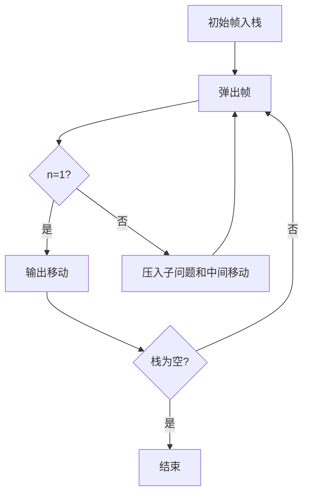

# 7-17 汉诺塔的非递归实现

- **分值：** 25分

## 题目描述

借助堆栈以非递归（循环）方式求解汉诺塔的问题（n, a, b, c），即将N个盘子从起始柱（标记为“a”）通过借助柱（标记为“b”）移动到目标柱（标记为“c”），并保证每个移动符合汉诺塔问题的要求。

## 输入格式

输入为一个正整数N，即起始柱上的盘数。

## 输出格式

每个操作（移动）占一行，按`柱1 -> 柱2`的格式输出。

## 输入样例
```
3
```

## 输出样例
```
a -> c
a -> b
c -> b
a -> c
b -> a
b -> c
a -> c
```

### 实现原理与解题思路

用显式栈保存递归调用帧，模拟 `Hanoi(n, from, aux, to)`。弹出 `n>1` 的帧时，按递归执行顺序的逆序压入右子问题、中间移动和左子问题。

### 代码流程说明

初始问题入栈；`n=1` 输出一次移动，否则拆成两个子问题和一次移动。移动总数为 `2^N-1`，时间复杂度 `O(2^N)`，辅助空间 `O(N)`。

### 代码实现

```cpp
// 实现原理：
// 用显式栈保存递归调用帧，模拟 `Hanoi(n, from, aux, to)`。弹出 `n>1` 的帧时，按递归执行顺序的逆序压入右子问题、中间移动和左子问题。
// 处理流程：
// 初始问题入栈；`n=1` 输出一次移动，否则拆成两个子问题和一次移动。移动总数为 `2^N-1`，时间复杂度 `O(2^N)`，辅助空间 `O(N)`。
#include <iostream>
#include <stack>
using namespace std;
struct Task {
    int n;
    char from, aux, to;
    bool move;
};
int main() {
    int n;
    cin >> n;
    stack<Task> st;
    st.push({n, 'a', 'b', 'c', false});
    while (!st.empty()) {
        Task t = st.top();
        st.pop();
        if (t.move) {
            cout << t.from << " -> " << t.to << '\n';
            continue;
        }
        if (t.n == 1) {
            cout << t.from << " -> " << t.to << '\n';
            continue;
        }
        st.push({t.n - 1, t.aux, t.from, t.to, false});
        st.push({0, t.from, 0, t.to, true});
        st.push({t.n - 1, t.from, t.to, t.aux, false});
    }
}
```

### 代码流程图



### 解题流程图


### 常见易错点

- 栈的压入顺序必须是递归执行顺序的反序。
- 子问题中的三根柱子角色会改变。
- 每次移动严格输出 `柱1 -> 柱2`。
