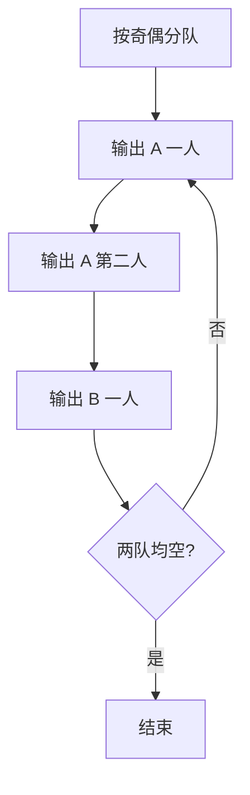

## 7-18 银行业务队列简单模拟

- **分值：** 25分

## 题目描述

设某银行有A、B两个业务窗口，且处理业务的速度不一样，其中A窗口处理速度是B窗口的2倍 —— 即当A窗口每处理完2个顾客时，B窗口处理完1个顾客。给定到达银行的顾客序列，请按业务完成的顺序输出顾客序列。假定不考虑顾客先后到达的时间间隔，并且当不同窗口同时处理完2个顾客时，A窗口顾客优先输出。

## 输入格式

输入为一行正整数，其中第1个数字N(\le1000)为顾客总数，后面跟着N位顾客的编号。编号为奇数的顾客需要到A窗口办理业务，为偶数的顾客则去B窗口。数字间以空格分隔。

## 输出格式

按业务处理完成的顺序输出顾客的编号。数字间以空格分隔，但最后一个编号后不能有多余的空格。

## 输入样例
```
8 2 1 3 9 4 11 13 15
```

## 输出样例
```
1 3 2 9 11 4 13 15
```

## 实现原理与解题思路

奇数顾客进入 A 队列，偶数顾客进入 B 队列。A 每完成两人、B 每完成一人，所以每个周期按 A、A、B 的顺序输出；某一队列为空时跳过该队列。

## 代码流程说明

分队后循环取 A 队首最多两次，再取 B 队首一次，直到两队均空。时间复杂度 `O(N)`，空间复杂度 `O(N)`。

## 代码实现

```cpp
// 实现原理：
// 奇数顾客进入 A 队列，偶数顾客进入 B 队列。A 每完成两人、B 每完成一人，所以每个周期按 A、A、B 的顺序输出；某一队列为空时跳过该队列。
// 处理流程：
// 分队后循环取 A 队首最多两次，再取 B 队首一次，直到两队均空。时间复杂度 `O(N)`，空间复杂度 `O(N)`。
#include <iostream>
#include <queue>
using namespace std;
int main() {
    ios::sync_with_stdio(false);
    cin.tie(nullptr);
    int n;
    cin >> n;
    queue<int> a, b;
    for (int i = 0, x; i < n; ++i) {
        cin >> x;
        (x % 2 ? a : b).push(x);
    }
    bool first = true;
    auto print = [&](int x) {
        if (!first)
            cout << ' ';
        cout << x;
        first = false;
    };
    while (!a.empty() || !b.empty()) {
        if (!a.empty())
            print(a.front()), a.pop();
        if (!a.empty())
            print(a.front()), a.pop();
        if (!b.empty())
            print(b.front()), b.pop();
    }
    cout << '\n';
}
```

## 代码流程图



## 解题流程图


## 常见易错点

- 顾客奇偶性决定窗口，输入位置不参与判断。
- A 的两个顾客要在同周期的 B 顾客之前。
- 队列耗尽后必须跳过，不应输出不存在的元素。
