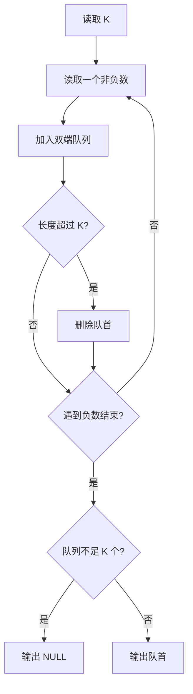

# 7-19 求链式线性表的倒数第K项

- **分值：** 20分

## 题目描述

给定一系列正整数，请设计一个尽可能高效的算法，查找倒数第K个位置上的数字。

## 输入格式

输入首先给出一个正整数K，随后是若干非负整数，最后以一个负整数表示结尾（该负数不算在序列内，不要处理）。

## 输出格式

输出倒数第K个位置上的数据。如果这个位置不存在，输出错误信息`NULL`。

## 输入样例
```
4 1 2 3 4 5 6 7 8 9 0 -1
```

## 输出样例
```
7
```

### 实现原理与解题思路

使用容量为 `K` 的双端队列保存最近读入的元素。每读入一个非负数就加入队尾，超过 `K` 个时从队首删除；读完后队首就是倒数第 `K` 项。时间复杂度 `O(n)`，额外空间 `O(K)`。

### 代码流程说明

1. 负数结束标志不加入缓冲区。
2. 缓冲区长度超过 `K` 时删除最早的元素。
3. 若缓冲区不足 `K` 个元素则输出 `NULL`，否则输出队首。

### 代码实现

```cpp
// 实现原理：
// 使用容量为 `K` 的双端队列保存最近读入的元素。每读入一个非负数就加入队尾，超过 `K` 个时从队首删除；读完后队首就是倒数第 `K` 项。时间复杂度 `O(n)`，额外空间
// `O(K)`。
// 处理流程：
// 1. 负数结束标志不加入缓冲区。 2. 缓冲区长度超过 `K` 时删除最早的元素。 3. 若缓冲区不足 `K` 个元素则输出 `NULL`，否则输出队首。
#include <deque>
#include <iostream>
using namespace std;
int main() {
    ios::sync_with_stdio(false);
    cin.tie(nullptr);
    int k;
    cin >> k;
    deque<int> last;
    int x;
    while (cin >> x && x >= 0) {
        if (k > 0) {
            last.push_back(x);
            if ((int)last.size() > k)
                last.pop_front();
        }
    }
    if (k <= 0 || (int)last.size() < k)
        cout << "NULL\n";
    else
        cout << last.front() << '\n';
}
```

### 代码流程图



### 解题流程图


### 常见易错点

- 负数只表示结束，不能作为数据。
- `K=1` 时应返回尾结点。
- 移动或访问 `fast` 前要判断空指针。
