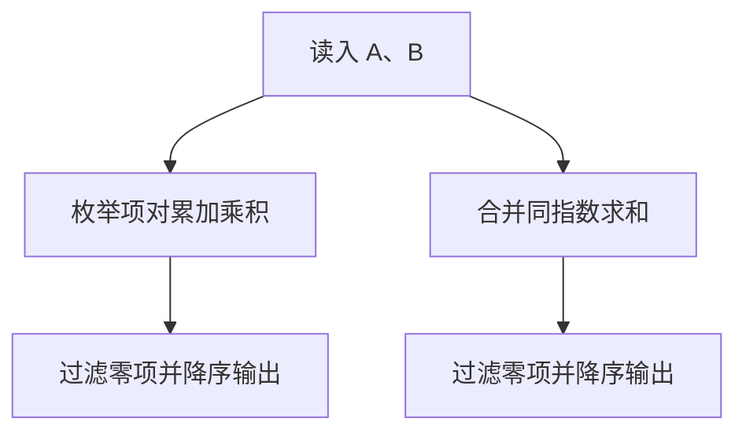

## 7-2 一元多项式的乘法与加法运算

- **分值：** 20分

## 题目描述

设计函数分别求两个一元多项式的乘积与和。

## 输入格式

输入分2行，每行分别先给出多项式非零项的个数，再以指数递降方式输入一个多项式非零项系数和指数（绝对值均为不超过1000的整数）。数字间以空格分隔。

## 输出格式

输出分2行，分别以指数递降方式输出乘积多项式以及和多项式非零项的系数和指数。数字间以空格分隔，但结尾不能有多余空格。零多项式应输出`0 0`。

## 输入样例
```
4 3 4 -5 2  6 1  -2 0
3 5 20  -7 4  3 1
```

## 输出样例
```
15 24 -25 22 30 21 -10 20 -21 8 35 6 -33 5 14 4 -15 3 18 2 -6 1
5 20 -4 4 -5 2 9 1 -2 0
```

## 实现原理与解题思路

用“指数 → 系数”的映射保存多项式。乘法枚举两式的项，将系数乘积累加到指数之和；加法直接合并同指数项。最后按指数降序输出，跳过系数为 0 的项；空结果输出 `0 0`。

## 代码流程说明

1. 读入两组非零项并建立映射。
2. 双重枚举计算乘积并合并同类项。
3. 合并两张映射得到和多项式。
4. 降序输出。设项数为 `p、q`，时间复杂度 `O(pq + U log U)`，空间复杂度 `O(U)`。

## 代码实现

```cpp
// 实现原理：
// 用“指数 → 系数”的映射保存多项式。乘法枚举两式的项，将系数乘积累加到指数之和；加法直接合并同指数项。最后按指数降序输出，跳过系数为 0 的项；空结果输出 `0 0`。
// 处理流程：
// 1. 读入两组非零项并建立映射。 2. 双重枚举计算乘积并合并同类项。 3. 合并两张映射得到和多项式。 4. 降序输出。设项数为 `p、q`，时间复杂度 `O(pq + U log
// U)`，空间复杂度 `O(U)`。
#include <iostream>
#include <map>
using namespace std;
using Poly = map<int, long long>;
Poly readPoly() {
    int n;
    cin >> n;
    Poly p;
    while (n--) {
        long long c;
        int e;
        cin >> c >> e;
        p[e] += c;
    }
    return p;
}
void printPoly(const Poly& p) {
    bool first = true;
    for (auto it = p.rbegin(); it != p.rend(); ++it) {
        if (it->second == 0)
            continue;
        if (!first)
            cout << ' ';
        cout << it->second << ' ' << it->first;
        first = false;
    }
    if (first)
        cout << "0 0";
    cout << '\n';
}
int main() {
    ios::sync_with_stdio(false);
    cin.tie(nullptr);
    Poly a = readPoly(), b = readPoly(), sum = a, product;
    for (auto [e, c] : b)
        sum[e] += c;
    for (auto [ea, ca] : a)
        for (auto [eb, cb] : b)
            product[ea + eb] += ca * cb;
    printPoly(product);
    printPoly(sum);
    return 0;
}
```

## 代码流程图



## 解题流程图


## 常见易错点

- 乘积指数是两指数之和。
- 合并后系数为 0 的项不能输出。
- 注意分别输出乘积和多项式，并保证项按指数递降。
