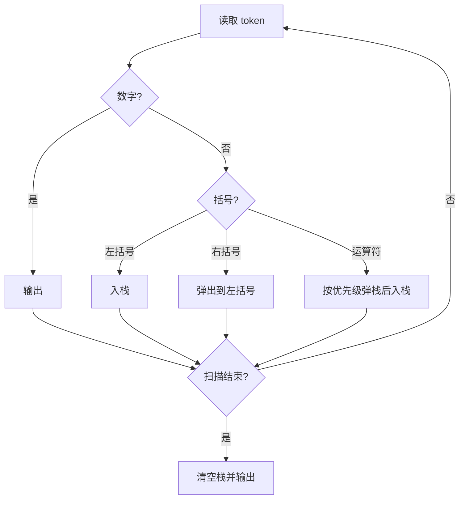

# 7-20 表达式转换

- **分值：** 25分

## 题目描述

算术表达式有前缀表示法、中缀表示法和后缀表示法等形式。日常使用的算术表达式是采用中缀表示法，即二元运算符位于两个运算数中间。请设计程序将中缀表达式转换为后缀表达式。

## 输入格式

输入在一行中给出不含空格的中缀表达式，可包含`+`、`-`、`*`、`/`以及左右括号`()`，表达式不超过20个字符。

## 输出格式

在一行中输出转换后的后缀表达式，要求不同对象（运算数、运算符号）之间以空格分隔，但结尾不得有多余空格。

## 输入样例
```
2+3*(7-4)+8/4
```

## 输出样例
```
2 3 7 4 - * + 8 4 / +
```

### 实现原理与解题思路

使用运算符栈的调度场算法。数字直接输出；左括号入栈；右括号弹出至左括号；运算符按优先级弹出栈顶更高或相等优先级的运算符，再将自身入栈。扫描结束后清空栈。

### 代码流程说明

扫描长度为 `n` 的表达式，操作符只进出栈有限次，因此时间复杂度 `O(n)`，空间复杂度 `O(n)`。

### 代码实现

```cpp
// 实现原理：
// 使用运算符栈的调度场算法。数字直接输出；左括号入栈；右括号弹出至左括号；运算符按优先级弹出栈顶更高或相等优先级的运算符，再将自身入栈。扫描结束后清空栈。
// 处理流程：
// 扫描长度为 `n` 的表达式，操作符只进出栈有限次，因此时间复杂度 `O(n)`，空间复杂度 `O(n)`。
#include <cctype>
#include <iostream>
#include <stack>
#include <string>
using namespace std;
int pri(char c) { return c == '+' || c == '-' ? 1 : 2; }
int main() {
    ios::sync_with_stdio(false);
    cin.tie(nullptr);
    string s;
    cin >> s;
    stack<char> op;
    bool first = true;
    auto out = [&](char c) {
        if (!first)
            cout << ' ';
        cout << c;
        first = false;
    };
    for (char c : s) {
        if (isdigit((unsigned char)c))
            out(c);
        else if (c == '(')
            op.push(c);
        else if (c == ')') {
            while (op.top() != '(')
                out(op.top()), op.pop();
            op.pop();
        } else {
            while (!op.empty() && op.top() != '(' && pri(op.top()) >= pri(c))
                out(op.top()), op.pop();
            op.push(c);
        }
    }
    while (!op.empty())
        out(op.top()), op.pop();
    cout << '\n';
}
```

### 代码流程图



### 解题流程图


### 常见易错点

- 右括号只弹出到对应左括号，左括号不能输出。
- 乘除优先级高于加减。
- 最后必须清空运算符栈。
