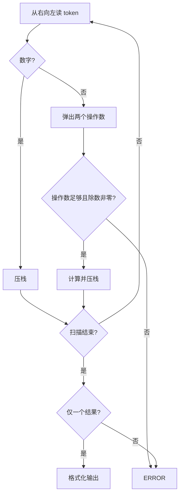
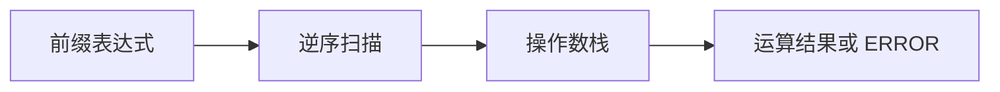

## 7-21 求前缀表达式的值

- **分值：** 25分

## 题目描述

算术表达式有前缀表示法、中缀表示法和后缀表示法等形式。前缀表达式指二元运算符位于两个运算数之前，例如`2+3*(7-4)+8/4`的前缀表达式是：`+ + 2 * 3 - 7 4 / 8 4`。请设计程序计算前缀表达式的结果值。

## 输入格式

输入在一行内给出不超过30个字符的前缀表达式，只包含`+`、`-`、`*`、`/`以及运算数，不同对象（运算数、运算符号）之间以空格分隔。

## 输出格式

输出前缀表达式的运算结果，保留小数点后1位，或错误信息`ERROR`。

## 输入样例
```
+ + 2 * 3 - 7 4 / 8 4
```

## 输出样例
```
13.0
```

## 实现原理与解题思路

从右向左扫描前缀表达式。遇到数字压入操作数栈，遇到运算符弹出右操作数和左操作数，计算后再压回。除法时检查除数是否为 0；若操作数不足或最终栈中不是唯一结果，输出 `ERROR`。

## 代码流程说明

按空格分割 token 后逆序处理。每个 token 只入栈/出栈一次，时间复杂度 `O(n)`，空间复杂度 `O(n)`。

## 代码实现

```cpp
// 实现原理：
// 从右向左扫描前缀表达式。遇到数字压入操作数栈，遇到运算符弹出右操作数和左操作数，计算后再压回。除法时检查除数是否为 0；若操作数不足或最终栈中不是唯一结果，输出 `ERROR`。
// 处理流程：
// 按空格分割 token 后逆序处理。每个 token 只入栈/出栈一次，时间复杂度 `O(n)`，空间复杂度 `O(n)`。
#include <iomanip>
#include <iostream>
#include <sstream>
#include <stack>
#include <string>
#include <vector>
using namespace std;
int main() {
    ios::sync_with_stdio(false);
    cin.tie(nullptr);
    string line, token;
    getline(cin, line);
    stringstream ss(line);
    vector<string> a;
    while (ss >> token)
        a.push_back(token);
    stack<double> st;
    bool ok = true;
    for (int i = (int)a.size() - 1; i >= 0 && ok; --i) {
        if (a[i].size() > 1 || isdigit((unsigned char)a[i][0]) || a[i][0] == '.')
            st.push(stod(a[i]));
        else if (a[i] == "+" || a[i] == "-" || a[i] == "*" || a[i] == "/") {
            if (st.size() < 2) {
                ok = false;
                break;
            }
            double left = st.top();
            st.pop();
            double rhs = st.top();
            st.pop();
            if (a[i] == "/" && rhs == 0) {
                ok = false;
                break;
            }
            if (a[i] == "+")
                st.push(left + rhs);
            else if (a[i] == "-")
                st.push(left - rhs);
            else if (a[i] == "*")
                st.push(left * rhs);
            else
                st.push(left / rhs);
        } else
            ok = false;
    }
    if (!ok || st.size() != 1)
        cout << "ERROR\n";
    else
        cout << fixed << setprecision(1) << st.top() << '\n';
}
```

## 代码流程图



## 解题流程图



## 常见易错点

- 弹出的第一个数是左操作数还是右操作数要保持一致；逆序扫描时先弹出的为左操作数。
- 除数为 0 必须输出 `ERROR`。
- 输出固定保留一位小数。
