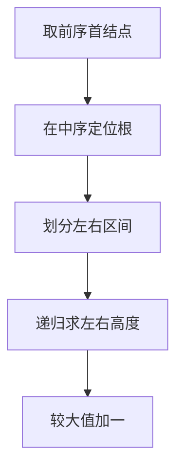

## 7-23 还原二叉树

- **分值：** 25分

## 题目描述

给定一棵二叉树的前序遍历序列和中序遍历序列，要求计算该二叉树的高度。

## 输入格式

输入首先给出正整数 n（\le50），为树中结点总数。随后 2 行先后给出前序和中序遍历序列，均是长度为 n 的不包含重复英文字母（区别大小写）的字符串。

## 输出格式

输出为一个整数，即该二叉树的高度。

## 输入样例
```
9
ABDFGHIEC
FDHGIBEAC
```

## 输出样例
```
5
```

## 实现原理与解题思路

前序序列的首字符是根，在中序序列中找到根即可划分左右子树；递归处理两个区间并返回左右子树高度的较大值加一。

## 代码流程说明

建立字符到中序下标的映射，递归传递前序和中序区间。时间复杂度 `O(n)`，空间复杂度 `O(n)`（映射和递归栈）。

## 代码实现

```cpp
// 实现原理：
// 前序序列的首字符是根，在中序序列中找到根即可划分左右子树；递归处理两个区间并返回左右子树高度的较大值加一。
// 处理流程：
// 建立字符到中序下标的映射，递归传递前序和中序区间。时间复杂度 `O(n)`，空间复杂度 `O(n)`（映射和递归栈）。
#include <algorithm>
#include <iostream>
#include <string>
#include <unordered_map>
using namespace std;
string pre, in;
unordered_map<char, int> pos;
int height(int pl, int il, int n) {
    if (n == 0)
        return 0;
    int k = pos[pre[pl]], left = k - il;
    return max(height(pl + 1, il, left), height(pl + 1 + left, k + 1, n - left - 1)) + 1;
}
int main() {
    int n;
    cin >> n >> pre >> in;
    for (int i = 0; i < n; ++i)
        pos[in[i]] = i;
    cout << height(0, 0, n) << '\n';
}
```

## 代码流程图



## 解题流程图


## 常见易错点

- 左子树大小是根在中序中的位置减去当前中序左边界。
- 前序右子树起点要跳过根和整个左子树。
- 空区间高度为 0，单结点高度为 1。
