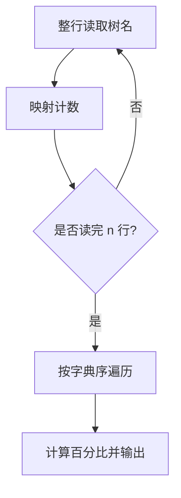
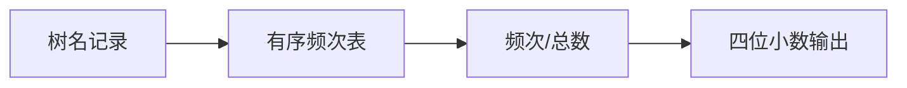

## 7-24 树种统计

- **分值：** 25分

## 题目描述

随着卫星成像技术的应用，自然资源研究机构可以识别每一棵树的种类。请编写程序帮助研究人员统计每种树的数量，计算每种树占总数的百分比。

## 输入格式

输入首先给出正整数 n（\le 10^5），随后 n 行，每行给出卫星观测到的一棵树的种类名称。种类名称由不超过 30 个英文字母和空格组成（大小写有区分）。

## 输出格式

按字典序递增输出各种树的种类名称及其所占总数的百分比，其间以空格分隔，保留小数点后 4 位。

## 输入样例
```
29
Red Alder
Ash
Aspen
Basswood
Ash
Beech
Yellow Birch
Ash
Cherry
Cottonwood
Ash
Cypress
Red Elm
Gum
Hackberry
White Oak
Hickory
Pecan
Hard Maple
White Oak
Soft Maple
Red Oak
Red Oak
White Oak
Poplan
Sassafras
Sycamore
Black Walnut
Willow
```

## 输出样例
```
Ash 13.7931%
Aspen 3.4483%
Basswood 3.4483%
Beech 3.4483%
Black Walnut 3.4483%
Cherry 3.4483%
Cottonwood 3.4483%
Cypress 3.4483%
Gum 3.4483%
Hackberry 3.4483%
Hard Maple 3.4483%
Hickory 3.4483%
Pecan 3.4483%
Poplan 3.4483%
Red Alder 3.4483%
Red Elm 3.4483%
Red Oak 6.8966%
Sassafras 3.4483%
Soft Maple 3.4483%
Sycamore 3.4483%
White Oak 10.3448%
Willow 3.4483%
Yellow Birch 3.4483%
```

**鸣谢青岛大学周强老师修正题面！**

## 实现原理与解题思路

用有序映射统计每种树的出现次数。树名整行读取以保留空格和大小写，最后按映射的字典序遍历，计算 `count/n×100` 并固定输出四位小数。

## 代码流程说明

逐行读入并计数，再按键的字典序输出。时间复杂度 `O(n log U)`，空间复杂度 `O(U)`，`U` 为树种数。

## 代码实现

```cpp
// 实现原理：
// 用有序映射统计每种树的出现次数。树名整行读取以保留空格和大小写，最后按映射的字典序遍历，计算 `count/n×100` 并固定输出四位小数。
// 处理流程：
// 逐行读入并计数，再按键的字典序输出。时间复杂度 `O(n log U)`，空间复杂度 `O(U)`，`U` 为树种数。
#include <iomanip>
#include <iostream>
#include <map>
#include <string>
using namespace std;
int main() {
    ios::sync_with_stdio(false);
    cin.tie(nullptr);
    int n;
    cin >> n;
    string name;
    getline(cin, name);
    map<string, int> cnt;
    for (int i = 0; i < n; ++i) {
        getline(cin, name);
        ++cnt[name];
    }
    cout << fixed << setprecision(4);
    for (auto& [s, c] : cnt)
        cout << s << ' ' << 100.0 * c / n << "%\n";
}
```

## 代码流程图



## 解题流程图



## 常见易错点

- 必须用 `getline`，不能用 `>>` 丢失树名中的空格。
- 百分比计算要使用浮点数。
- 输出百分号且固定四位小数。
