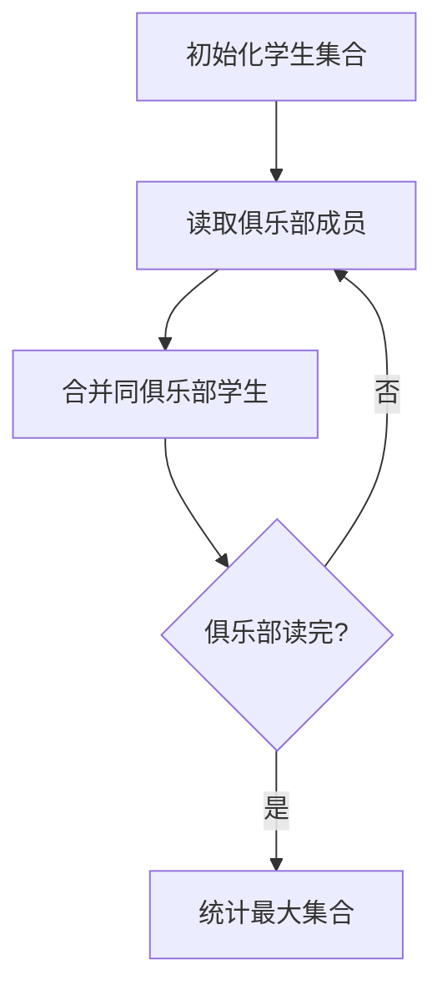

# 7-25 朋友圈

- **分值：** 25分

## 题目描述

某学校有N个学生，形成M个俱乐部。每个俱乐部里的学生有着一定相似的兴趣爱好，形成一个朋友圈。一个学生可以同时属于若干个不同的俱乐部。根据“我的朋友的朋友也是我的朋友”这个推论可以得出，如果A和B是朋友，且B和C是朋友，则A和C也是朋友。请编写程序计算最大朋友圈中有多少人。

## 输入格式

输入的第一行包含两个正整数N（$$\le$$30000）和M（$$\le$$1000），分别代表学校的学生总数和俱乐部的个数。后面的M行每行按以下格式给出1个俱乐部的信息，其中学生从1~N编号：

`第i个俱乐部的人数Mi（空格）学生1（空格）学生2 … 学生Mi`

## 输出格式

输出给出一个整数，表示在最大朋友圈中有多少人。

## 输入样例
```
7 4
3 1 2 3
2 1 4
3 5 6 7
1 6
```

## 输出样例
```
4
```

### 解题思路

把学生视为并查集元素。同一俱乐部中的所有学生依次合并，最终每个集合就是一个朋友圈；统计所有根的集合大小并取最大值。

### 代码流程说明

初始化 `N` 个单元素集合，扫描每个俱乐部并把成员与第一个成员合并，最后统计最大集合大小。时间复杂度 `O((N+总成员数)α(N))`，空间复杂度 `O(N)`。

### 代码实现

```cpp
#include <iostream>
#include <vector>
using namespace std;
struct DSU{vector<int> p,sz;DSU(int n):p(n+1),sz(n+1,1){for(int i=1;i<=n;++i)p[i]=i;}int find(int x){return p[x]==x?x:p[x]=find(p[x]);}void unite(int a,int b){a=find(a);b=find(b);if(a==b)return;if(sz[a]<sz[b])swap(a,b);p[b]=a;sz[a]+=sz[b];}};
int main(){
    ios::sync_with_stdio(false);cin.tie(nullptr);int n,m;cin>>n>>m;DSU d(n);
    while(m--){int k,first,x;cin>>k>>first;for(int i=1;i<k;++i)cin>>x,d.unite(first,x);}
    int ans=0;for(int i=1;i<=n;++i)ans=max(ans,d.sz[d.find(i)]);cout<<ans<<'\n';
}
```

### 代码流程图



### 解题流程图


### 常见易错点

- 一个俱乐部的所有成员都要合并，不只是相邻两人。
- 统计时应使用根结点的集合大小。
- 未参加俱乐部的学生也构成大小为 1 的集合。
