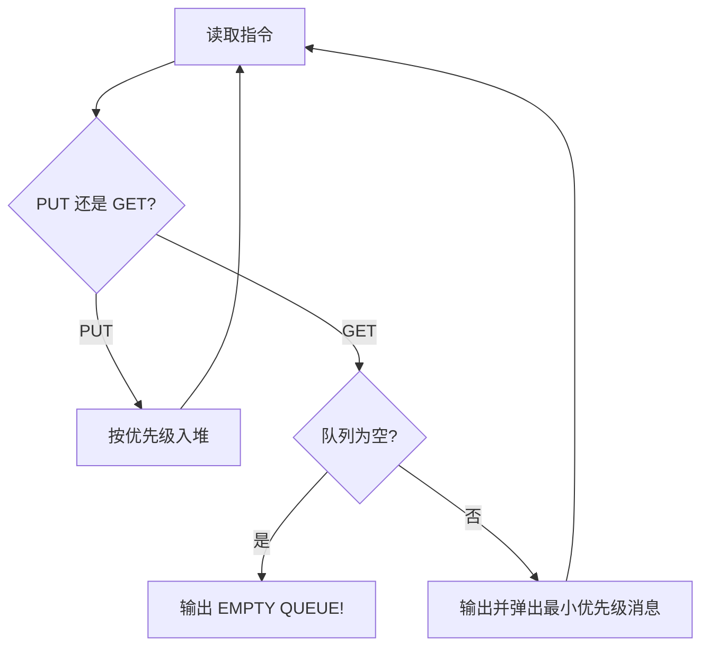

## 7-26 Windows消息队列

- **分值：** 25分

## 题目描述

消息队列是 Windows 系统的基础。对于每个进程，系统维护一个消息队列。如果在进程中有特定事件发生，如点击鼠标、文字改变等，系统将把这个消息连同表示此消息优先级高低的正整数（称为优先级值）加到队列当中。同时，如果队列不是空的，这一进程循环地从队列中按照优先级获取消息。请注意优先级值低意味着优先级高。请编辑程序模拟消息队列，将消息加到队列中以及从队列中获取消息。

## 输入格式

输入第 1 行给出正整数 $n$（$$\le 10^5$$），随后 $n$ 行，每行给出一个指令——`GET` 或 `PUT`，分别表示从队列中取出消息或将消息添加到队列中。如果指令是 `PUT`，后面就有一个消息名称、以及一个正整数表示消息的优先级，此数越小表示优先级越高。消息名称是长度不超过 10 个字符且不含空格的字符串；题目保证队列中消息的优先级无重复，且输入至少有一个 `GET`。

## 输出格式

对于每个 `GET` 指令，在一行中输出消息队列中优先级最高的消息的名称和参数。如果消息队列中没有消息，输出 `EMPTY QUEUE!`。对于 `PUT` 指令则没有输出。

## 输入样例
```
9
PUT msg1 5
PUT msg2 4
GET
PUT msg3 2
PUT msg4 4
GET
GET
GET
GET
```

## 输出样例
```
msg2
msg3
msg4
msg1
EMPTY QUEUE!
```

## 实现原理与解题思路

使用按优先级升序的优先队列保存消息。`PUT` 插入消息和优先级，`GET` 取出堆顶；题目保证队列中优先级不重复，所以无需额外处理同优先级顺序。

## 代码流程说明

逐条处理指令：插入操作为 `O(log n)`，取出操作为 `O(log n)`；总时间复杂度 `O(n log n)`，空间复杂度 `O(n)`。

## 代码实现

```cpp
// 实现原理：
// 使用按优先级升序的优先队列保存消息。`PUT` 插入消息和优先级，`GET` 取出堆顶；题目保证队列中优先级不重复，所以无需额外处理同优先级顺序。
// 处理流程：
// 逐条处理指令：插入操作为 `O(log n)`，取出操作为 `O(log n)`；总时间复杂度 `O(n log n)`，空间复杂度 `O(n)`。
#include <iostream>
#include <queue>
#include <string>
using namespace std;
struct Message {
    string name;
    int priority;
    bool operator>(const Message& x) const { return priority > x.priority; }
};
int main() {
    ios::sync_with_stdio(false);
    cin.tie(nullptr);
    int n;
    cin >> n;
    priority_queue<Message, vector<Message>, greater<Message>> q;
    string op;
    while (n--) {
        cin >> op;
        if (op == "PUT") {
            Message x;
            cin >> x.name >> x.priority;
            q.push(x);
        } else if (q.empty())
            cout << "EMPTY QUEUE!\n";
        else
            cout << q.top().name << '\n', q.pop();
    }
}
```

## 代码流程图



## 解题流程图


## 常见易错点

- 优先级数值越小越先处理。
- `GET` 空队列时输出完整的 `EMPTY QUEUE!`。
- 消息名和优先级都要在 `PUT` 时保存。
