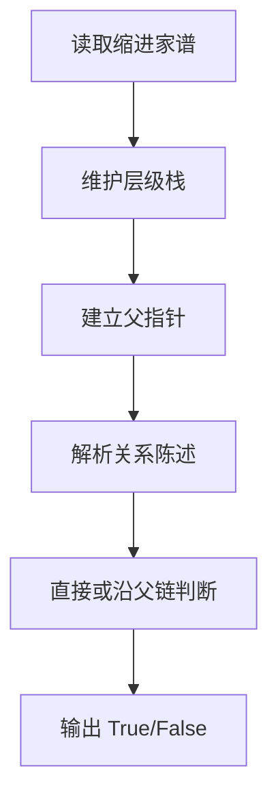

## 7-27 家谱处理

- **分值：** 30分

## 题目描述

人类学研究对于家族很感兴趣，于是研究人员搜集了一些家族的家谱进行研究。实验中，使用计算机处理家谱。为了实现这个目的，研究人员将家谱转换为文本文件。下面为家谱文本文件的实例：

```
LaoLi
  DaLi
    XiaoMing
    XiaoHong
  ErLi
    MeiMei
```

家谱文本文件中，每一行包含一个人的名字。第一行中的名字是这个家族最早的祖先。家谱仅包含最早祖先的后代，而他们的丈夫或妻子不出现在家谱中。每个人的子女比父母多缩进 2 个空格。以上述家谱文本文件为例，`LaoLi` 是这个家族最早的祖先，他有两个孩子 `DaLi` 和 `ErLi`，`DaLi` 有两个孩子 `XiaoMing` 和 `XiaoHong`，`ErLi` 只有一个孩子 `MeiMei`。

在实验中，研究人员还收集了家庭文件，并提取了家谱中有关两个人关系的陈述语句。下面为家谱中关系的陈述语句实例：

```
LaoLi is the parent of DaLi （老李与大李是父子关系）
DaLi is a sibling of ErLi  （大李与二李是兄弟姊妹关系）
MeiMei is a descendant of DaLi （梅梅是大李的后代）
```

研究人员需要判断每个陈述语句是真还是假，请编写程序帮助研究人员判断。

## 输入格式

输入第 1 行给出 2 个正整数 $$n$$（$$2\le n\le 100$$）和 $$m$$（$$\le 100$$），其中 $$n$$ 为家谱中名字的数量，$$m$$ 为家谱中陈述语句的数量。

接下来输入的每行不超过 70 个字符。名字的字符串由不超过 10 个英文字母组成。在家谱中的第一行给出的名字前没有缩进空格。家谱中的其他名字至少缩进 2 个空格，即他们是家谱中最早祖先（第一行给出的名字）的后代，且如果家谱中一个名字前缩进 $$k$$ 个空格，则下一行中名字至多缩进 $$k+2$$ 个空格。

在一个家谱中同样的名字不会出现两次，且家谱中没有出现的名字不会出现在陈述语句中。每句陈述语句格式如下（括号内为解释文字，不是格式的一部分），其中 `X` 和 `Y` 为家谱中的不同名字：
```
X is a child of Y （X是Y的孩子）
X is the parent of Y （X是Y的父母）
X is a sibling of Y （X是Y的兄弟姊妹）
X is a descendant of Y （X是Y的后代）
X is an ancestor of Y （X是Y的祖先）
```

## 输出格式

对于测试用例中的每句陈述语句，如果陈述为真，在一行中输出 `True`；如果陈述为假，在一行中输出 `False`。

## 输入样例
```
6 5
LaoLi
  DaLi
    XiaoMing
    XiaoHong
  ErLi
    MeiMei
DaLi is a child of LaoLi
DaLi is an ancestor of XiaoHong
DaLi is a sibling of ErLi
ErLi is the parent of XiaoMing
LaoLi is a descendant of XiaoHong
```

## 输出样例
```
True
True
True
False
False
```

## 实现原理与解题思路

按缩进恢复父子关系。逐行读取家谱时维护“每个缩进层对应的最近结点”，当前名字的父亲就是上一层栈顶。得到 parent、children 后，关系判断可统一为父子、兄弟或沿 parent 链的祖先/后代。

## 代码流程说明

1. 读取前 `n` 行家谱，利用缩进层建立父指针。
2. 解析每条陈述中的 `X`、关系和 `Y`。
3. 根据 parent 链判断关系并输出 `True/False`。建谱和单次查询均为 `O(n)`，本题规模下足够；空间复杂度 `O(n)`。

## 代码实现

```cpp
// 实现原理：
// 按缩进恢复父子关系。逐行读取家谱时维护“每个缩进层对应的最近结点”，当前名字的父亲就是上一层栈顶。得到 parent、children 后，关系判断可统一为父子、兄弟或沿 parent
// 链的祖先/后代。
// 处理流程：
// 1. 读取前 `n` 行家谱，利用缩进层建立父指针。 2. 解析每条陈述中的 `X`、关系和 `Y`。 3. 根据 parent 链判断关系并输出 `True/False`。
// 建谱和单次查询均为 `O(n)`，本题规模下足够；空间复杂度 `O(n)`。
#include <iostream>
#include <sstream>
#include <string>
#include <unordered_map>
#include <vector>
using namespace std;
int main() {
    ios::sync_with_stdio(false);
    cin.tie(nullptr);
    int n, m;
    cin >> n >> m;
    string line;
    getline(cin, line);
    unordered_map<string, string> parent;
    vector<string> level;
    for (int i = 0; i < n; ++i) {
        getline(cin, line);
        int d = 0;
        while (d < (int)line.size() && line[d] == ' ')
            ++d;
        string name = line.substr(d);
        if (d / 2 < (int)level.size())
            level.resize(d / 2);
        if (!level.empty())
            parent[name] = level.back();
        level.push_back(name);
    }
    auto ancestor = [&](string a, string b) {
        for (auto it = parent.find(b); it != parent.end(); it = parent.find(it->second))
            if (it->second == a)
                return true;
        return false;
    };
    while (m--) {
        string query;
        getline(cin, query);
        while (query.empty())
            getline(cin, query);
        string x, is, a, rel, of, y;
        stringstream ss(query);
        ss >> x >> is >> a >> rel >> of >> y;
        bool ok = false;
        if (rel == "child")
            ok = parent[x] == y;
        else if (rel == "parent")
            ok = parent[y] == x;
        else if (rel == "sibling")
            ok = parent.count(x) && parent.count(y) && parent[x] == parent[y];
        else if (rel == "descendant")
            ok = ancestor(y, x);
        else if (rel == "ancestor")
            ok = ancestor(x, y);
        cout << (ok ? "True" : "False") << '\n';
    }
}
```

## 代码流程图



## 解题流程图


## 常见易错点

- 缩进层应按两个空格一级计算，并处理回退层级。
- sibling 要求父结点相同，不能只比较层级。
- ancestor 和 descendant 的方向相反，判断时不要写反。
