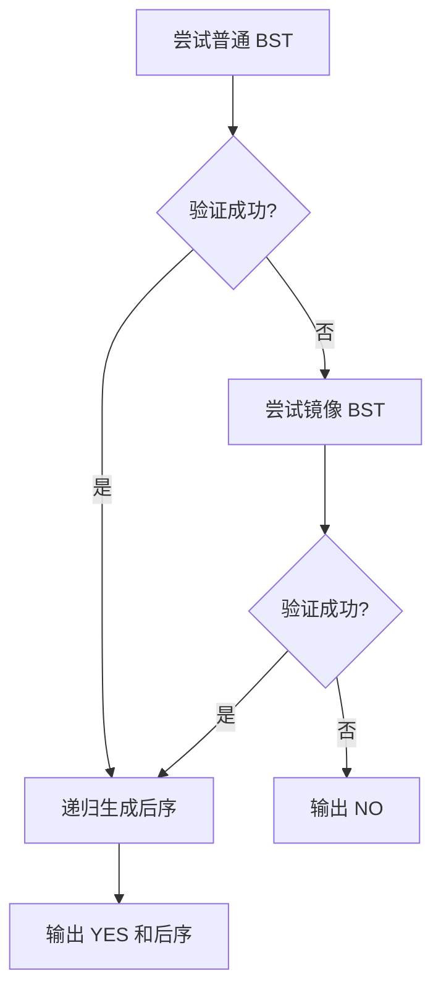

# 7-28 查找树判断

- **分值：** 25分

## 题目描述

对于二叉查找树，我们规定任一结点的左子树仅包含严格小于该结点的键值，而其右子树包含大于或等于该结点的键值。如果我们交换每个节点的左子树和右子树，得到的树叫做镜像二叉查找树。

现在我们给出一个整数键值序列，请编写程序判断该序列是否为某棵二叉查找树或某镜像二叉查找树的前序遍历序列，如果是，则输出对应二叉树的后序遍历序列。

## 输入格式

输入的第一行包含一个正整数 $n$（$\le 1000$），第二行包含 $n$ 个整数，为给出的整数键值序列，数字间以空格分隔。

## 输出格式

输出的第一行首先给出判断结果，如果输入的序列是某棵二叉查找树或某镜像二叉查找树的前序遍历序列，则输出`YES`，否侧输出`NO`。如果判断结果是`YES`，下一行输出对应二叉树的后序遍历序列。数字间以空格分隔，但行尾不能有多余的空格。

## 输入样例1
```
7
8 6 5 7 10 8 11
```

## 输出样例1
```
YES
5 7 6 8 11 10 8
```

## 输入样例2
```
7
8 6 8 5 10 9 11
```

## 输出样例2
```
NO
```

### 解题思路

递归验证一段序列是否能成为 BST 或镜像 BST 的前序序列。首元素为根；普通 BST 中先找连续的小于根的左子树段，剩余部分必须都大于等于根；镜像情况将比较方向反过来。验证通过后按同样分段递归收集后序序列。

### 代码流程说明

对普通规则和镜像规则各尝试一次，任一成功即输出 `YES` 及后序结果。每个区间中的元素被扫描一次，时间复杂度最坏 `O(n²)`，递归空间 `O(n)`。

### 代码实现

```cpp
#include <iostream>
#include <vector>
using namespace std;
vector<int>a,post;
bool build(int l,int r,bool mirror){
    if(l>r)return true;int root=a[l],p=l+1;
    if(!mirror)while(p<=r&&a[p]<root)++p;else while(p<=r&&a[p]>=root)++p;
    int split=p;
    while(p<=r&&(!mirror?a[p]>=root:a[p]<root))++p;
    if(p<=r)return false;
    if(!build(l+1,split-1,mirror)||!build(split,r,mirror))return false;
    post.push_back(root);return true;
}
int main(){int n;cin>>n;a.resize(n);for(int&x:a)cin>>x;bool ok=build(0,n-1,false);if(!ok){post.clear();ok=build(0,n-1,true);}if(!ok){cout<<"NO\n";return 0;}cout<<"YES\n";for(int i=0;i<(int)post.size();++i){if(i)cout<<' ';cout<<post[i];}cout<<'\n';}
```

### 代码流程图



### 解题流程图


### 常见易错点

- 普通 BST 左边是严格小于，右边是大于等于。
- 镜像规则的方向必须整体反转。
- 分段后要检查右区间所有元素，不能只找到分界点就判定成功。
