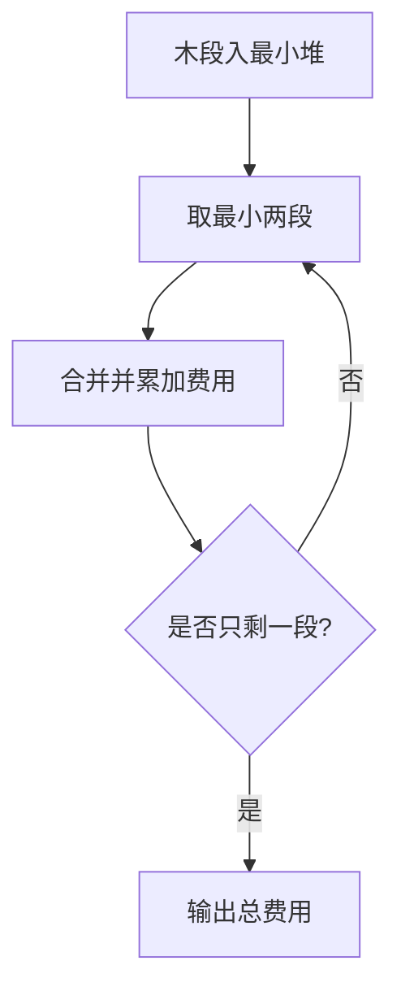

# 7-29 修理牧场

- **分值：** 25分

## 题目描述

农夫要修理牧场的一段栅栏，他测量了栅栏，发现需要 $$n$$ 块木头，每块木头长度为整数 $$l_i$$ 个长度单位，于是他购买了一条很长的、能锯成 $$n$$ 块的木头，即该木头的长度是 $$l_i$$ 的总和。

但是农夫自己没有锯子，请人锯木的酬金跟这段木头的长度成正比。为简单起见，不妨就设酬金等于所锯木头的长度。例如，要将长度为 20 的木头锯成长度为 8、7 和 5 的三段，第一次锯木头花费 20，将木头锯成 12 和 8；第二次锯木头花费 12，将长度为 12 的木头锯成 7 和 5，总花费为 32。如果第一次将木头锯成 15 和 5，则第二次锯木头花费 15，总花费为 35（大于 32）。

请编写程序帮助农夫计算将木头锯成 $$n$$ 块的最少花费。

## 输入格式

输入首先给出正整数 $$n$$（$$\le 10^4$$），表示要将木头锯成 $$n$$ 块。第二行给出 $$n$$ 个正整数（$$\le 50$$），表示每段木块的长度。

## 输出格式

输出一个整数，即将木头锯成 $$n$$ 块的最少花费。

## 输入样例
```
8
4 5 1 2 1 3 1 1
```

## 输出样例
```
49
```

### 实现原理与解题思路

这是哈夫曼合并问题。每次选择当前最短的两段木头合并，支付它们长度之和，再将合并段放回集合。使用最小堆可保证每一步选择最优。

### 代码流程说明

将 `n` 段长度全部入最小堆；反复弹出最小两段、累加和并重新入堆，直到剩一段。时间复杂度 `O(n log n)`，空间复杂度 `O(n)`。

### 代码实现

```cpp
// 实现原理：
// 这是哈夫曼合并问题。每次选择当前最短的两段木头合并，支付它们长度之和，再将合并段放回集合。使用最小堆可保证每一步选择最优。
// 处理流程：
// 将 `n` 段长度全部入最小堆；反复弹出最小两段、累加和并重新入堆，直到剩一段。时间复杂度 `O(n log n)`，空间复杂度 `O(n)`。
#include <functional>
#include <iostream>
#include <queue>
using namespace std;
int main() {
    ios::sync_with_stdio(false);
    cin.tie(nullptr);
    int n;
    cin >> n;
    priority_queue<long long, vector<long long>, greater<long long>> q;
    while (n--) {
        long long x;
        cin >> x;
        q.push(x);
    }
    long long ans = 0;
    while (q.size() > 1) {
        long long x = q.top();
        q.pop();
        long long y = q.top();
        q.pop();
        ans += x + y;
        q.push(x + y);
    }
    cout << ans << '\n';
}
```

### 代码流程图



### 解题流程图


### 常见易错点

- 每次必须取最短的两段，而不是任意两段。
- 合并后的长度要重新放回堆。
- `n=1` 时无需锯切，费用为 0。
