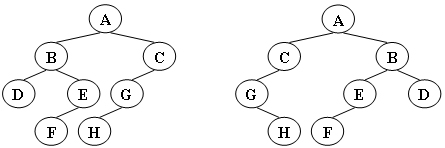
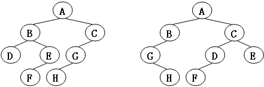
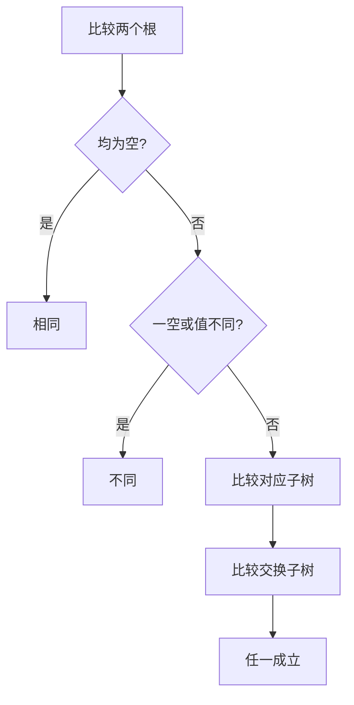
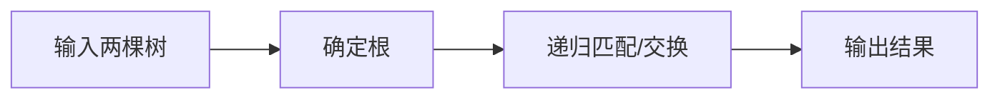

# 7-3 树的同构

- **分值：** 25分

## 题目描述

给定两棵树  $T_1$ 和 $T_2$。如果 $T_1$ 可以通过若干次左右孩子互换就变成 $T_2$，则我们称两棵树是“同构”的。例如图1给出的两棵树就是同构的，因为我们把其中一棵树的结点A、B、G的左右孩子互换后，就得到另外一棵树。而图2就不是同构的。

| 图1 | 图2 |
| :--: | :--: |
|  |  |

现给定两棵树，请你判断它们是否是同构的。

## 输入格式

输入给出2棵二叉树的信息。对于每棵树，首先在一行中给出一个非负整数 $$n$$ ($$\le 10$$)，即该树的结点数（此时假设结点从 0 到 $$n -1$$ 编号）；随后 $$n$$ 行，第 $$i$$ 行对应编号第 $$i$$ 个结点，给出该结点中存储的 1 个英文大写字母、其左孩子结点的编号、右孩子结点的编号。如果孩子结点为空，则在相应位置上给出 “-”。给出的数据间用一个空格分隔。注意：题目保证每个结点中存储的字母是不同的。

## 输出格式

如果两棵树是同构的，输出“Yes”，否则输出“No”。

## 输入样例1（对应图1）
```
8
A 1 2
B 3 4
C 5 -
D - -
E 6 -
G 7 -
F - -
H - -
8
G - 4
B 7 6
F - -
A 5 1
H - -
C 0 -
D - -
E 2 -
```

## 输出样例1
```
Yes
```

## 输入样例2（对应图2）
```
8
B 5 7
F - -
A 0 3
C 6 -
H - -
D - -
G 4 -
E 1 -
8
D 6 -
B 5 -
E - -
H - -
C 0 2
G - 3
F - -
A 1 4
```

## 输出样例2
```
No
```

### 实现原理与解题思路

两棵树同构时，每个根的左右子树可以对应，也可以整体交换。递归比较两个根：均为空则相同，一空或数据不同则不同；否则判断“不交换”和“交换”两种组合，任一成立即可。

### 代码流程说明

1. 读入结点及左右孩子编号，并找出未作为孩子出现的根。
2. 递归比较根值和两种子树对应方式。
3. 输出 `Yes` 或 `No`。时间、空间复杂度均为 `O(n)`。

### 代码实现

```cpp
// 实现原理：
// 两棵树同构时，每个根的左右子树可以对应，也可以整体交换。递归比较两个根：均为空则相同，一空或数据不同则不同；否则判断“不交换”和“交换”两种组合，任一成立即可。
// 处理流程：
// 1. 读入结点及左右孩子编号，并找出未作为孩子出现的根。 2. 递归比较根值和两种子树对应方式。 3. 输出 `Yes` 或 `No`。时间、空间复杂度均为 `O(n)`。
#include <iostream>
#include <string>
#include <vector>
using namespace std;
struct Node {
    char data;
    int left = -1, right = -1;
};
int readTree(vector<Node>& t) {
    int n;
    cin >> n;
    t.assign(n, {});
    vector<bool> child(n, false);
    for (int i = 0; i < n; ++i) {
        string l, r;
        cin >> t[i].data >> l >> r;
        if (l != "-")
            t[i].left = stoi(l), child[t[i].left] = true;
        if (r != "-")
            t[i].right = stoi(r), child[t[i].right] = true;
    }
    if (n == 0)
        return -1;
    for (int i = 0; i < n; ++i)
        if (!child[i])
            return i;
    return -1;
}
bool iso(const vector<Node>& a, int x, const vector<Node>& b, int y) {
    if (x == -1 || y == -1)
        return x == y;
    if (a[x].data != b[y].data)
        return false;
    return (iso(a, a[x].left, b, b[y].left) && iso(a, a[x].right, b, b[y].right)) ||
           (iso(a, a[x].left, b, b[y].right) && iso(a, a[x].right, b, b[y].left));
}
int main() {
    ios::sync_with_stdio(false);
    cin.tie(nullptr);
    vector<Node> a, b;
    int ra = readTree(a), rb = readTree(b);
    cout << (iso(a, ra, b, rb) ? "Yes" : "No") << '\n';
}
```

### 代码流程图



### 解题流程图



### 常见易错点

- 必须考虑左右子树交换，而非只比较固定位置。
- 空结点标记要与合法下标区分。
- 根结点应通过“未被其他结点指向”确定。
