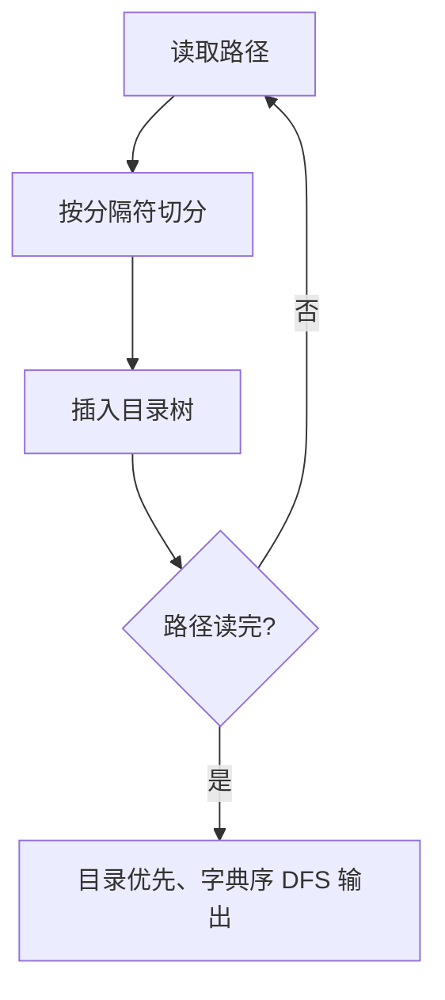

# 7-30 目录树

- **分值：** 30分

## 题目描述

在ZIP归档文件中，保留着所有压缩文件和目录的相对路径和名称。当使用WinZIP等GUI软件打开ZIP归档文件时，可以从这些信息中重建目录的树状结构。请编写程序实现目录的树状结构的重建工作。

## 输入格式

输入首先给出正整数N（$$\le 10^4$$），表示ZIP归档文件中的文件和目录的数量。随后N行，每行有如下格式的文件或目录的相对路径和名称（每行不超过260个字符）：

- 路径和名称中的字符仅包括英文字母（区分大小写）；
- 符号“\”仅作为路径分隔符出现；
- 目录以符号“\”结束；
- 不存在重复的输入项目；
- 整个输入大小不超过2MB。

## 输出格式

假设所有的路径都相对于root目录。从root目录开始，在输出时每个目录首先输出自己的名字，然后以字典序输出所有子目录，然后以字典序输出所有文件。注意，在输出时，应根据目录的相对关系使用空格进行缩进，每级目录或文件比上一级多缩进2个空格。

## 输入样例
```
7
b
c\
ab\cd
a\bc
ab\d
a\d\a
a\d\z\
```

## 输出样例
```
root
  a
    d
      z
      a
    bc
  ab
    cd
    d
  c
  b
```

### 解题思路

用树表示目录层级，每个结点保存名称、子目录和文件。解析路径时按反斜杠分段，逐层创建/查找结点；输出时对子目录和文件分别排序，先递归目录，再输出文件。

### 代码流程说明

读入每条路径并插入树，最后从 `root` 深度优先打印。设路径总长度为 `L`，排序开销为 `O(S log S)`（`S` 为各目录下项目数），空间复杂度 `O(L)`。

### 代码实现

```cpp
#include <iostream>
#include <map>
#include <string>
#include <sstream>
using namespace std;
struct Node{string name;bool file=false;map<string,Node*> child;Node(string s=""):name(move(s)){} };
void print(Node* u,int dep){
    cout<<string(dep*2,' ')<<u->name<<'\n';
    for(auto &[name,v]:u->child)if(!v->file)print(v,dep+1);
    for(auto &[name,v]:u->child)if(v->file)print(v,dep+1);
}
int main(){ios::sync_with_stdio(false);cin.tie(nullptr);int n;cin>>n;string s;getline(cin,s);Node root("root");
    while(n--){getline(cin,s);stringstream ss(s);string part;Node*cur=&root;while(getline(ss,part,'\\')){if(part.empty())continue;bool last=ss.eof();if(!cur->child.count(part))cur->child[part]=new Node(part);cur=cur->child[part];if(last&&s.back()!='\\')cur->file=true;}}
    print(&root,0);
}
```

### 代码流程图



### 解题流程图


### 常见易错点

- 目录名结尾的 `\\` 只是类型标记，不应创建空名称结点。
- 输出顺序是目录在前、文件在后，各自字典序。
- 每深入一级缩进 2 个空格。
