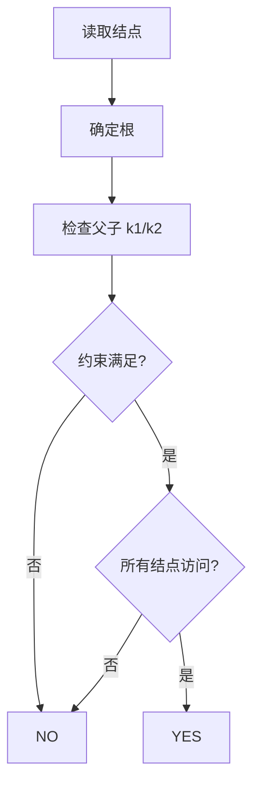
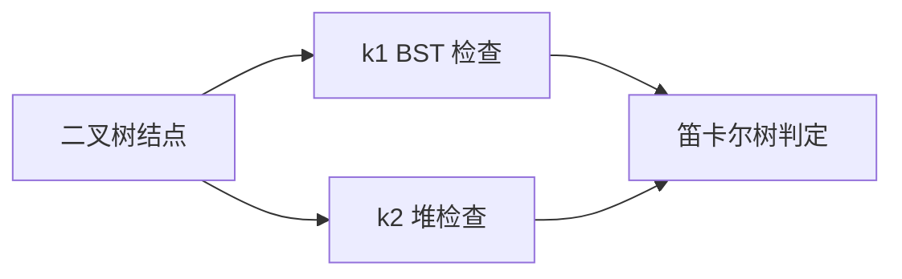

# 7-31 笛卡尔树

- **分值：** 25分

## 题目描述

笛卡尔树是一种特殊的二叉树，其结点包含两个关键字 $k_1$ 和 $k_2$。首先笛卡尔树是关于 $k_1$ 的二叉查找树，即结点左子树的所有 $k_1$ 值都比该结点的 $k_1$ 值小，右子树则大。其次所有结点的 $k_2$ 关键字满足优先队列（不妨设为最小堆）的顺序要求，即该结点的 $k_2$ 值比其子树中所有结点的 $k_2$ 值小。给定一棵二叉树，请判断该树是否笛卡尔树。

## 输入格式

输入首先给出正整数 $n$（$\le 1000$），为树中结点的个数。随后 $n$ 行，每行给出一个结点的信息，包括：结点的 $k_1$ 值、$k_2$ 值、左孩子结点编号、右孩子结点编号。设结点从0~($n-1$)顺序编号。若某结点不存在孩子结点，则该位置给出 $-1$。

## 输出格式

输出`YES`如果该树是一棵笛卡尔树；否则输出`NO`。

## 输入样例1
```
6
8 27 5 1
9 40 -1 -1
10 20 0 3
12 21 -1 4
15 22 -1 -1
5 35 -1 -1
```

## 输出样例1
```
YES
```

## 输入样例2
```
6
8 27 5 1
9 40 -1 -1
10 20 0 3
12 11 -1 4
15 22 -1 -1
50 35 -1 -1
```

## 输出样例2
```
NO
```

### 实现原理与解题思路

先根据孩子编号找根，再从根 DFS。对每条父子边同时检查 BST 的 `k1` 关系和最小堆的 `k2` 关系：左孩子 `k1` 必须更小，右孩子 `k1` 必须更大，且孩子 `k2` 不得小于父结点 `k2`。

### 代码流程说明

标记所有孩子并确定根，递归检查每个结点和直接孩子；同时统计访问数以排除不连通结构。时间复杂度 `O(n)`，空间复杂度 `O(n)`。

### 代码实现

```cpp
// 实现原理：
// 先根据孩子编号找根，再从根 DFS。对每条父子边同时检查 BST 的 `k1` 关系和最小堆的 `k2` 关系：左孩子 `k1` 必须更小，右孩子 `k1` 必须更大，且孩子 `k2`
// 不得小于父结点 `k2`。
// 处理流程：
// 标记所有孩子并确定根，递归检查每个结点和直接孩子；同时统计访问数以排除不连通结构。时间复杂度 `O(n)`，空间复杂度 `O(n)`。
#include <iostream>
#include <vector>
using namespace std;
struct Node {
    int k1, k2, l, r;
};
int main() {
    ios::sync_with_stdio(false);
    cin.tie(nullptr);
    int n;
    cin >> n;
    vector<Node> a(n);
    vector<bool> has(n);
    for (auto& x : a) {
        cin >> x.k1 >> x.k2 >> x.l >> x.r;
        if (x.l != -1)
            has[x.l] = true;
        if (x.r != -1)
            has[x.r] = true;
    }
    int root = -1;
    for (int i = 0; i < n; ++i)
        if (!has[i])
            root = i;
    vector<bool> vis(n);
    bool ok = true;
    auto dfs = [&](auto&& self, int v, long long low, long long high, long long parentK2) -> void {
        if (v == -1 || !ok)
            return;
        if (vis[v]) {
            ok = false;
            return;
        }
        vis[v] = true;
        auto& x = a[v];
        if (x.k1 <= low || x.k1 >= high || x.k2 <= parentK2)
            ok = false;
        self(self, x.l, low, x.k1, x.k2);
        self(self, x.r, x.k1, high, x.k2);
    };
    if (root == -1)
        ok = false;
    else
        dfs(dfs, root, -(1LL << 60), (1LL << 60), -(1LL << 60));
    for (bool x : vis)
        if (!x)
            ok = false;
    cout << (ok ? "YES" : "NO") << '\n';
}
```

### 代码流程图



### 解题流程图



### 常见易错点

- `k2` 是最小堆，父结点不能大于孩子。
- BST 约束需要区分左孩子和右孩子。
- 要检查根和所有结点，不能只检查局部输入行。
