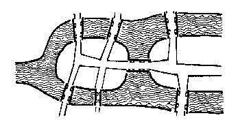
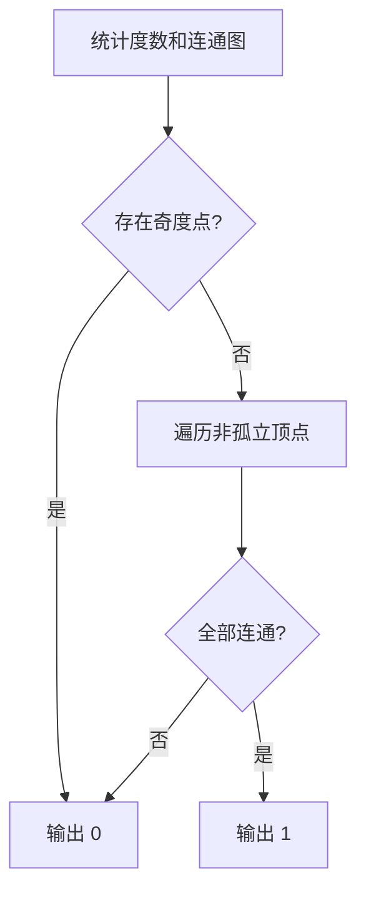
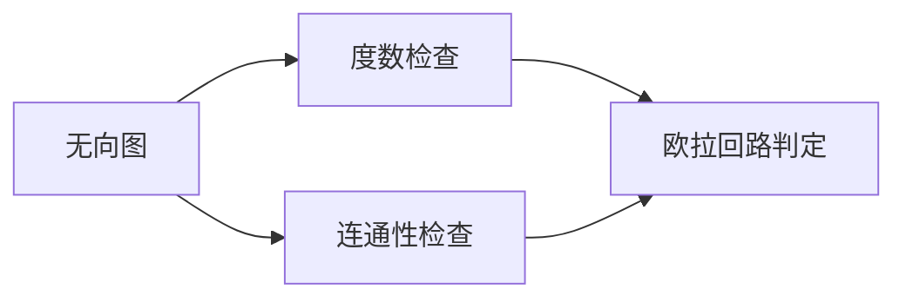

## 7-32 哥尼斯堡的“七桥问题”

- **分值：** 25分

## 题目描述

哥尼斯堡是位于普累格河上的一座城市，它包含两个岛屿及连接它们的七座桥，如下图所示。



可否走过这样的七座桥，而且每桥只走过一次？瑞士数学家欧拉(Leonhard Euler，1707—1783)最终解决了这个问题，并由此创立了拓扑学。

这个问题如今可以描述为判断欧拉回路是否存在的问题。欧拉回路是指不令笔离开纸面，可画过图中每条边仅一次，且可以回到起点的一条回路。现给定一个无向图，问是否存在欧拉回路？

## 输入格式

输入第一行给出两个正整数，分别是节点数 n （1\le n\le 1000）和边数 m；随后的 m 行对应 m 条边，每行给出一对正整数，分别是该条边直接连通的两个节点的编号（节点从1到 n 编号）。

## 输出格式

若欧拉回路存在则输出 1，否则输出 0。

## 输入样例1
```
6 10
1 2
2 3
3 1
4 5
5 6
6 4
1 4
1 6
3 4
3 6
```

## 输出样例1
```
1
```

## 输入样例2
```
5 8
1 2
1 3
2 3
2 4
2 5
5 3
5 4
3 4
```

## 输出样例2
```
0
```

## 实现原理与解题思路

无向图存在欧拉回路的充要条件是：所有非零度顶点属于同一个连通分量，且每个顶点的度数为偶数。先统计度数，再从任一有边顶点 DFS/BFS 检查连通性。

## 代码流程说明

建图并统计度数，检查奇度点；若无奇度点，再检查所有有边顶点是否可达。时间复杂度 `O(n+m)`，空间复杂度 `O(n+m)`。

## 代码实现

```cpp
// 实现原理：
// 无向图存在欧拉回路的充要条件是：所有非零度顶点属于同一个连通分量，且每个顶点的度数为偶数。先统计度数，再从任一有边顶点 DFS/BFS 检查连通性。
// 处理流程：
// 建图并统计度数，检查奇度点；若无奇度点，再检查所有有边顶点是否可达。时间复杂度 `O(n+m)`，空间复杂度 `O(n+m)`。
#include <iostream>
#include <vector>
using namespace std;
int main() {
    ios::sync_with_stdio(false);
    cin.tie(nullptr);
    int n, m;
    cin >> n >> m;
    vector<vector<int>> g(n + 1);
    vector<int> d(n + 1);
    while (m--) {
        int u, v;
        cin >> u >> v;
        g[u].push_back(v);
        g[v].push_back(u);
        ++d[u];
        ++d[v];
    }
    int s = 1;
    while (s <= n && !d[s])
        ++s;
    vector<bool> vis(n + 1);
    if (s <= n) {
        vector<int> st{s};
        vis[s] = true;
        while (!st.empty()) {
            int v = st.back();
            st.pop_back();
            for (int u : g[v])
                if (!vis[u])
                    vis[u] = true, st.push_back(u);
        }
    }
    bool ok = true;
    for (int i = 1; i <= n; ++i)
        if (d[i] % 2 != 0 || (d[i] != 0 && !vis[i]))
            ok = false;
    cout << (ok ? 1 : 0) << '\n';
}
```

## 代码流程图



## 解题流程图



## 常见易错点

- 孤立顶点不影响有边部分的连通性。
- 只检查所有度数为偶数还不够，必须检查连通性。
- 每条无向边的两个端点度数都要加一。
