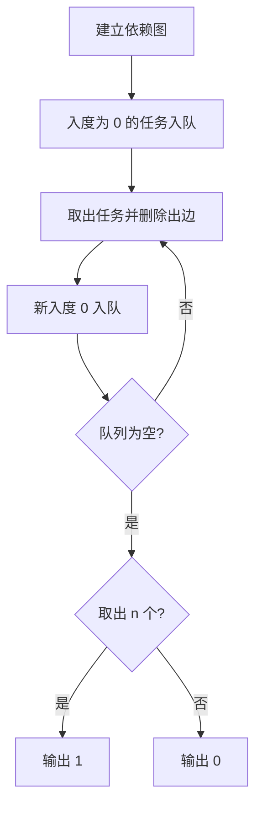

## 7-34 任务调度的合理性

- **分值：** 25分

## 题目描述

假定一个工程项目由一组子任务构成，子任务之间有的可以并行执行，有的必须在完成了其它一些子任务后才能执行。“任务调度”包括一组子任务、以及每个子任务可以执行所依赖的子任务集。

比如完成一个专业的所有课程学习和毕业设计可以看成一个本科生要完成的一项工程，各门课程可以看成是子任务。有些课程可以同时开设，比如英语和 C 程序设计，它们没有必须先修哪门的约束；有些课程则不可以同时开设，因为它们有先后的依赖关系，比如 C 程序设计和数据结构两门课，必须先学习前者。

但是需要注意的是，对一组子任务，并不是任意的任务调度都是一个可行的方案。比如方案中存在“子任务 $a$ 依赖于子任务 $b$，子任务 $b$ 依赖于子任务 $c$，子任务 $c$ 又依赖于子任务 $a$”，那么这三个任务哪个都不能先执行，这就是一个不可行的方案。你现在的工作是写程序判定任何一个给定的任务调度是否可行。

## 输入格式

输入说明：输入第一行给出子任务数 $$n$$（$$\le 100$$），子任务按 1 ~ $$n$$ 编号。随后 $$n$$ 行，每行给出一个子任务的依赖集合：首先给出依赖集合中的子任务数 $$k$$，随后给出 $$k$$ 个子任务编号，整数之间都用空格分隔。

## 输出格式

如果方案可行，则输出 1，否则输出 0。

## 输入样例1
```
12
0
0
2 1 2
0
1 4
1 5
2 3 6
1 3
2 7 8
1 7
1 10
1 7
```

## 输出样例1
```
1
```

## 输入样例2
```
5
1 4
2 1 4
2 2 5
1 3
0
```

## 实现原理与解题思路

依赖关系构成有向图。对每个任务的依赖 `v` 建边 `v→task`，统计入度并执行 Kahn 拓扑排序；若能取出的任务数等于 `n`，说明无环、调度可行。

## 代码流程说明

初始化入度，把所有入度为 0 的任务入队；每取出一个任务就删除其出边并更新入度。时间复杂度 `O(n+e)`，空间复杂度 `O(n+e)`。

## 代码实现

```cpp
// 实现原理：
// 依赖关系构成有向图。对每个任务的依赖 `v` 建边 `v→task`，统计入度并执行 Kahn 拓扑排序；若能取出的任务数等于 `n`，说明无环、调度可行。
// 处理流程：
// 初始化入度，把所有入度为 0 的任务入队；每取出一个任务就删除其出边并更新入度。时间复杂度 `O(n+e)`，空间复杂度 `O(n+e)`。
#include <iostream>
#include <queue>
#include <vector>
using namespace std;
int main() {
    ios::sync_with_stdio(false);
    cin.tie(nullptr);
    int n;
    cin >> n;
    vector<vector<int>> g(n + 1);
    vector<int> in(n + 1);
    for (int v = 1; v <= n; ++v) {
        int k;
        cin >> k;
        while (k--) {
            int u;
            cin >> u;
            g[u].push_back(v);
            ++in[v];
        }
    }
    queue<int> q;
    for (int i = 1; i <= n; ++i)
        if (!in[i])
            q.push(i);
    int cnt = 0;
    while (!q.empty()) {
        int u = q.front();
        q.pop();
        ++cnt;
        for (int v : g[u])
            if (!--in[v])
                q.push(v);
    }
    cout << (cnt == n ? 1 : 0) << '\n';
}
```

## 代码流程图



## 解题流程图


## 常见易错点

- 依赖方向应从前置任务指向后置任务。
- 不能只判断是否存在入度为 0 的任务，还要统计完整拓扑序长度。
- 重复依赖边会影响入度，最好按输入边逐条处理。

## 输出样例2
```
0
```
