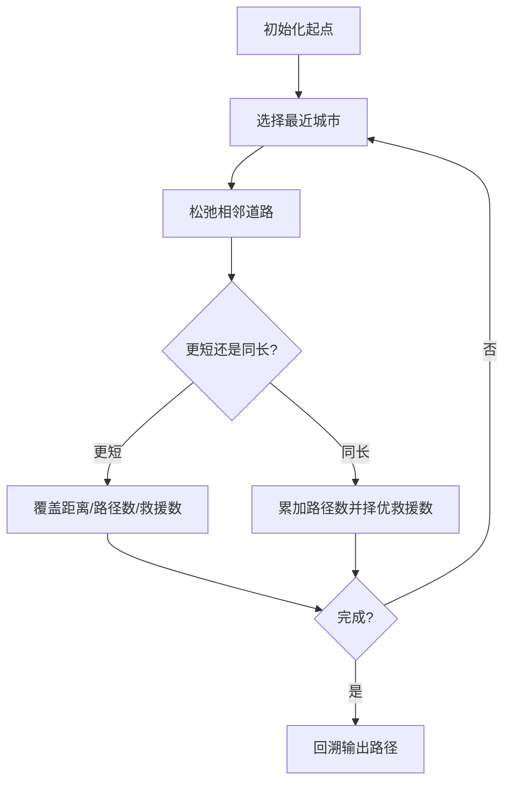
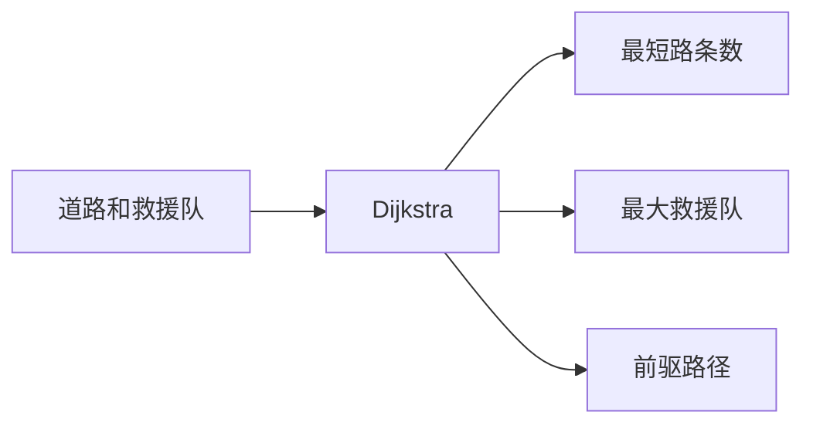

# 7-35 城市间紧急救援

- **分值：** 25分

## 题目描述

作为一个城市的应急救援队伍的负责人，你有一张特殊的全国地图。在地图上显示有多个分散的城市和一些连接城市的快速道路。每个城市的救援队数量和每一条连接两个城市的快速道路长度都标在地图上。当其他城市有紧急求助电话给你的时候，你的任务是带领你的救援队尽快赶往事发地，同时，一路上召集尽可能多的救援队。

## 输入格式

输入第一行给出 4 个正整数 $$n$$、$$m$$、$$s$$、$$d$$，其中 $$n$$（$$2\le n\le 500$$）是城市的个数，顺便假设城市的编号为 0 ~ $$(n-1)$$；$$m$$ 是快速道路的条数；$$s$$ 是出发地的城市编号；$$d$$是目的地的城市编号。

第二行给出 $$n$$ 个正整数，其中第 $$i$$ 个数是第 $$i$$ 个城市的救援队的数目，数字间以空格分隔。随后的 $$m$$ 行中，每行给出一条快速道路的信息，分别是：城市 1、城市 2、快速道路的长度，中间用空格分开，数字均为整数且不超过 500。输入保证救援可行且最优解唯一。

## 输出格式

第一行输出最短路径的条数和能够召集的最多的救援队数量。第二行输出从 $$s$$ 到 $$d$$ 的路径中经过的城市编号。数字间以空格分隔，输出结尾不能有多余空格。

## 输入样例
```
4 5 0 3
20 30 40 10
0 1 1
1 3 2
0 3 3
0 2 2
2 3 2
```

## 输出样例
```
2 60
0 1 3
```

### 解题思路

使用 Dijkstra，同时维护最短距离 `dist`、最短路径数 `ways`、最多救援队数 `teams` 和前驱 `pre`。发现更短路径时覆盖三者；距离相等时累加路径数，并保留救援队更多的前驱。

### 代码流程说明

从起点初始化 `ways=1`、`teams=救援队数`，不断选取最近城市并松弛邻边。结束后沿前驱回溯路径。时间复杂度 `O(n²+m)`，空间复杂度 `O(n+m)`。

### 代码实现

```cpp
#include <iostream>
#include <vector>
#include <algorithm>
using namespace std;
struct Edge{int to,w;};
int main(){ios::sync_with_stdio(false);cin.tie(nullptr);int n,m,s,d;cin>>n>>m>>s>>d;vector<int>team(n);for(int&x:team)cin>>x;vector<vector<Edge>>g(n);while(m--){int u,v,w;cin>>u>>v>>w;g[u].push_back({v,w});g[v].push_back({u,w});}
    const int INF=1e9;vector<int>dis(n,INF),ways(n),res(n),pre(n,-1);vector<bool>done(n);dis[s]=0;ways[s]=1;res[s]=team[s];
    for(int it=0;it<n;++it){int v=-1;for(int i=0;i<n;++i)if(!done[i]&&(v==-1||dis[i]<dis[v]))v=i;if(v==-1||dis[v]==INF)break;done[v]=true;
        for(auto e:g[v]){int nd=dis[v]+e.w;if(nd<dis[e.to])dis[e.to]=nd,ways[e.to]=ways[v],res[e.to]=res[v]+team[e.to],pre[e.to]=v;else if(nd==dis[e.to]){ways[e.to]+=ways[v];if(res[v]+team[e.to]>res[e.to])res[e.to]=res[v]+team[e.to],pre[e.to]=v;}}
    }
    vector<int>path;for(int v=d;v!=-1;v=pre[v])path.push_back(v);reverse(path.begin(),path.end());cout<<ways[d]<<' '<<res[d]<<'\n';for(int i=0;i<(int)path.size();++i){if(i)cout<<' ';cout<<path[i];}cout<<'\n';
}
```

### 代码流程图



### 解题流程图



### 常见易错点

- 同长度路径要累加条数，不能只保留一条。
- 救援队数量只在距离相同的候选中比较。
- 前驱回溯后要反转，才能输出从 `s` 到 `d`。
