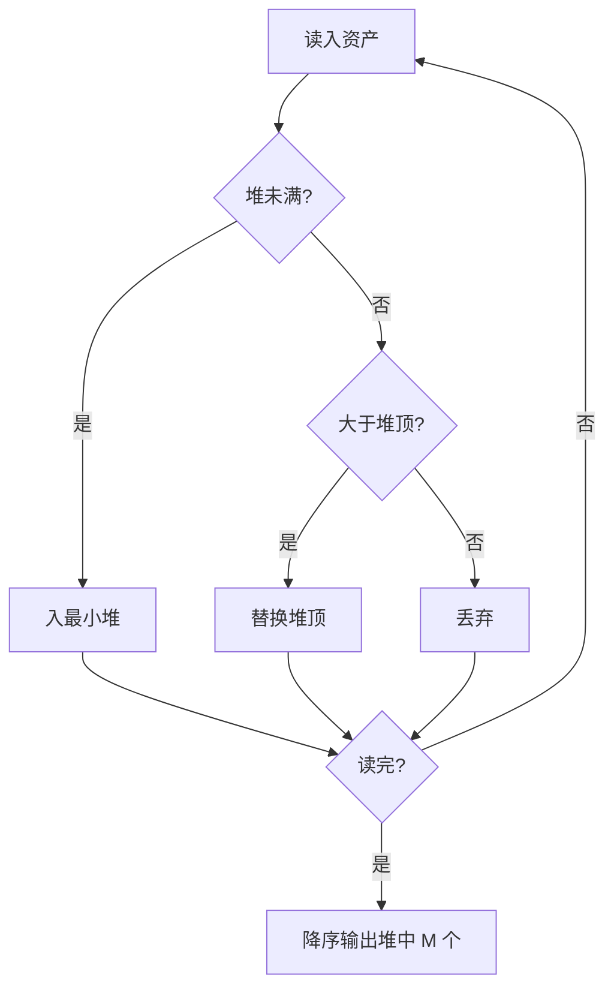

## 7-38 寻找大富翁

- **分值：** 25分

## 题目描述

胡润研究院的调查显示，截至2017年底，中国个人资产超过1亿元的高净值人群达15万人。假设给出N个人的个人资产值，请快速找出资产排前M位的大富翁。

## 输入格式

输入首先给出两个正整数$$N$$（$$\le 10^6$$）和$$M$$（$$\le 10$$），其中$$N$$为总人数，$$M$$为需要找出的大富翁数；接下来一行给出$$N$$个人的个人资产值，以百万元为单位，为不超过长整型范围的整数。数字间以空格分隔。

## 输出格式

在一行内按非递增顺序输出资产排前$$M$$位的大富翁的个人资产值。数字间以空格分隔，但结尾不得有多余空格。

## 输入样例
```
8 3
8 12 7 3 20 9 5 18
```

## 输出样例
```
20 18 12
```

## 实现原理与解题思路

只需保留最大的 `M` 个资产值。维护容量为 `M` 的小顶堆：新值大于堆顶时替换堆顶。最后将堆中元素降序排序输出，适合 `N` 很大而 `M≤10` 的情况。

## 代码流程说明

每个元素最多进行一次 `log M` 调整，时间复杂度 `O(N log M + M log M)`，空间复杂度 `O(M)`。

## 代码实现

```cpp
// 实现原理：
// 只需保留最大的 `M` 个资产值。维护容量为 `M` 的小顶堆：新值大于堆顶时替换堆顶。最后将堆中元素降序排序输出，适合 `N` 很大而 `M≤10` 的情况。
// 处理流程：
// 每个元素最多进行一次 `log M` 调整，时间复杂度 `O(N log M + M log M)`，空间复杂度 `O(M)`。
#include <algorithm>
#include <iostream>
#include <queue>
#include <vector>
using namespace std;
int main() {
    ios::sync_with_stdio(false);
    cin.tie(nullptr);
    int n, m;
    cin >> n >> m;
    priority_queue<long long, vector<long long>, greater<long long>> q;
    while (n--) {
        long long x;
        cin >> x;
        if ((int)q.size() < m)
            q.push(x);
        else if (x > q.top())
            q.pop(), q.push(x);
    }
    vector<long long> a;
    while (!q.empty())
        a.push_back(q.top()), q.pop();
    sort(a.rbegin(), a.rend());
    for (int i = 0; i < (int)a.size(); ++i) {
        if (i)
            cout << ' ';
        cout << a[i];
    }
    cout << '\n';
}
```

## 代码流程图



## 解题流程图


## 常见易错点

- 维护前 M 大应使用小顶堆，而不是大顶堆。
- 资产值可能超出 `int` 范围，应使用长整型。
- 最终输出需要非递增顺序。
