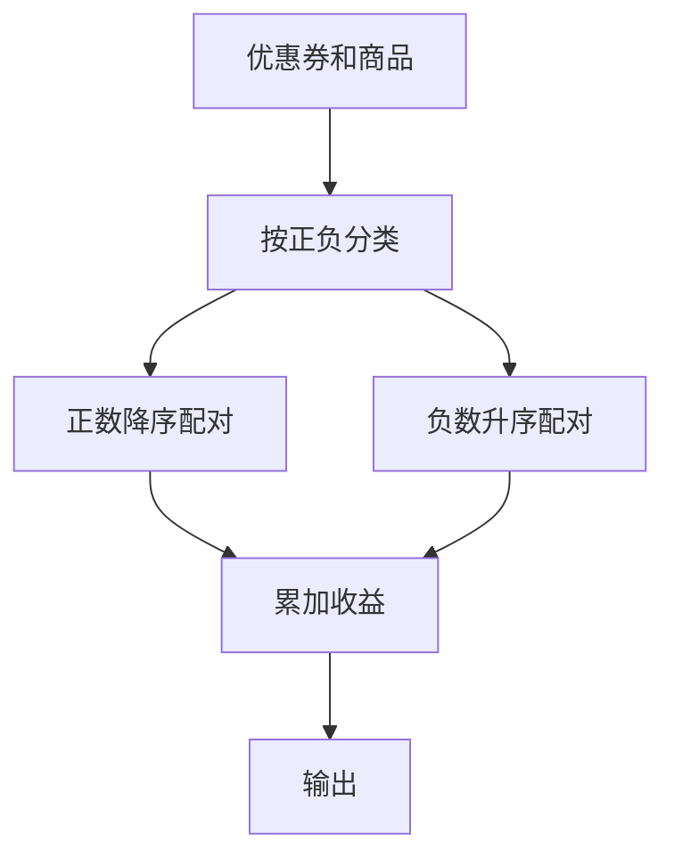

# 7-39 魔法优惠券

- **分值：** 25分

## 题目描述

在火星上有个魔法商店，提供魔法优惠券。每个优惠劵上印有一个整数面值K，表示若你在购买某商品时使用这张优惠劵，可以得到K倍该商品价值的回报！该商店还免费赠送一些有价值的商品，但是如果你在领取免费赠品的时候使用面值为正的优惠劵，则必须倒贴给商店K倍该商品价值的金额…… 但是不要紧，还有面值为负的优惠劵可以用！（真是神奇的火星）

例如，给定一组优惠劵，面值分别为1、2、4、-1；对应一组商品，价值为火星币M$7、6、-2、-3，其中负的价值表示该商品是免费赠品。我们可以将优惠劵3用在商品1上，得到M$28的回报；优惠劵2用在商品2上，得到M$12的回报；优惠劵4用在商品4上，得到M$3的回报。但是如果一不小心把优惠劵3用在商品4上，你必须倒贴给商店M$12。同样，当你一不小心把优惠劵4用在商品1上，你必须倒贴给商店M$7。

规定每张优惠券和每件商品都只能最多被使用一次，求你可以得到的最大回报。

## 输入格式

输入有两行。第一行首先给出优惠劵的个数N，随后给出N个优惠劵的整数面值。第二行首先给出商品的个数M，随后给出M个商品的整数价值。N和M在[1, $$10^6$$]之间，所有的数据大小不超过$$2^{30}$$，数字间以空格分隔。

## 输出格式

输出可以得到的最大回报。

## 输入样例
```
4 1 2 4 -1
4 7 6 -2 -3
```

## 输出样例
```
43
```

### 实现原理与解题思路

将优惠券和商品分别排序。正数优惠券只与正数商品配对最优，负数优惠券只与负数商品配对最优；分别按从大到小或从小到大配对，累加正收益，其他配对不会增加答案。

### 代码流程说明

分离正负数并排序，正数部分配最大对最大，负数部分配最小对最小。时间复杂度 `O((N+M)log(N+M))`，空间复杂度 `O(N+M)`。

### 代码实现

```cpp
// 实现原理：
// 将优惠券和商品分别排序。正数优惠券只与正数商品配对最优，负数优惠券只与负数商品配对最优；分别按从大到小或从小到大配对，累加正收益，其他配对不会增加答案。
// 处理流程：
// 分离正负数并排序，正数部分配最大对最大，负数部分配最小对最小。时间复杂度 `O((N+M)log(N+M))`，空间复杂度 `O(N+M)`。
#include <algorithm>
#include <iostream>
#include <vector>
using namespace std;
int main() {
    ios::sync_with_stdio(false);
    cin.tie(nullptr);
    int n, m;
    cin >> n;
    vector<long long> cp, cn;
    for (int i = 0, x; i < n; ++i) {
        cin >> x;
        (x > 0 ? cp : cn).push_back(x);
    }
    cin >> m;
    vector<long long> vp, vn;
    for (int i = 0, x; i < m; ++i) {
        cin >> x;
        (x > 0 ? vp : vn).push_back(x);
    }
    sort(cp.rbegin(), cp.rend());
    sort(vp.rbegin(), vp.rend());
    sort(cn.begin(), cn.end());
    sort(vn.begin(), vn.end());
    long long ans = 0;
    for (int i = 0; i < (int)min(cp.size(), vp.size()); ++i)
        ans += cp[i] * vp[i];
    for (int i = 0; i < (int)min(cn.size(), vn.size()); ++i)
        ans += cn[i] * vn[i];
    cout << ans << '\n';
}
```

### 代码流程图



### 解题流程图


### 常见易错点

- 正券与正商品、负券与负商品分别处理。
- 正数应大对大，负数应小对小。
- 不要为了“使用所有券”进行无收益或负收益配对。
