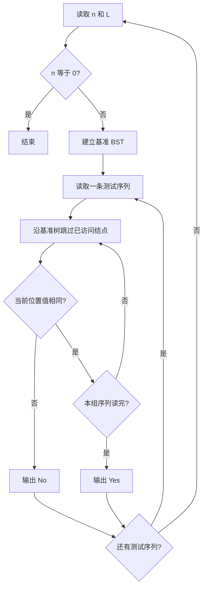
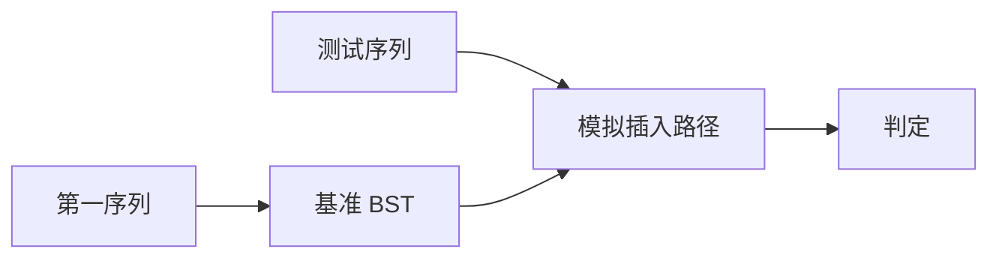

## 7-4 是否同一棵二叉搜索树

- **分值：** 25分

## 题目描述

给定一个插入序列就可以唯一确定一棵二叉搜索树。然而，一棵给定的二叉搜索树却可以由多种不同的插入序列得到。例如分别按照序列{2, 1, 3}和{2, 3, 1}插入初始为空的二叉搜索树，都得到一样的结果。于是对于输入的各种插入序列，你需要判断它们是否能生成一样的二叉搜索树。

## 输入格式

输入包含若干组测试数据。每组数据的第1行给出两个正整数N (\le 10)和L，分别是每个序列插入元素的个数和需要检查的序列个数。第2行给出N个以空格分隔的正整数，作为初始插入序列。随后L行，每行给出N个插入的元素，属于L个需要检查的序列。

简单起见，我们保证每个插入序列都是1到N的一个排列。当读到N为0时，标志输入结束，这组数据不要处理。

## 输出格式

对每一组需要检查的序列，如果其生成的二叉搜索树跟对应的初始序列生成的一样，输出“Yes”，否则输出“No”。

## 输入样例
```
4 2
3 1 4 2
3 4 1 2
3 2 4 1
2 1
2 1
1 2
0
```

## 输出样例
```
Yes
No
No
```

**鸣谢青岛大学周强老师补充测试数据！**

## 实现原理与解题思路

每组数据先用第一序列建立基准二叉搜索树。对每个待测序列，沿基准树向下查找：跳过已经访问的结点，当前位置必须正好等于待插入值，再标记该结点。所有组数据都处理完后遇到 `n=0` 结束。

## 代码流程说明

1. 建立基准 BST。
2. 每组测试前清空访问标记。
3. 对每个值沿 BST 比较并检查访问状态。
4. 输出 `Yes` 或 `No`。平均时间复杂度 `O(N log N)`，最坏 `O(N²)`，空间复杂度 `O(N)`。

## 代码实现

```cpp
// 实现原理：
// 每组数据先用第一序列建立基准二叉搜索树。对每个待测序列，沿基准树向下查找：跳过已经访问的结点，当前位置必须正好等于待插入值，再标记该结点。所有组数据都处理完后遇到 `n=0` 结束。
// 处理流程：
// 1. 建立基准 BST。 2. 每组测试前清空访问标记。 3. 对每个值沿 BST 比较并检查访问状态。 4. 输出 `Yes` 或 `No`。平均时间复杂度 `O(N log N)`，
// 最坏 `O(N²)`，空间复杂度 `O(N)`。
#include <iostream>
#include <vector>
using namespace std;
struct Node {
    int key, left = -1, right = -1;
};
void insertNode(vector<Node>& t, int root, int x) {
    int p = root;
    while (true) {
        if (x < t[p].key) {
            if (t[p].left == -1) {
                t[p].left = t.size();
                t.push_back({x});
                return;
            }
            p = t[p].left;
        } else {
            if (t[p].right == -1) {
                t[p].right = t.size();
                t.push_back({x});
                return;
            }
            p = t[p].right;
        }
    }
}
bool same(const vector<Node>& tree, int root, const vector<int>& seq) {
    vector<bool> seen(tree.size(), false);
    for (int x : seq) {
        int p = root;
        while (p != -1 && seen[p])
            p = x < tree[p].key ? tree[p].left : tree[p].right;
        if (p == -1 || tree[p].key != x)
            return false;
        seen[p] = true;
    }
    return true;
}
int main() {
    ios::sync_with_stdio(false);
    cin.tie(nullptr);
    int n, l;
    while (cin >> n >> l && n != 0) {
        vector<Node> tree;
        vector<int> base(n);
        for (int& x : base)
            cin >> x;
        tree.push_back({base[0]});
        for (int i = 1; i < n; ++i)
            insertNode(tree, 0, base[i]);
        while (l--) {
            vector<int> seq(n);
            for (int& x : seq)
                cin >> x;
            cout << (same(tree, 0, seq) ? "Yes" : "No") << '\n';
        }
    }
}
```

## 代码流程图



## 解题流程图



## 常见易错点

- 每组测试必须重新清空 `visited`。
- 不能只比较输入序列的顺序或排序结果。
- 发现首个未访问位置后应标记它，而不是继续向下比较。
