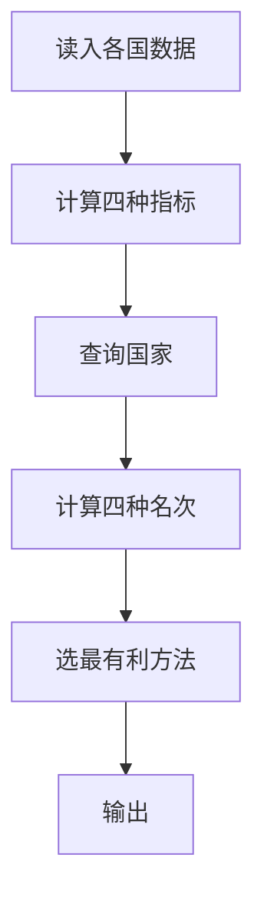

## 7-40 奥运排行榜

- **分值：** 25分

## 题目描述

每年奥运会各大媒体都会公布一个排行榜，但是细心的读者发现，不同国家的排行榜略有不同。比如中国金牌总数列第一的时候，中国媒体就公布“金牌榜”；而美国的奖牌总数第一，于是美国媒体就公布“奖牌榜”。如果人口少的国家公布一个“国民人均奖牌榜”，说不定非洲的国家会成为榜魁…… 现在就请你写一个程序，对每个前来咨询的国家按照对其最有利的方式计算它的排名。

## 输入格式

输入的第一行给出两个正整数N和M（\le 224，因为世界上共有224个国家和地区），分别是参与排名的国家和地区的总个数、以及前来咨询的国家的个数。为简单起见，我们把国家从0 ~ N-1编号。之后有N行输入，第i行给出编号为i-1的国家的金牌数、奖牌数、国民人口数（单位为百万），数字均为[0,1000]区间内的整数，用空格分隔。最后面一行给出M个前来咨询的国家的编号，用空格分隔。

## 输出格式

在一行里顺序输出前来咨询的国家的`排名:计算方式编号`。其排名按照对该国家最有利的方式计算；计算方式编号为：金牌榜=1，奖牌榜=2，国民人均金牌榜=3，国民人均奖牌榜=4。输出间以空格分隔，输出结尾不能有多余空格。

若某国在不同排名方式下有相同名次，则输出编号最小的计算方式。

## 输入样例
```
4 4
51 100 1000
36 110 300
6 14 32
5 18 40
0 1 2 3
```

## 输出样例
```
1:1 1:2 1:3 1:4
```

## 实现原理与解题思路

为每个国家分别计算四种指标：金牌数、奖牌数、人均金牌数、人均奖牌数。某指标的名次为严格优于该国的国家数加一；查询时取四个名次中的最小值，若并列则取方法编号最小者。

## 代码流程说明

预先保存四种指标，查询每个国家时扫描全部国家计算名次。`N≤224`，时间复杂度 `O(N²+NM)`，空间复杂度 `O(N)`。

## 代码实现

```cpp
// 实现原理：
// 为每个国家分别计算四种指标：金牌数、奖牌数、人均金牌数、人均奖牌数。某指标的名次为严格优于该国的国家数加一；查询时取四个名次中的最小值，若并列则取方法编号最小者。
// 处理流程：
// 预先保存四种指标，查询每个国家时扫描全部国家计算名次。`N≤224`，时间复杂度 `O(N²+NM)`，空间复杂度 `O(N)`。
#include <iostream>
#include <vector>
using namespace std;
struct Country {
    int gold, medal, pop;
};
int main() {
    ios::sync_with_stdio(false);
    cin.tie(nullptr);
    int n, m;
    cin >> n >> m;
    vector<Country> a(n);
    for (auto& x : a)
        cin >> x.gold >> x.medal >> x.pop;
    vector<int> q(m);
    for (int& x : q)
        cin >> x;
    for (int z = 0; z < m; ++z) {
        int id = q[z], bestRank = 1e9, bestMethod = 1;
        for (int method = 1; method <= 4; ++method) {
            int rank = 1;
            for (int j = 0; j < n; ++j) {
                double x, y;
                if (method == 1)
                    x = a[j].gold, y = a[id].gold;
                else if (method == 2)
                    x = a[j].medal, y = a[id].medal;
                else if (method == 3)
                    x = (double)a[j].gold / a[j].pop, y = (double)a[id].gold / a[id].pop;
                else
                    x = (double)a[j].medal / a[j].pop, y = (double)a[id].medal / a[id].pop;
                if (x > y)
                    ++rank;
            }
            if (rank < bestRank)
                bestRank = rank, bestMethod = method;
        }
        if (z)
            cout << ' ';
        cout << bestRank << ':' << bestMethod;
    }
    cout << '\n';
}
```

## 代码流程图



## 解题流程图


## 常见易错点

- 排名比较只统计严格更优者，同分共享名次。
- 人均指标要用浮点数比较。
- 名次相同时选择编号较小的方法。
