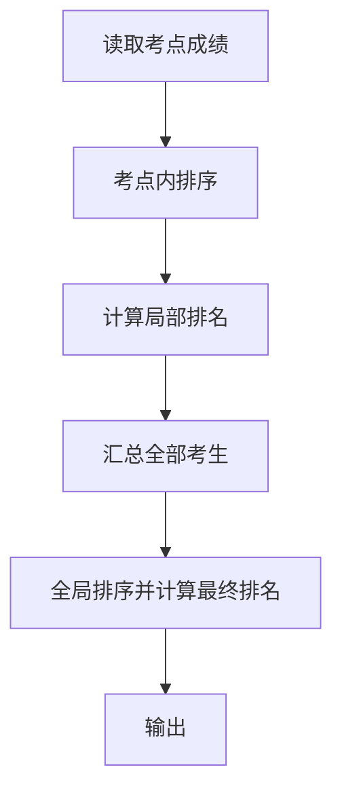
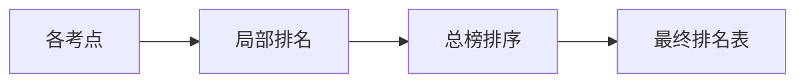

## 7-41 PAT排名汇总

- **分值：** 25分

## 题目描述

计算机程序设计能力考试（Programming Ability Test，简称PAT）旨在通过统一组织的在线考试及自动评测方法客观地评判考生的算法设计与程序设计实现能力，科学的评价计算机程序设计人才，为企业选拔人才提供参考标准（网址http://www.patest.cn）。

每次考试会在若干个不同的考点同时举行，每个考点用局域网，产生本考点的成绩。考试结束后，各个考点的成绩将即刻汇总成一张总的排名表。

现在就请你写一个程序自动归并各个考点的成绩并生成总排名表。

## 输入格式

输入的第一行给出一个正整数N（$$\le$$100），代表考点总数。随后给出N个考点的成绩，格式为：首先一行给出正整数K（$$\le$$300），代表该考点的考生总数；随后K行，每行给出1个考生的信息，包括考号（由13位整数字组成）和得分（为[0,100]区间内的整数），中间用空格分隔。

## 输出格式

首先在第一行里输出考生总数。随后输出汇总的排名表，每个考生的信息占一行，顺序为：考号、最终排名、考点编号、在该考点的排名。其中考点按输入给出的顺序从1到N编号。考生的输出须按最终排名的非递减顺序输出，获得相同分数的考生应有相同名次，并按考号的递增顺序输出。

## 输入样例
```
2
5
1234567890001 95
1234567890005 100
1234567890033 95
1234567890002 77
1234567890004 85
4
1234567890013 95
1234567890011 25
1234567890014 100
1234567890042 95
```

## 输出样例
```
9
1234567890005 1 1 1
1234567890014 1 2 1
1234567890001 3 1 2
1234567890013 3 2 2
1234567890033 3 1 2
1234567890042 3 2 2
1234567890004 7 1 4
1234567890002 8 1 5
1234567890011 9 2 4
```

**鸣谢厦门大学郑旭玲老师补充数据！**

## 实现原理与解题思路

每个考点内部先按成绩降序、考号升序排序并计算局部排名；将所有考生汇总后再按成绩降序、考号升序排序，依据前一名成绩计算最终并列排名。

## 代码流程说明

记录考号、成绩、考点和局部排名。局部排序后赋排名，再做一次全局排序和排名。时间复杂度 `O(T log T)`，空间复杂度 `O(T)`，`T` 为考生总数。

## 代码实现

```cpp
// 实现原理：
// 每个考点内部先按成绩降序、考号升序排序并计算局部排名；将所有考生汇总后再按成绩降序、考号升序排序，依据前一名成绩计算最终并列排名。
// 处理流程：
// 记录考号、成绩、考点和局部排名。局部排序后赋排名，再做一次全局排序和排名。时间复杂度 `O(T log T)`，空间复杂度 `O(T)`，`T` 为考生总数。
#include <algorithm>
#include <iostream>
#include <string>
#include <vector>
using namespace std;
struct Student {
    string id;
    int score, site, local, rank;
};
int main() {
    ios::sync_with_stdio(false);
    cin.tie(nullptr);
    int n, total = 0;
    cin >> n;
    vector<Student> a;
    for (int site = 1; site <= n; ++site) {
        int k;
        cin >> k;
        vector<Student> cur(k);
        for (auto& x : cur)
            cin >> x.id >> x.score, x.site = site;
        sort(cur.begin(), cur.end(),
             [](auto& x, auto& y) { return x.score != y.score ? x.score > y.score : x.id < y.id; });
        for (int i = 0; i < k; ++i)
            cur[i].local = i && cur[i].score == cur[i - 1].score ? cur[i - 1].local : i + 1;
        for (auto x : cur)
            a.push_back(x);
        total += k;
    }
    sort(a.begin(), a.end(),
         [](auto& x, auto& y) { return x.score != y.score ? x.score > y.score : x.id < y.id; });
    cout << total << '\n';
    for (int i = 0; i < total; ++i) {
        a[i].rank = i && a[i].score == a[i - 1].score ? a[i - 1].rank : i + 1;
        cout << a[i].id << ' ' << a[i].rank << ' ' << a[i].site << ' ' << a[i].local << '\n';
    }
}
```

## 代码流程图



## 解题流程图



## 常见易错点

- 同分考生排名相同，不是简单使用排序下标。
- 考号升序只是同分时的输出/排序规则。
- 局部排名和最终排名要分别计算。
