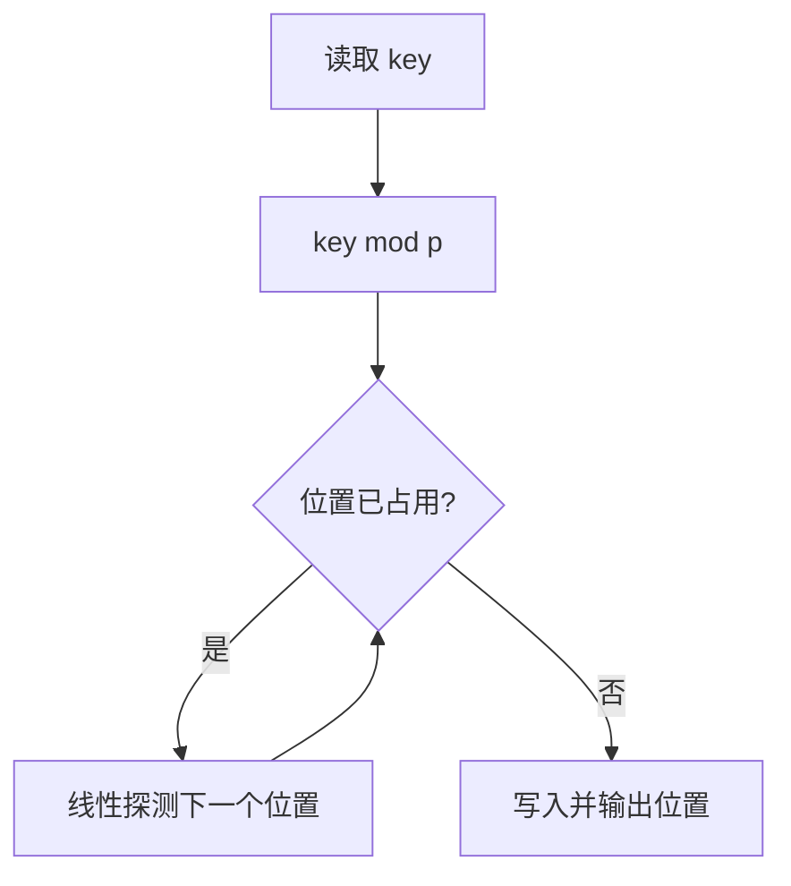

# 7-42 整型关键字的散列映射

- **分值：** 25分

## 题目描述

给定一系列整型关键字和素数 $p$，用除留余数法定义的散列函数 $H(key) = key \% p$ 将关键字映射到长度为 $p$ 的散列表中。用线性探测法解决冲突。

## 输入格式

输入第一行首先给出两个正整数 $n$（$\le 1000$）和 $p$（$\ge n$ 的最小素数），分别为待插入的关键字总数、以及散列表的长度。第二行给出 $n$ 个整型关键字。数字间以空格分隔。

## 输出格式

在一行内输出每个整型关键字在散列表中的位置。数字间以空格分隔，但行末尾不得有多余空格。

## 输入样例
```
4 5
24 15 61 88
```

## 输出样例
```
4 0 1 3
```

### 实现原理与解题思路

散列表初始为空。对每个关键字从 `key % p` 开始，沿线性探测位置 `(pos+1)%p` 查找第一个空槽并记录该位置。

### 代码流程说明

依次插入并输出位置。每次探测最坏 `O(p)`，总复杂度最坏 `O(np)`，空间复杂度 `O(p)`。

### 代码实现

```cpp
// 实现原理：
// 散列表初始为空。对每个关键字从 `key % p` 开始，沿线性探测位置 `(pos+1)%p` 查找第一个空槽并记录该位置。
// 处理流程：
// 依次插入并输出位置。每次探测最坏 `O(p)`，总复杂度最坏 `O(np)`，空间复杂度 `O(p)`。
#include <iostream>
#include <vector>
using namespace std;
int main() {
    ios::sync_with_stdio(false);
    cin.tie(nullptr);
    int n, p;
    cin >> n >> p;
    vector<bool> used(p);
    for (int i = 0; i < n; ++i) {
        int key;
        cin >> key;
        int pos = ((key % p) + p) % p;
        while (used[pos])
            pos = (pos + 1) % p;
        used[pos] = true;
        if (i)
            cout << ' ';
        cout << pos;
    }
    cout << '\n';
}
```

### 代码流程图



### 解题流程图


### 常见易错点

- 探测到表尾后必须循环回表头。
- 负数取模时应规范化到 `[0,p-1]`（若扩展输入范围）。
- 输出的是每个关键字最终插入位置。
