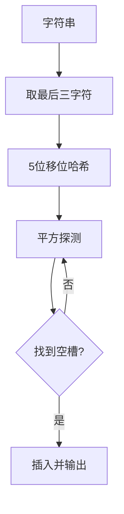

## 7-43 字符串关键字的散列映射

- **分值：** 25分

## 题目描述

给定一系列由大写英文字母组成的字符串关键字和素数$$P$$，用移位法定义的散列函数$$H(Key)$$将关键字$$Key$$中的最后3个字符映射为整数，每个字符占5位；再用除留余数法将整数映射到长度为$$P$$的散列表中。例如将字符串`AZDEG`插入长度为1009的散列表中，我们首先将26个大写英文字母顺序映射到整数0~25；再通过移位将其映射为$$3\times 32^2 + 4 \times 32 + 6 = 3206$$；然后根据表长得到$$3206 \% 1009 = 179$$，即是该字符串的散列映射位置。

发生冲突时请用平方探测法解决。

## 输入格式

输入第一行首先给出两个正整数$$N$$（$$\le 500$$）和$$P$$（$$\ge 2N$$的最小素数），分别为待插入的关键字总数、以及散列表的长度。第二行给出$$N$$个字符串关键字，每个长度不超过8位，其间以空格分隔。

## 输出格式

在一行内输出每个字符串关键字在散列表中的位置。数字间以空格分隔，但行末尾不得有多余空格。

## 输入样例1
```
4 11
HELLO ANNK ZOE LOLI
```

## 输出样例1
```
3 10 4 0
```

## 输入样例2
```
6 11
LLO ANNA NNK ZOJ INNK AAA
```

## 输出样例2
```
3 0 10 9 6 1
```

## 实现原理与解题思路

只取字符串最后三个字符，按 5 位移位计算 `value=value*32+(ch-'A')`，再对 `P` 取模。冲突按平方探测顺序尝试 `h+1²、h-1²、h+2²、h-2²...`，找到空槽即插入。

## 代码流程说明

逐个计算初始散列位置并平方探测。每次插入最坏 `O(P)`，总时间最坏 `O(NP)`，空间复杂度 `O(P)`。

## 代码实现

```cpp
// 实现原理：
// 只取字符串最后三个字符，按 5 位移位计算 `value=value*32+(ch-'A')`，再对 `P` 取模。冲突按平方探测顺序尝试 `h+1²、h-1²、h+2²、h-2²...
// `，找到空槽即插入。
// 处理流程：
// 逐个计算初始散列位置并平方探测。每次插入最坏 `O(P)`，总时间最坏 `O(NP)`，空间复杂度 `O(P)`。
#include <algorithm>
#include <iostream>
#include <string>
#include <unordered_map>
#include <vector>
using namespace std;
int main() {
    ios::sync_with_stdio(false);
    cin.tie(nullptr);
    int n, p;
    cin >> n >> p;
    vector<bool> used(p);
    unordered_map<string, int> position;
    for (int z = 0; z < n; ++z) {
        string s;
        cin >> s;
        auto it = position.find(s);
        int pos;
        if (it != position.end())
            pos = it->second;
        else {
            long long h = 0;
            int start = max(0, (int)s.size() - 3);
            for (int i = start; i < (int)s.size(); ++i)
                h = h * 32 + s[i] - 'A';
            pos = (int)(h % p);
            if (used[pos])
                for (int step = 1; step <= p; ++step) {
                    long long d = 1LL * step * step;
                    long long cand = (h + d) % p;
                    if (!used[cand]) {
                        pos = (int)cand;
                        break;
                    }
                    cand = (h - d) % p;
                    if (cand < 0)
                        cand += p;
                    if (!used[cand]) {
                        pos = (int)cand;
                        break;
                    }
                }
            used[pos] = true;
            position[s] = pos;
        }
        if (z)
            cout << ' ';
        cout << pos;
    }
    cout << '\n';
}
```

## 代码流程图



## 解题流程图


## 常见易错点

- 只使用最后三个字符，长度不足三时使用全部字符。
- 每个字符占 5 位，即乘以 32。
- 负方向探测和取模要规范化，不能出现负下标。
