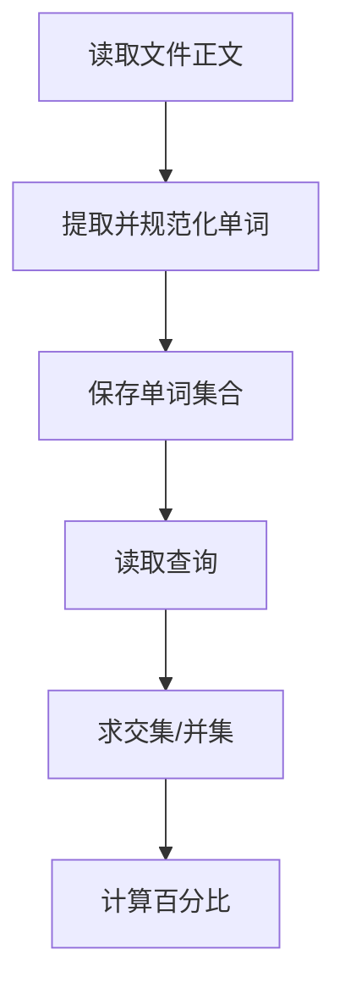

## 7-44 基于词频的文件相似度

- **分值：** 30分

## 题目描述

实现一种简单原始的文件相似度计算，即以两文件的公共词汇占总词汇的比例来定义相似度。为简化问题，这里不考虑中文（因为分词太难了），只考虑长度不小于3、且不超过10的英文单词，长度超过10的只考虑前10个字母。

## 输入格式

输入首先给出正整数$$N$$（$$\le 100$$），为文件总数。随后按以下格式给出每个文件的内容：首先给出文件正文，最后在一行中只给出一个字符`#`，表示文件结束。在$$N$$个文件内容结束之后，给出查询总数$$M$$（$$\le 10^4$$），随后$$M$$行，每行给出一对文件编号，其间以空格分隔。这里假设文件按给出的顺序从1到$$N$$编号。

## 输出格式

针对每一条查询，在一行中输出两文件的相似度，即两文件的公共词汇量占两文件总词汇量的百分比，精确到小数点后1位。注意这里的一个“单词”只包括仅由英文字母组成的、长度不小于3、且不超过10的英文单词，长度超过10的只考虑前10个字母。单词间以任何非英文字母隔开。另外，大小写不同的同一单词被认为是相同的单词，例如“You”和“you”是同一个单词。

## 输入样例
```
3
Aaa Bbb Ccc
#
Bbb Ccc Ddd
#
Aaa2 ccc Eee
is at Ddd@Fff
#
2
1 2
1 3
```

## 输出样例
```
50.0%
33.3%
```

## 实现原理与解题思路

每个文件用集合保存规范化后的单词：只提取连续英文字母，转小写，长度超过 10 截取前 10 个，长度小于 3 丢弃。查询两文件时计算集合交集大小与并集大小的比值。

## 代码流程说明

读完每个文件后存集合。每次查询扫描第一个文件的集合并在第二个集合中查找，同时复制并合并两个集合得到并集，最后计算百分比。单次查询复杂度为 `O(|A|log|B|+|A|+|B|log|A|)`，空间复杂度 `O(总不同词数)`。

## 代码实现

```cpp
// 实现原理：
// 每个文件用集合保存规范化后的单词：只提取连续英文字母，转小写，长度超过 10 截取前 10 个，长度小于 3 丢弃。查询两文件时计算集合交集大小与并集大小的比值。
// 处理流程：
// 读完每个文件后存集合。每次查询扫描第一个文件的集合并在第二个集合中查找，同时复制并合并两个集合得到并集，最后计算百分比。单次查询复杂度为
// `O(|A|log|B|+|A|+|B|log|A|)`，空间复杂度 `O(总不同词数)`。
#include <cctype>
#include <iomanip>
#include <iostream>
#include <set>
#include <string>
#include <vector>
using namespace std;
set<string> parse(const vector<string>& lines) {
    set<string> s;
    string w;
    auto add = [&]() {
        if (w.size() >= 3) {
            for (char& c : w)
                c = tolower((unsigned char)c);
            if (w.size() > 10)
                w.resize(10);
            s.insert(w);
        }
        w.clear();
    };
    for (auto& line : lines) {
        for (char c : line) {
            if (isalpha((unsigned char)c))
                w += c;
            else
                add();
        }
        add();
    }
    return s;
}
int main() {
    ios::sync_with_stdio(false);
    cin.tie(nullptr);
    int n;
    cin >> n;
    string line;
    getline(cin, line);
    vector<set<string>> f(n);
    for (int i = 0; i < n; ++i) {
        vector<string> lines;
        while (getline(cin, line) && line != "#")
            lines.push_back(line);
        f[i] = parse(lines);
    }
    int m;
    cin >> m;
    cout << fixed << setprecision(1);
    while (m--) {
        int a, b;
        cin >> a >> b;
        int common = 0;
        for (auto& x : f[a - 1])
            common += f[b - 1].count(x);
        set<string> uni = f[a - 1];
        uni.insert(f[b - 1].begin(), f[b - 1].end());
        double similarity = uni.empty() ? 0.0 : 100.0 * common / uni.size();
        cout << similarity << "%\n";
    }
}
```

## 代码流程图



## 解题流程图


## 常见易错点

- 单词只由英文字母组成，数字和符号都作为分隔符。
- 大小写不敏感，长度超过 10 只保留前 10 个字母。
- 相似度分母是并集大小，不是两个集合大小之和。
