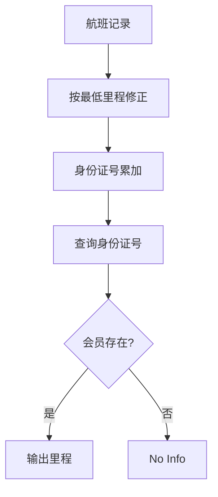

## 7-45 航空公司VIP客户查询

- **分值：** 25分

## 题目描述

不少航空公司都会提供优惠的会员服务，当某顾客飞行里程累积达到一定数量后，可以使用里程积分直接兑换奖励机票或奖励升舱等服务。现给定某航空公司全体会员的飞行记录，要求实现根据身份证号码快速查询会员里程积分的功能。

## 输入格式

输入首先给出两个正整数$$N$$（$$\le 10^5$$）和$$K$$（$$\le 500$$）。其中$$K$$是最低里程，即为照顾乘坐短程航班的会员,航空公司还会将航程低于$$K$$公里的航班也按$$K$$公里累积。随后$$N$$行，每行给出一条飞行记录。飞行记录的输入格式为：`18位身份证号码（空格）飞行里程`。其中身份证号码由17位数字加最后一位校验码组成，校验码的取值范围为0~9和x共11个符号；飞行里程单位为公里，是(0, 15 000]区间内的整数。然后给出一个正整数$$M$$（$$\le 10^5$$），随后给出$$M$$行查询人的身份证号码。

## 输出格式

对每个查询人，给出其当前的里程累积值。如果该人不是会员，则输出`No Info`。每个查询结果占一行。

## 输入样例
```
4 500
330106199010080419 499
110108198403100012 15000
120104195510156021 800
330106199010080419 1
4
120104195510156021
110108198403100012
330106199010080419
33010619901008041x
```

## 输出样例
```
800
15000
1000
No Info
```

## 实现原理与解题思路

用哈希表按身份证号累加里程，每条航班贡献 `max(distance,K)`。查询时查表即可，不存在则输出 `No Info`。

## 代码流程说明

读入记录并累加，再处理查询。时间复杂度平均 `O(N+M)`，空间复杂度 `O(U)`。

## 代码实现

```cpp
// 实现原理：
// 用哈希表按身份证号累加里程，每条航班贡献 `max(distance,K)`。查询时查表即可，不存在则输出 `No Info`。
// 处理流程：
// 读入记录并累加，再处理查询。时间复杂度平均 `O(N+M)`，空间复杂度 `O(U)`。
#include <algorithm>
#include <iostream>
#include <string>
#include <unordered_map>
using namespace std;
int main() {
    ios::sync_with_stdio(false);
    cin.tie(nullptr);
    int n, k;
    cin >> n >> k;
    unordered_map<string, long long> m;
    while (n--) {
        string id;
        int d;
        cin >> id >> d;
        m[id] += max(d, k);
    }
    int q;
    cin >> q;
    while (q--) {
        string id;
        cin >> id;
        auto it = m.find(id);
        if (it == m.end())
            cout << "No Info\n";
        else
            cout << it->second << '\n';
    }
}
```

## 代码流程图



## 解题流程图


## 常见易错点

- 航程低于 `K` 时按 `K` 计，高于等于 `K` 时按实际里程计。
- 身份证末位可能为 `x`，应按字符串保存。
- 多条记录必须累加，不能覆盖。
