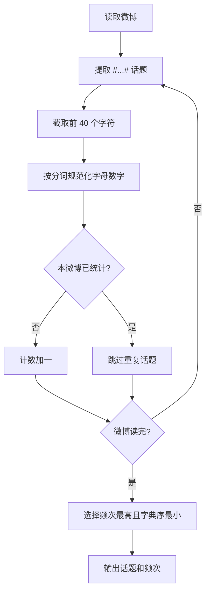
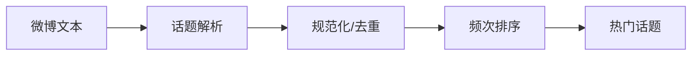

# 7-46 新浪微博热门话题

- **分值：** 30分

## 题目描述

新浪微博可以在发言中嵌入“话题”，即将发言中的话题文字写在一对“#”之间，就可以生成话题链接，点击链接可以看到有多少人在跟自己讨论相同或者相似的话题。新浪微博还会随时更新热门话题列表，并将最热门的话题放在醒目的位置推荐大家关注。

本题目要求实现一个简化的热门话题推荐功能，从大量英文（因为中文分词处理比较麻烦）微博中解析出话题，找出被最多条微博提到的话题。

## 输入格式

输入说明：输入首先给出一个正整数 $n$（$\le 10^5$），随后 $n$ 行，每行给出一条英文微博，其长度不超过 140 个字符。任何包含在一对最近的“#”中的内容均被认为是一个话题，如果长度超过40个字符，则只保留前40个字符。输入保证“#”成对出现。

## 输出格式

第一行输出被最多条微博提到的话题，第二行输出其被提到的微博条数。如果这样的话题不唯一，则输出按字母序最小的话题，并在第三行输出 `And k more ...`，其中 `k` 是另外几条热门话题的条数。输入保证至少存在一条话题。

注意：两条话题被认为是相同的，如果在去掉所有非英文字母和数字的符号、并忽略大小写区别后，它们是相同的字符串；同时它们有完全相同的分词。输出时除首字母大写外，只保留小写英文字母和数字，并用一个空格分隔原文中的单词。

## 输入样例
```
4
This is a #test of topic#.
Another #Test of topic.#
This is a #Hot# #Hot# topic
Another #hot!# #Hot# topic
```

## 输出样例
```
Hot
2
And 1 more ...
```

### 解题思路

逐条微博扫描成对的 `#`，提取话题并截取前 40 个字符。对话题去除非字母数字、统一小写后形成规范键，同时保存按原规则整理出的显示文本。每条微博内同一规范话题只计一次，最后按出现微博数降序、规范键字典序选择热门话题。

### 代码流程说明

扫描话题并将字母数字规范化为“单词间一个空格、首字母大写”的字符串；同一条微博用集合去重，再维护规范话题到出现微博数的映射。总时间复杂度 `O(总字符数)`，空间复杂度 `O(不同话题总长度)`。

### 代码实现

```cpp
#include <iostream>
#include <string>
#include <map>
#include <set>
#include <cctype>
using namespace std;
string normalize(const string& raw){string result;bool separator=false,capitalized=false;for(char c:raw){unsigned char u=(unsigned char)c;if(isalnum(u)){if(separator&&!result.empty())result+=' ';if(isalpha(u)){char x=(char)tolower(u);if(!capitalized){x=(char)toupper(u);capitalized=true;}result+=x;}else result+=c;separator=false;}else if(!result.empty())separator=true;}return result;}
int main(){ios::sync_with_stdio(false);cin.tie(nullptr);int n;cin>>n;string line;getline(cin,line);map<string,int>count;
    for(int z=0;z<n;++z){getline(cin,line);set<string>seen;for(size_t l=0;l<line.size();){size_t a=line.find('#',l);if(a==string::npos)break;size_t b=line.find('#',a+1);string raw=line.substr(a+1,b-a-1);if(raw.size()>40)raw.resize(40);string topic=normalize(raw);if(seen.insert(topic).second)++count[topic];l=b+1;}}
    int best=0,more=0;string topic;bool selected=false;for(auto&[name,c]:count){if(c>best){best=c;topic=name;more=0;selected=true;}else if(c==best){++more;if(!selected||name<topic){topic=name;selected=true;}}}cout<<topic<<'\n'<<best<<'\n';if(more)cout<<"And "<<more<<" more ...\n";
}
```

### 代码流程图



### 解题流程图



### 常见易错点

- 同一条微博中重复出现的话题只能计一条微博。
- 比较热门程度使用规范键和出现微博数，不能直接比较原文。
- 输出显示名需按题目要求首字母大写、单词间一个空格。
