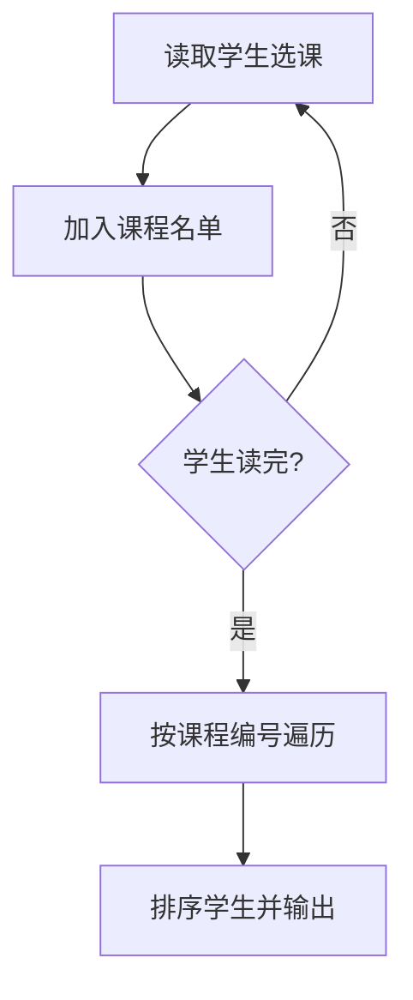

## 7-47 打印选课学生名单

- **分值：** 25分

## 题目描述

假设全校有最多40000名学生和最多2500门课程。现给出每个学生的选课清单，要求输出每门课的选课学生名单。

## 输入格式

输入的第一行是两个正整数：N（\le40000），为全校学生总数；K（\le2500），为总课程数。此后N行，每行包括一个学生姓名（3个大写英文字母+1位数字）、一个正整数C（\le20）代表该生所选的课程门数、随后是C个课程编号。简单起见，课程从1到K编号。

## 输出格式

顺序输出课程1到K的选课学生名单。格式为：对每一门课，首先在一行中输出课程编号和选课学生总数（之间用空格分隔），之后在第二行按字典序输出学生名单，每个学生名字占一行。

## 输入样例
```
10 5
ZOE1 2 4 5
ANN0 3 5 2 1
BOB5 5 3 4 2 1 5
JOE4 1 2
JAY9 4 1 2 5 4
FRA8 3 4 2 5
DON2 2 4 5
AMY7 1 5
KAT3 3 5 4 2
LOR6 4 2 4 1 5
```

## 输出样例
```
1 4
ANN0
BOB5
JAY9
LOR6
2 7
ANN0
BOB5
FRA8
JAY9
JOE4
KAT3
LOR6
3 1
BOB5
4 7
BOB5
DON2
FRA8
JAY9
KAT3
LOR6
ZOE1
5 9
AMY7
ANN0
BOB5
DON2
FRA8
JAY9
KAT3
LOR6
ZOE1
```

## 实现原理与解题思路

建立以课程编号为下标的学生名单数组。读入每个学生及其课程时，将姓名加入对应课程；课程处理完后对名单排序并按课程编号输出。

## 代码流程说明

先完成“学生 → 课程”的反向填表，再扫描课程 1 到 `K` 输出。总选课记录数为 `R` 时，时间复杂度 `O(R + Σ sᵢ log sᵢ)`，空间复杂度 `O(R)`。

## 代码实现

```cpp
// 实现原理：
// 建立以课程编号为下标的学生名单数组。读入每个学生及其课程时，将姓名加入对应课程；课程处理完后对名单排序并按课程编号输出。
// 处理流程：
// 先完成“学生 → 课程”的反向填表，再扫描课程 1 到 `K` 输出。总选课记录数为 `R` 时，时间复杂度 `O(R + Σ sᵢ log sᵢ)`，空间复杂度 `O(R)`。
#include <algorithm>
#include <iostream>
#include <string>
#include <vector>
using namespace std;
int main() {
    ios::sync_with_stdio(false);
    cin.tie(nullptr);
    int n, k;
    cin >> n >> k;
    vector<vector<string>> course(k + 1);
    for (int i = 0; i < n; ++i) {
        string name;
        int c;
        cin >> name >> c;
        while (c--) {
            int x;
            cin >> x;
            course[x].push_back(name);
        }
    }
    for (int i = 1; i <= k; ++i) {
        sort(course[i].begin(), course[i].end());
        cout << i << ' ' << course[i].size() << '\n';
        for (auto& s : course[i])
            cout << s << '\n';
    }
}
```

## 代码流程图



## 解题流程图


## 常见易错点

- 输出课程顺序必须是 `1..K`，即使某课无人选也要输出人数 0。
- 学生姓名按字典序排序。
- 不能把每个学生的输入顺序当作课程名单顺序。
